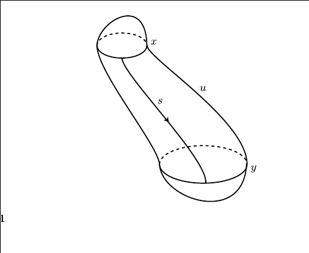

# Background and Notation

!include ./notation.md

# Talk

Overview:
Analyze the space $\mcm(x, y)$ of solutions to the Floer equation connecting two orbits $x, y$ of $H$.
Show $\mcm(x, y)$ is in fact a manifold of dimension $\mu(x) - \mu(y)$.

Strategy:

1. Describe $\mcm(x, y)$ as the zero set of a section of a vector bundle over the Banach manifold $\mcp(x, y)$.
2. Apply the Sard-Smale theorem: perturb $H$ to make $\mcm(x, y)$ the inverse image of a regular value of some map.
3. Show that the tangent maps (?) are Fredholm operators of index $\mu(x) - \mu(y) = \dim \mcm(x, y)$.

Goals:

- 8.3: Overview and big picture
- 8.4: Formula for linearization of $\mcf$.

## Review 8.2

What is $\mcf$?

We started with the unadorned Floer map:
\begin{align*}
\mathcal{F}: \mathcal{C}^{\infty}\left(\mathbf{R} \times S^{1} ; W\right) & \to \mathcal{C}^{\infty}\left(\mathbf{R} \times S^{1} ; T W\right) \\
u & \mapsto \frac{\partial u}{\partial s}+J \frac{\partial u}{\partial t}+\operatorname{grad}_{u}\left(H_{t}\right)
\end{align*}

and promoted this to a map of Banach spaces
\begin{align*}
\mcf: \mcp^{1, p}(x, y) &\to \mcl^p(x, y) \\
\mathcal{F}(u) &= \frac{\partial u}{\partial s}+J(u) \frac{\partial u}{\partial t}+\operatorname{grad} H_{t}(u)
.\end{align*}

What is the LHS?
It is the space of maps
\begin{align*}
\mcp^{1, p}(x, y): ? &\to ? \\
(s, t) &\mapsto \exp_{w(s, t)} Y(s, t)
.\end{align*}

where $Y \in W^{1, p}(w^* TW)$ and $w\in C^\infty_{\searrow}(x, y)$.

## 8.3: The Space of Perturbations of $H$

Goal: given a fixed Hamiltonian $H\in C^\infty(W\cross S^1; \RR)$, perturb it (without modifying the periodic orbits) so that $\mcm(x, y)$ are manifolds of the expected dimension.

Start by trying to construct a subspace $\mcc_\eps^{\infty}(H) \subset \mcc^\infty(W\cross S^1; \RR)$, the space of perturbations of $H$ depending on a certain sequence $\eps = \theset{\eps_k}$, and show it is a dense subspace.

Idea: similar to how you build $L^2(\RR)$, define a norm $\norm{\wait}_\eps$ on $C_\eps^{\infty}(H)$ and take the subspace of finite-norm elements.

- Let $h(\vector x, t) \in C_\eps^\infty(H)$ denote a perturbation of $H$.
- Fix $\vector \eps = \theset{\eps_k \mid k\in \ZZ^{\geq 0}} \subset \RR^{>0}$ a sequence of real numbers, which we will choose carefully later.

- For a fixed $\vector x \in W, t\in \RR$ and $k \in \ZZ^{\geq 0}$, define 
  $$
  \abs{d^k h(\vector x, t)} = \max \theset {d^\alpha h(\vector x, t) \suchthat \abs{\alpha} = k}
  ,$$
  the maximum over all sets of multi-indices $\alpha$ of length $k$.

  > Note: I interpret this as 
  $$
  d^{\alpha_1, \alpha_2, \cdots, \alpha_k}h = \frac{\del^k h}{\del x_{\alpha_1} ~\del x_{\alpha_2} \cdots \del x_{\alpha_k}}
  ,$$
  the partial derivatives wrt the corresponding variables.

- Define a norm on $C^\infty(W\cross S^1; \RR)$:

  \begin{align*}
  \|h\|_{\vector \eps}
  &= \sum_{k \geq 0} \eps_{k} \sup _{(x, t) \in W \times S^{1}}\left|d^{k} h(x, t)\right|
  .\end{align*}

- Since $W\cross S^1$ is assumed compact (?), fix a finite covering $\theset{B_i}$ of $W\cross S^1$ such that 
  $$
  \union_i B_i^\circ = W \cross S^1
  .$$

  - Choose them in such a way we obtain charts 
    \begin{align*}
    \Psi_i: B_i &\to \bar{B(0, 1)} \subset \RR^{2n + 1} ~(?)
    .\end{align*}
  
- Obtain the computable form
  \begin{align*}
  \norm{h}_{\vector \eps} &= \sum_{k \geq 0} \eps_{k} \sup _{(x, t) \in W \times S^{1}} \sup_{i, z\in B(0, 1)} \abs{ d^k (h\circ \Psi_i\inv)(z)}
  .\end{align*}

- Define 
    $$
    C_\eps^\infty = \theset{h\in C^\infty(W\cross S^1; \RR) \suchthat \norm{h}_\eps < \infty} \subset C^{\infty}(W\cross S^1; \RR)
    ,$$ 
   which is a Banach space (normed and complete). 

- Show that the sequence $\theset{\eps_k}$ can be chosen so that $C_\eps^\infty$ is a *dense* subspace for the $C^\infty$ topology, and in particular for the $C^1$ topology.

Proposition
: Such a sequence $\theset {\eps_k}$ can be chosen.

Lemma
: $C^\infty(W \cross S^1; \RR)$ with the $C^1$ topology is separable as a topological space (contains a countable dense subset).

Proof (of Lemma, Sketch)
:   \hfill
    First prove for $C^0$:

    - **Idea:** reduce to polynomials in $\RR^m$.
    - Embed $W\cross S^1 \injects [-M, M]^m \cong I^m \subset \RR^m$ for some large $m$, reduces to proving it for $C^\infty(I^m; \RR)$.
    - Recall Stone-Weierstrass: 
      
      > For $A\leq C^0(X; \RR)$ a subalgebra with $X$ compact Hausdorff and $A$ containing a nonzero constant function, $A$ is dense iff it separates points (for all $a\neq b\in X$ there exists $f\in A$ such that $f(a) \neq f(b)$) 

    - Apply to $A = \QQ[x_1, \cdots, x_m]$ the subalgebra of polynomial functions, the nonzero constant function $c(x) = 1$, and show it separates points via $f(x) = x-a$, then $f(a) = 0$ and $f(b) = a-b \neq 0$ by assumption.
    
    - Thus $A$ is a countable dense subset.

    \

    Then prove for $C^1$:

    - **Idea**: Take polynomials convolved with a countable sequence of bump functions, which is still a countable dense subset.
    - Choose a smooth bump function $\chi$ supported on $B(0, 1)$
    - Define the sequence $\chi_k(x) \definedas k^m \chi(kx)$.
    - Prove that $(f\ast \chi_k) \converges{k\to\infty}\to f$ in the $C_\loc^0$ sense (?)
    - Show that for a fixed $k$, any other sequence $g_\ell \to f$ in $C_\loc^\infty$, we have $g_\ell \ast \chi_k \to f \ast \chi_k$ in the $C_\loc^0$ sense using 
    $$
    \abs{g_\ell - f} \to 0 \implies \sup_K \abs{\dd{}{x_i} (g_\ell - f) \ast \chi_k} \leq \sup_k \abs{g_\ell - f} \cdot (\cdots) \to 0 \quad \forall i
    $$
    - Conclude $\lim_\ell \lim_k g_\ell \ast \chi_k = f$.
    - Taking $g_\ell$ to be polynomial approximations, the following subset is countable and dense:
    $$
    \union_{k\in \ZZ^{\geq 0}} \theset{P\ast \chi_k \suchthat P \in \QQ[x_1, \cdots, x_m]}
    $$

Proof (of Proposition, Sketch)
:   Show that $C^\infty(W \cross S^1)$ is separable, yielding a sequence $(f_n) \subset C^\infty(W \cross S^1)$ that is dense in the $C^1$ topology, then 
    \begin{align*}
    \eps_n = {1 \over 2^n \max_{k \leq n} \norm{f_k}{C^n(W\cross S^1)} }
    \end{align*}
    where the diffeomorphisms $\Psi_i$ are used to compute these norms.

Go on to show that for $\norm{h}_\eps \ll 1$, the $\per(H_0 + h) = \per(H_0)$ and are nondegenerate.

## 8.4: Linearizing the Floer equation: The Differential of $\mcf$

Embed $TW \injects \RR^m \cross\RR^m$ to identify tangent vectors (such as $Z_i$, tangents to $W$ along $u$ or in a neighborhood $B$ of $u$) with actual vectors in $\RR^m$.

> Why? Bypasses differentiating vector fields and the Levi-Cevita connection.

We can then identify $\im \mcf = C^\infty (\RR \cross S^1; \RR^m)$ or $L^p(\RR\cross S^1; W)$, and we seek to compute its differential $d \mcf$.

> We've just replaced the target spaces here.

Recall that $x, y$ are contractible loops in $W$ that are nondegenerate critical points of the action functional $\mca_H$ (i.e. solutions to the Floer equation), and $C_{\searrow}(x ,y)$ was the set of maps $u: \RR\cross S^1 \to W$ satisfying some conditions.

Fix a solution $u\in \mcm(x, y) \subset C_{\loc}^\infty(\RR\cross S^1; W)$.

We lift each map to $\tilde u: S^2 \to W$ in the following way:
the loops $x, y$ are contractible, so they bound discs.
So we extend according to:

Recall assumption 6.22: every smooth map $w: S^2 \to W$ yields a symplectic trivialization of $w^* TW$ (e.g. when $\pi_2(W) = 0$, so every map from $S^2$ extends to $B^3$).

Trivialize the symplectic fiber bundle $\tilde u ^* TW$ to obtain an orthonormal unitary frame $\theset{Z_i}_{i=1}^{2n} \subset T_{u(s, t)} W$ depending smoothly on $(s, t) \in S^2$, where $\lim_{s\to \infty} Z_i$ exists for each $i$.
We also require that $\del_s Z_i, \del^2_s Z_i, \del_s\del_t Z_i \converges{s\to \pm\infty}\to 0$ for each $i$.

This frame defines a chart about $u$ of $\mcp^{1, p}(x, y)$ given by
\begin{align*}
\iota: W^{1, p}\left(\mathbb{R} \times S^{1} ; \mathbb{R}^{2 n}\right) & \longrightarrow \mathcal{P}^{1, p}(x, y) \\
\vector{y} = \left(y_{1}, \dots, y_{2 n}\right) & \longmapsto \exp _{u}\left(\sum y_{i} Z_{i}\right)
.\end{align*}

Since $(d\exp)_0 = \id$, we have $(d\iota)_0 (\vector y) = \sum_i y_i Z_i$.

We'll now consider and compute the differential of
\begin{align*}
\mathcal{F}: \mathcal{P}^{1, p}(x, y) & \stackrel{\mathcal{F}}{\longrightarrow} L^{p}\left(\mathbb{R} \times S^{1} ; T W\right) \longrightarrow L^{p}\left(\mathbb{R} \times S^{1} ; \mathbb{R}^{m}\right) \\
u & \longmapsto \frac{\partial u}{\partial s}+J(u)\left(\frac{\partial u}{\partial t}-X_{t}(u)\right)
.\end{align*}
Take the vector $Y(s, t) \definedas (y_1(s, t), \cdots) \in \RR^{2n} \subset \RR^m$, where we view $Y$ as a vector in $\RR^m$ tangent to $W$, given by $Y = \sum y_i Z_i$.

We write
\begin{align*}
\mathcal{F}(u+Y)=\frac{\partial(u+Y)}{\partial s}+J(u+Y) \frac{\partial(u+Y)}{\partial t}-J(u+Y) X_{t}(u+Y)
\end{align*}

and extract the part that is linear in $Y$:
\begin{align*}
(d \mathcal{F})_{u}(Y)=\frac{\partial Y}{\partial s}+(d J)_{u}(Y) \frac{\partial u}{\partial t}+J(u) \frac{\partial Y}{\partial t}-(d J)_{u}(Y) X_{t}-J(u)\left(d X_{t}\right)_{u}(Y)
.\end{align*}

Lemma (Acting by Derivation)
:   For any $J \to \endo(\RR^m)$ and $Y, v: ? \to \RR^m$ we have
    \begin{align*}
    (dj)(Y) \cdot v = d(Jv)(Y) - J dv(Y)
    .\end{align*}

> There is a proof.

For every such smooth map $u: \RR\cross S^1 \to W$, $(d\mcf)_u(Y) = O_1 + O_0$ where $O_i$ are differential operators of order $i$, and in fact $O_1$ can be chosen to be a Cauchy-Riemann operator.
In this specific chart, we can in fact decompose $(d\mcf)_u(Y) = \bar\del Y + SY$ where $S: \RR \cross S^1 \to \endo(\RR^n)$ is linear of order 0, and in fact we have

Proposition
: If $u$ solves Floer's equation, then $(d\mcf)_u = \bar\del + S( s, t)$ where $S$ is linear, tends to a symmetric operator as $s\to \pm \infty$, and $\lim \del_t S = 0$ uniformly in $t$.

> There is a very long computational proof.

Denote the order $0$ part of $(d\mcf)_u$ as $Y \mapsto S\cdot Y$ so $S: \RR \cross S^1 \to \endo(\RR^{m})$ and define $S^\pm \definedas \lim_{s\to\pm \infty} S(s, \wait)$.

Proposition
: The equation $\del_t Y = J_0 S^{\pm} Y$ linearizes Hamilton's equation $\dot z = X_t(z)$ at $x = \lim_{s\to \pm\infty} u$ for $S^+$ and $S^-$ respectively.

> Proof: uses previous proposition.

Given a solution $u$, the product 
\begin{align*}
u \cdot s: ? \to ? \\
(\sigma, t) \mapsto u(\sigma + s, t)
\end{align*}
is also a solution and $\mcf(u \cdot s) = 0$ for all $s$.

**Punchline**:

Thus $\dd{u}{s}$ is a solution of the linearized equation, since
\begin{align*}
0 = \dd{}{s} \mcf (u\cdot s) = (d\mcf)_u \qty{\dd{u}{s}}
.\end{align*}

Along any nonconstant solution connecting $x$ and $y$, $\dim \ker (d_\mcf)_u \geq 1$.

