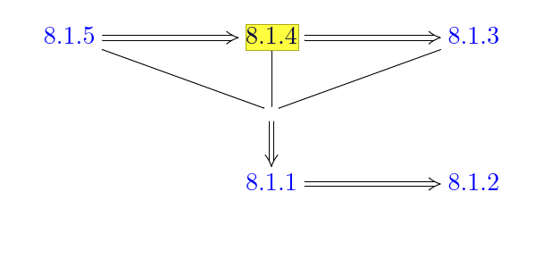

## Outline

- Prove Theorem 8.5.4 
- Prove the continuation principle that was used in Proposition 8.1.4

Outline of statements:

Set up notation:

- $z = s+it$
- $u$ is a solution to an equation (appearing below)
- $X$ is a vector field (time-dependent and periodic) on $\RR^{2n}$
- $X, J$ are smooth
- $C(u)$ the set of critical points $u$
- $R(u)$ the set of regular points of $u$

Theorem (8.5.4)
: $C(u)$ is discrete and $R(u) \injects \RR \cross S^1$ is open and dense.

Proposition (8.1.4, "Transversality Property")
:   \hfill 
    Define
    \begin{align*}
    \mathcal{Z}(x, y, J)\definedas 
    \left\{\left(u, H_{0}+h\right) | h \in \mathcal{C}_{\varepsilon}^{\infty}\left(H_{0}\right) \text { and } u \in \mathcal{M}(x, y, J, H)\right\}
    .\end{align*}
    If $(u, H_0 + h) \in \mathcal{Z}(x, y)$ then the following map admits a continuous right-inverse and is surjective:
    \begin{align*}
    \Gamma: W^{1, p}\left(\mathbb{R} \times S^{1} ; \mathbb{R}^{2 n}\right) \times \mathcal{C}_{\varepsilon}^{\infty}\left(H_{0}\right) & \longrightarrow L^{p}\left(\mathbb{R} \times S^{1} ; \mathbb{R}^{2 n}\right) \\
    (Y, h) & \longmapsto\left(d \mathcal{F}^{H_0 + h}\right)_{u}(Y)+\operatorname{grad}_{u} h
    \end{align*}

    where $\mcf^{H_0 + h}$ is the Floer operator corresponding to $H_+ h$.

    > Used to show (via the implicit function theorem) that $\mcz(x, y, J)$ is a Banach manifold when $x\neq y$.

Proposition (8.6.1, Transform to CR-equation on R2)
:   If $u$ is a solution to the following equation:
    \begin{align*}
    \frac{\partial u}{\partial s}+J(t, u)\left(\frac{\partial u}{\partial t}-X(t, u)\right)=0
    .\end{align*}

    Then there exist

    - An almost complex structure $J$
    - A diffeomorphism $\phi$ on $W$ ?
    - A map $v \in C^\infty(\RR^2; W)$

    satisfying

    - $\qty{\dd{}{s} + J \dd{}{t} }v = 0$ 
    
    - $v(s, t+1) = \varphi(v(s, t))$
    
    - $C(u) = C(v)$, i.e. $u, v$ have the same critical points
    
    - $R(u) = R(v)$.

Proof: short, include.

Lemma 8.6.2: The set of critical points of $v$ above is discrete.
Precisely: There exists a constant $\delta > 0$ such that $\qty{dv}_z \neq 0$ for any $0 << \abs{z} < \delta$.

Proof:
Postponed to p.264.

Definition:
Multiple points

Proposition 8.6.3: Injectivity result.
Let $v$ be a smooth $1\dash$periodic (in $t$) solution of the CR equation, i.e. $v(s, t+1) = \phi(v(s, t))$ for some smooth $\phi$ ? and $\dd{v}{s}{ \neq 0}$.
Then $R(v) \injects \RR^2$ is open and dense.

## Regular Points Are Open and Dense

Proof (BIG):

- Show $R(v)$ is open (easy)
- Show $R(v)$ is dense (delicate)

Long proof.

Lemma 8.6.4:
For every $r> 0$ there exists a $\delta >0$ such that 
\begin{align*}
\abs{t-t_0},~~\abs{s-s_0} < \delta \implies \exists s' \in B_r(s_j) \text{ s.t. } v(s, t) = v(s', t)
.\end{align*}

Proof: short.

Lemma 8.6.5:
Let $v_1, v_2$ be two solutions of the CR-equation with $X_t \equiv 0$ on $B_\eps(0)$, $v_1(0, 0) = v_2(0, 0)$ such that $\qty{dv_1}_0, \qty{dv_2}_0 \neq 0$.
Also suppose 
\begin{align*}
\forall \eps ~\exists \delta \text{ s.t. } \\
\forall (s, t) \in B_{\delta}(0), ~\exists s'\in \RR 
\begin{cases}
(s', t) \in B_\eps(0) \\
v_1(s, t) = v_2(s', t)
\end{cases}
.\end{align*}

Then 
\begin{align*}
\forall z\in B_\eps(0),\quad v_1(s, t) = v_2(s, t)
.\end{align*}

Take perturbed CR equation:
\begin{align*}
\frac{\partial Y}{\partial s}+J_{0} \frac{\partial Y}{\partial t}+S \cdot Y=0
.\end{align*}

Fix $S\in C^\infty(\RR^2; \endo(\RR^{2n}))$

Continuation Principle (8.6.6):
Let $Y$ be a solution to the perturbed CR equation on an open subset $U \subseteq \RR^2$, then the set
\begin{align*}
C \definedas \theset{(s, t) \in U \suchthat Y \text{ has an infinite order zero at } (s, t) }
\end{align*}
is clopen.
In particular, if $U$ is connected and $Y = 0$ on some nonempty $V \subset U$, then $Y\equiv 0$.

Lemma (Similarity Principle, used to prove continuation principle and 8.6.8):
Let $Y \in C^\infty(B_\eps; \CC^n)$ be a solution to the perturbed CR equation and let $p>2$.
Then there exists $0 < \delta < \eps$ and a map $A\in W^{1, p}(B_\delta, \gl(\RR^{2n}))$ and a holomorphic map $\sigma: B_\delta \to \CC^n$ such that 
\begin{align*}
\forall (s, t) \in B_\delta \quad Y(s, t) = A(s, t) ~ \sigma(s+it) \qtext{and} J_0 A)s, t) = A(s, t) J_0
.\end{align*}

Use continuation principle to finish proofs of many old theorems/lemmas.

Theorem (8.6.11, Essential property of $\bar \del$)
For every $p>1$, the following operator is surjective and Fredholm:
\begin{align*}
\bar\del: W^{1, p}\qty{S^2; \CC^n} \to L^p(\Lambda^{0, 1} T^* S^2 \tensor \CC^n)
.\end{align*}

Lead up to the proof of 8.1.5 in Section 8.7
