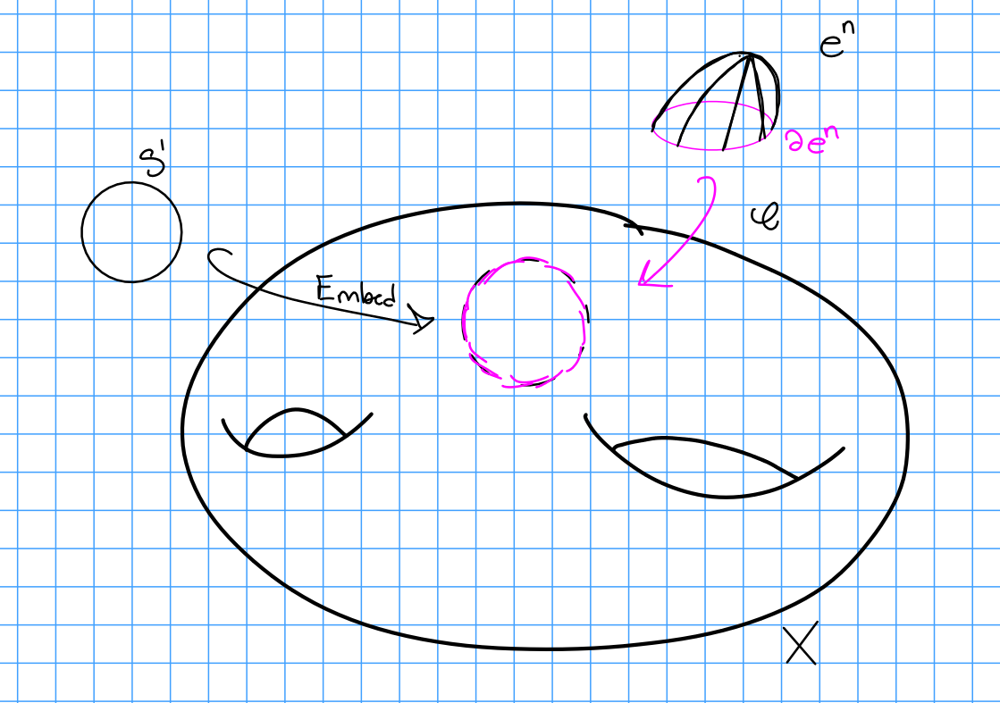

Topic: Weinstein Surgery and More

References:

- [Mike Usher's Notes](https://usherugamath.files.wordpress.com/2019/05/8230-s19.pdf)
- From Stein to Weinstein and Back (Cieliebak and Eliashberg)

# Motivation

**Theorem:** 
Every compact contact 3-manifold arises as a combination of (2 different variants of) Weinstein surgeries on $S^3$.

> Compare to theorem: every compact 3-manifold arises as surgery on a link.

**Theorem:** 
Weinstein surgery on a *loose Legendrian* knot yields an overtwisted contact structure.

> Compare: Every compact manifold is surgery on a link and admits a contact structure.

> However, not every compact 3-manifold admits a *fillable* contact structure -- need framing to be realizable as a *Legendrian* framing.

**Theorem:** 
Weinstein surgery along a loose Legendrian sphere yields an overtwisted contact manifold.

> Variants: "Contact -1 surgery" is where Liouville vector field points outward, and +1 is where it points inward.

# Definitions

**Definition (Hamiltonian)**:
A smooth function $H: M \to \RR$ will be referred to as an energy functional or a *Hamiltonian*.
If we have $H: M\cross I \to \RR$, we'll refer to this as a *time-dependent Hamiltonian*, i.e. the time slices $H_t: M \to \RR$ given by $H_t(p) = H(p, t)$ are Hamiltonians.

> *Remark:*
> If $(M, \omega)$ is a symplectic manifold, each $H_t: M \to I$ induces a unique vector field $X_{H_t}$ characterized by the property $\iota_{X_{H_t}}\omega = -dH_t$ where $\iota$ is the interior product.

**Definition (Symplectic Manifold):**
Recall that $M^{2n}$ is a **symplectic manifold** iff $W$ is smooth of even dimension and admits a 

- closed: $d\omega = 0$
- nondegenerate $\omega_p: T_p M \cross T_p M \to \RR$; $\omega_p(\vector v,\vector w) = 0~~\forall \vector w \implies \vector v= 0$.
- skew-symmetric: $\omega_p(\vector v, \vector w) = \omega_p(\vector w, \vector v)$. 
- bilinear: Lifts to a map $T_pM\tensor T_P M \to \RR$
- 2-form 
$$
\omega \in \Omega^2(M) = \Gamma^{\infty}(\bigwedge^2 T\dual M)
.$$ 

> *Motivation*: 
> There is Hamiltonian $H$ in the background, we want this to induce a vector field $V_H$ and thus a flow.

> Motivation for definitions: we want an "antisymmetric inner product".
>
> - *Closed:* 
  The lie derivative of $\omega$ along $V_H$ is 0, i.e. $\mathcal{L}_{V_H}(\omega) = 0$.
>
>  - *Nondegenerate:* 
    Implies that for every $dH$ there exists a vector field $V_H$ such that $dH = \omega(V_H, \wait)$.
>
> - *Skew-symmetry:*
    $H$ should be constant along flow lines, i.e. $dH(V_H) = \omega(V_H, V_H) = 0$
>
> - *Bilinear:*
    Send any form $\inner{\wait}{\wait}: V\times V \to k$ to the linear map $f: V \to V\dual$ where $f(v) = \inner{v}{\wait}$. If the pairing is nondegenerate, $\ker f = 0$, and we get an identification $V\cong V\dual$.

> **Important Remark**
> $\omega$ being nondegenerate can be combined with $\iota$ to obtain an isomorphism $\mathfrak{X}(M) \cong \Omega^1(M)$.
So we can freely trade 1-forms for vector fields. Very useful!

**Proposition:**
$(M, \omega \in \Omega^2(M))$ is symplectic iff $\omega^n \neq 0$ everywhere (c.f. Mike Hutchings).

**Corollary:**
Every symplectic manifold is orientable (since it has a nonvanishing volume form).

> **Important Remark:**
Symplectic structures on smooth manifolds give us a way to generate *flows* on a manifold (by defining a Hamiltonian or a symplectic vector field).

**Definition (Exact Symplectic Manifold):**
$W$ is an *exact* symplectic manifold iff there exists a 1-form $\lambda \in \Omega^1(W)$ such that $d\lambda \in \Omega^2(W)$ is non-degenerate.

> **Remark**:
> If $(W, \lambda)$ is exact symplectic then $(W, d\lambda)$ is symplectic.
> $\lambda$ is sometimes referred to as a *Liouville form*.

> **Important Remark:**
> If $(W, \lambda)$ is exact and $H: \RR \cross M \to \RR$ is smooth, then the *Hamiltonian flow* $\phi_H^t: M \to M$ is defined for all time and is an *exact symplectomorphism*.

**Definition (Liouville Vector Field):**
Let $(W, \lambda)$ be exact symplectic.
The Liouville vector field on $(W, \omega = d\lambda)$ is the (unique) vector field $X$ such that $\iota_x \omega = \lambda$.

> Remark:
> $X$ induces a flow $\psi^{X, t}$, and for any compact embedded surface $\Sigma_g \injects W$ we have
\begin{align*}
\psi^{X, t *} d \lambda&= e^{t} d \lambda \implies \\
\operatorname{Area}_{d \lambda}\left(\psi^{X, t}(S)\right)
&:=\int_{\psi^{X, t}(S)} d \lambda\\
&=\int_{S} (\psi^{X, t})^* d \lambda\\
&=e^{t} \operatorname{Area}_{d \lambda}(S)
\end{align*}
>
> This says that the flow lines of $X$ "dilate" the areas of surfaces at an exponential rate, or that $X$ is an "infinitesimal generator" of a canonical dilation..

> Remark:
> This is useful because even if $W$ isn't compact, we can obtain $W$ as the "limit" of compact submanifolds where we inflate along this flow.

**Definition (Contact Type):**
For $(W, \lambda)$ an exact symplectic manifold, a codimension 1 submanifold $Y \subset W$ is of *restricted contact-type* iff $X$ is transverse to $Y$, i.e. for every $p\in Y$, we have $X(p) \not\in T_p(Y)$.

We say $Y$ is of *contact type* iff there is a neighborhood $U \supset Y$ and a one-form $\lambda$ with $d\lambda = \restrictionof{\omega}{U}$ making $(U, \lambda)$ of restricted contact type.

> Remark:
>$(U, \lambda)$ is of restricted contact type iff $\restrictionof{\lambda}{U}$ is a contact form.

**Definition (Liouville Domain):**
$(W, \lambda)$ is a Liouville domain iff $W$ is a *compact* exact symplectic manifold with boundary such that the Liouville vector field $X$ points outwards on $\bd W$ transversally.

> Remark:
> This condition implies that $\bd W$ is a contact manifold with contact form $\alpha = \restrictionof{\lambda}{\bd W}$.

**Definition (Isotropic):**
Let $\Lambda$ be the image of an embedded sphere $S^k \to W$.
Then $\Lambda$ is *isotropic* iff $\restrictionof{\lambda}{\Lambda} = 0$.

**Definition (Weinstein Surgery):**
Let $(W, \lambda)$ be a Liouville domain (although we won't need compactness).

> Recall: $(W, \lambda)$ is a $2n\dash$dimensional exact symplectic manifold with contact-type boundary $\bd W$ such that the Liouville vector field $X$ points outwards along $\bd W$.

Weinstein surgery takes 

- $(W, \lambda)$ a $2n\dash$dimensional manifold
- That is exact and symplectic
- With contact-type boundary $\bd W$
- Where the Liouville vector field points outward along $\bd W$

and produces a distinct manifold $(W(\Lambda), \lambda')$ with the above properties which is obtained by surgery along $\Lambda$ an isotropic embedded sphere.
Thus $W(\Lambda)$ is obtained from attaching a $k\dash$handle to $W$ along $\Lambda$. 

## Aside on Surgery

Analogy: attaching cells in a CW complex.

Given $X$, we can form $\tilde X = X^n \disjoint_\phi e^n$ where $e^n \cong D^n$ is an $n\dash$cell and $\phi: S^{n-1} \to X$ is the characteristic/attaching map.

> Remark: Why $S^{n-1}$? Really it's $\bd e^n = \bd D^n = S^{n-1}$.

Problem:
This doesn't "see" the smooth structure, and CW complexes can have singular points (e.g. $S^2 = e^0 \disjoint e^2$.

Solution:
Use *tubular neighborhoods*, and only attach to boundaries.

**Definition (Normal Bundle):**
Let $i: S \injects M$ be an embedding, and let $N_M(S)$ denote the *normal bundle* of $S$ in $M$, which fits into an exact sequence
\begin{align*}
0 \to TS \to i^* TM \to N_M(S) \to 0
,\end{align*}

where $i*TM$ is the pullback:

\begin{tikzcd}
i^* TS \arrow[dd, dashed] \arrow[rr, dashed] &  & TM \arrow[dd] \\
                                             &  &               \\
S \arrow[rr, "i"]                            &  & M            
\end{tikzcd}

so we can identify $N_M(S) \cong \restrictionof{TM}{i(S)}/TS$.

> Remark: We can "symplectify" this definition by requiring that the pullback of $\omega$ is constant rank.

**Definition (Tubular Neighborhood):**
For $S\injects M$ an embedded submanifold, a *tubular neighborhood* of $S$ is an embedding of the total space of a vector bundle $