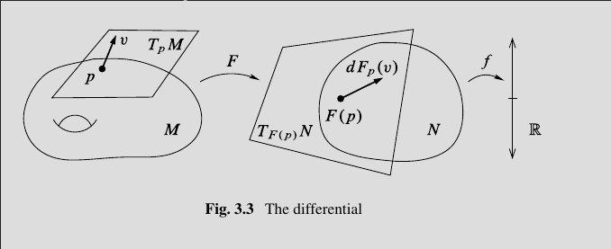
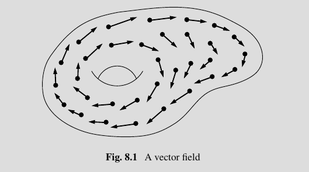
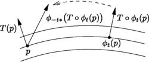

# General

**Definition (Derivative of a Map):**
Recall that for any smooth function $H: M\to N$, the *derivative* of $H$ at $p\in M$ is defined by $dH_p: T_pM \to T_p N$ which we define using the derivation definition of tangent vectors: given a derivation $v\in T_p M: C^\infty(M) \to \RR$, we send it to the derivation $w_v \in T_{q}M = C^\infty(M) \to \RR$ where $w_v$ actson on $f\in C^\infty(M)$ by precomposition, i.e. $w_v \actson f = v(f \circ H)$.

**Definition (Closed and Exact Forms):**
Let $d_p: \Omega^p(M) \to \Omega^{p+1}(M)$ be the exterior derivative. 
Then a form $\omega$ is *closed* (or is a *cocycle*) iff $\omega \in \ker d_p$, and *exact* (or a *coboundary*) iff $\omega \in \im d_{p-1}$.

Note that closed forms are exact, since $d^2  = 0$, i.e. $\omega$ closed implies $\omega = d\lambda$ implies $d\omega = d^2 \lambda = 0$ implies $\omega$ is exact.

If $\alpha, \beta \in \Omega^p(M)$ with $\alpha-\beta$ exact, they are said to be *cohomologous*.

**Definition (Vector Field):**
A *vector field* $X$ on $M$ is a section of the tangent bundle $TM \mapsvia{\pi} M$.
Recall that these form an algebra $\mathfrak{X}(M)$ under the Lie bracket.

Note that vector fields can be *time-dependent* as a section of $I\cross TM$.

**Definition (Flow):**
A *flow* is a group homomorphism $\RR \to \mathrm{Diff}(M)$ given by $t\mapsto \phi_t$.
Its integral curves are given by $\gamma_p: \RR \to M$ where $t\mapsto \phi_t(p)$.

Note that $X(p) \in T_pM$ is a tangent vector at each point, so we can ask that $\dd{\phi_t}{t} (p) = X(\phi_t(p))$

**Definition (Interior Product):**
Let $M$ be a manifold and $X$ a vector field.
The interior product is a map
\begin{align*}
\iota_X: \Omega^{p+1}(M) 	&\to \Omega^p(M) 	&& & \\
\omega 										&	\mapsto \iota_X \omega: \Lambda^p TM \to \RR \\
& (X_1, \cdots, X_p) \to \omega (\vector X, X_1, \cdots, X_p)
.\end{align*}

> Note that this *contracts* a vector field with a differential form, coming from a natural pairing on $(i, j)$ tensors $V^{\tensor i}\tensor (V\dual)^{\tensor j}$.

**Definition (Lie Derivative):**

**General definition**: 
For an arbitrary tensor field $T$ (a section of some tensor bundle $V \to TM^{\tensor n} \to M$, example: Riemann curvature tensor, or any differential form) and a vector field $X$ (a section of the tangent bundle $W \to TM \to M$), we can define a "derivative" of $T$ along $X$.
Namely, 
$$
(\mathcal{L}_X T)_p = \left[\dd{}{t} \qty{(\phi_{-t})_* T_{\phi_t(p)}} \right]_{t=0}
$$ 
where

- $\phi_t$ is the 1-parameter group of diffeomorphisms induced by the flow induced by $X$,
- $(\wait)_*$ is the pushforward

> This measures how a tensor field changes as we flow it along a vector field.

**Specialized definition**:
If $\omega \in \Omega^{p+1}(M)$ is a differential form, we define 
$$
\mathcal{L}_x\omega = [d, \iota_x] \omega = d(\iota_x \omega) - \iota_x(d\omega)
$$ 
where $d$ is the exterior product.

> This is a consequence of "Cartan's Magic Formula", not the actual definition!

# Symplectic

**Definition (Symplectic Vector Field)**:
A vector field $X$ is symplectic iff $\mathcal{L}_X(\omega) = 0$.

> Remark: Then the flow $\phi_X$ preserves the symplectic structure.

**Definition (Hamiltonian Vector Field)**:
If $X$ is a vector field and $\iota_X \omega$ is both closed and exact, then $X$ is a *Hamiltonian vector field*.

# Contact

**Definition (Overtwisted Contact Structure):**
$(M, \xi)$ is *overtwisted* iff there exists an embedded disc $D^n \mapsvia{i} M$ such that $T(\bd D^n)_p \subset \xi_p$ pointwise for all $p \in \bd D^n$ and $TD^n_p$ is transverse to $\xi$ for every $p\in  (D^n)^\circ$.