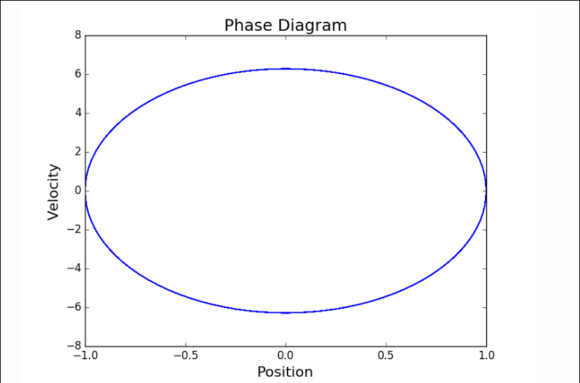

# Motivation

**Example (Hypersurfaces of contact type):**
The level sets of a Hamiltonian on $\RR^{2n} = \spanof_\RR\theset{\vector p, \vector q}$  given by $H  = K + U$ where $K = \frac 1 2 \norm{\vector p}^2$ and $U = U(\vector q)$ is a function of only $\vector q$.
(Usually kinetic + potential energy.)

> Remark: all hypersurfaces of contact type $(X, \omega)$ look locally like $X \injects \mathrm{Sp}(X)$, i.e. $X$ embedded into its symplectification.

Basic Questions: 

- Basic question: when does the flow of a vector field admit a *periodic orbit*?
- Does every/any vector field on a smooth manifold $M$ admit a closed orbit?
  - Corollary: does every/any vector field on $M$ admit a fixed point?
  - Note that if $\chi(M) \neq 0$, the Poincare-Hopf index theorem forces every vector field to have a fixed point.
- Does every vector field on $S^3$ admit a closed orbit?
  - Answer: no, very difficult to show, but turns out to hold for all 3-manifolds.

> *Remark*:
> The orbit of a Hamiltonian flow is contained in a single level set.

Example: Simple Harmonic Oscillator.

- $K = \frac 1 2 mv^2 = \frac{p^2}{2m}$ where $p=mv$ is the momentum, given by $F = ma$
- $U = \frac 1 2 kx^2$, given by Hooke's law
- $H(x, p) = U + K = \frac 1 2 mv^2 = \frac{p^2}{2m} + \frac 1 2 kx^2 \sim p^2 + x^2$
- Has "phase space" $\Phi = \RR^2 = \spanof_\RR\theset{x, p}$, i.e. a position and momentum completely characterize the system at any fixed time.
- Conservation of energy shows that the time evolution of the system is governed by $\dd{x}{t} = -\dd{H}{p}$ and $\dd{p}{t} = \dd{H}{x}$
  - Corresponds to a path $\gamma: \RR \to \Phi$ along which $H$ is constant, i.e. a constant energy hypersurface corresponding (roughly) to $p^2 + q^2 = \mathrm{const}$

	

	- If the Hamiltonian evolved over time, this region would travel around phases space, with the *volume* of this region invariant.

**Definition (Reeb flow):**

**Definition (Reeb vector field):**

