# Dave's Videos

- Historic note: Morse wanted to know not the diffeomorphism type of $M$, but rather the homotopy type.

- Definition: critical values and critical points

- Definition: indices of critical points

- Definition:

- Theorem (Smale, h-cobordism)
  - If $X^n$ is a smooth cobordism, $n\geq 6$, $\pi_1(X) = 0$, and $X$ "looks like" a product in algebraic topology, then $X$ is a product cobordism.

- Corollary (High-Dim Poincare)
  - If $X_1^n, X_2^n \cong_{\diff} S^n$, then there exists an $h\dash$cobordism between them.
  - Proof: use algebraic topology to eliminate (cancel) critical points.

- Definition: Morse function and index
  - Look at coordinate-free def?
  - Standard form at critical points
  - Alternatively: Hessian is non-singular at every critical point.
  - $f\inv\bd Y) = \bd X$

- Definition: Stable and generic

- Definition: cobordism
  - Example: (pair of pants)
  - Category: Objects are manifolds, morphisms are cobordisms between them

- Theorem: Every compact manifold has a Morse function.

- Theorem: Morse functions are generic (given any smooth function $f: X\to Y$, there's an arbitrarily small perturbation of $f$ that is Morse).

- Theorem (Morse Lemma): If $p\in \RR^n$ is a critical point of $f: \RR^n \to \RR$ such that the Hessian $H_f(p)$ is a non-degenerate bilinear form, then $f$ is locally Morse (standard form).

  - Moreover, after diagonalizing $H_f$, the index is given by the difference in the numbers of positive/negatives on the diagonal.

- Theorem: If $(W; M_0, M_1) \to I$ is Morse with no critical points then $W \cong_{\text{Diff}} I \cross M_0$

  - Consequence: $M_0 \cong_{\text{Diff}} M_1$ is a diffeomorphism, useful to show two things are diffeomorphic, used in higher-dimensional Poincare.

  - Recall that this is proved by constructing a vector field $V$ on $W$, then using a diffeo $\phi:I \cross M_0 \to W$ by flowing along $V$.

  - Say something about gradient flow in the case of a Riemannian metric?

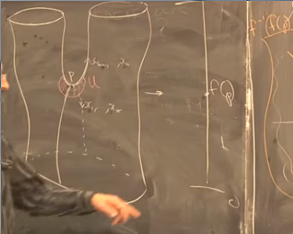\

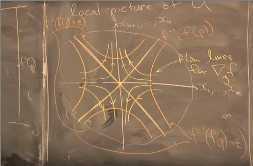\

[Video of conformal flows](https://youtu.be/mIUi1zIUQJw?t=42)

[Gradient Descent](https://youtu.be/vWFjqgb-ylQ?t=5)

- Theorem: If $X$ is closed and admits a Morse function with exactly 2 critical points, $X$ is homeomorphic to $S^n$.
  - Possibly used in Milnor's exotic 7-sphere (show a diffeomorphism invariant differs but admits such a Morse function)
- Diffeomorphism type depends on isotopy classes of attaching maps.

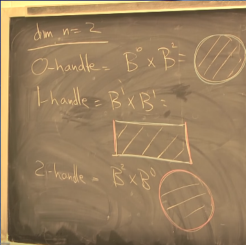

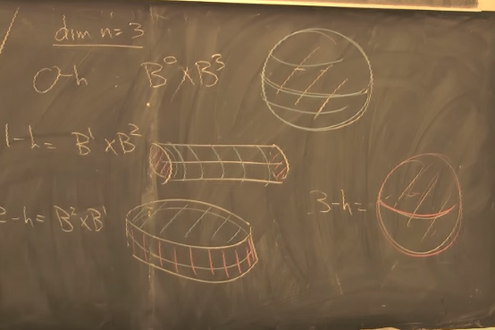

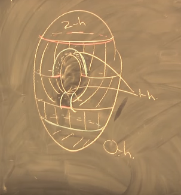

# Intro Video
[Link](https://www.youtube.com/watch?v=78OMJ8JKDqI)

Morse theory: handles nice singularities. Can have worse ones, covered by *catastrophe theory* (dynamical systems).

Fact: $M$ is homotopy equivalent to a CW complex with one cell of dimension $k$ for each critical point of $f$ of index $k$.

Index: number of linearly independent direction you can move for which the function *decreases*.

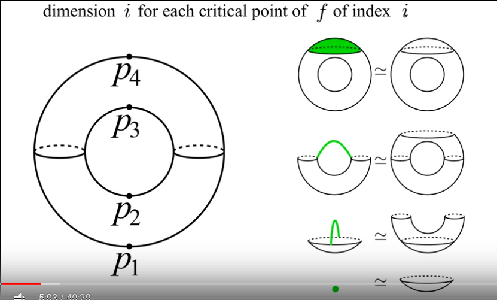\

Importance of CW complexes: triangulations of surfaces.

Morse Lemma: nondegenerate critical points have standard forms $\sum \pm x_i^2$, so the index is well-defined.

Morse Theorem 1:
If there are no critical points, $M_A \homotopic M_B$.

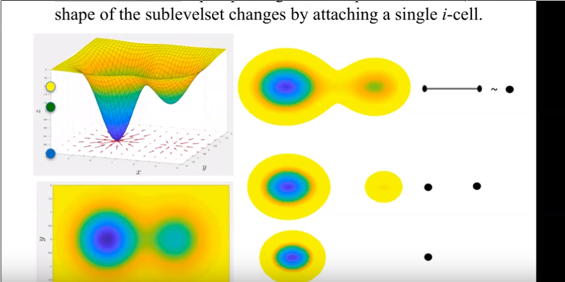\

Stable vs unstable:
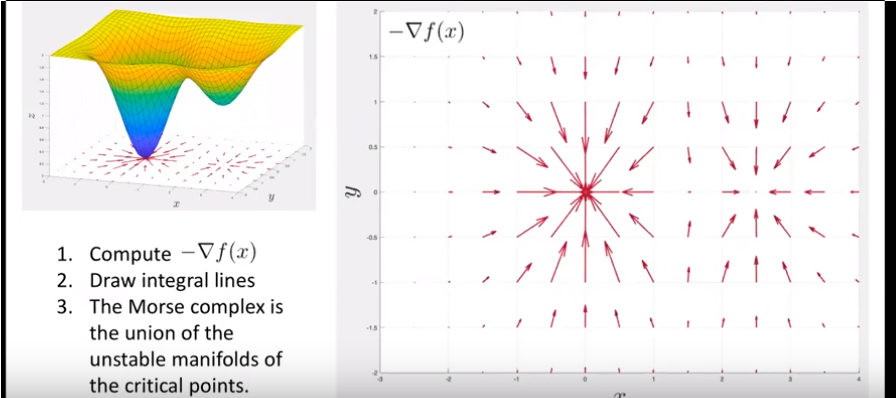\

Consider height function on torus.
Circles are index 0 critical points, triangle is index 1.
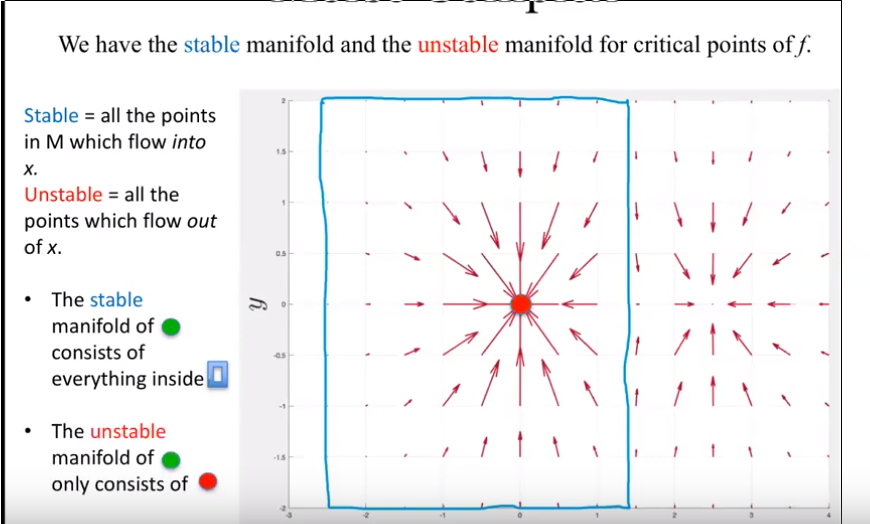\

\

Cancellation:
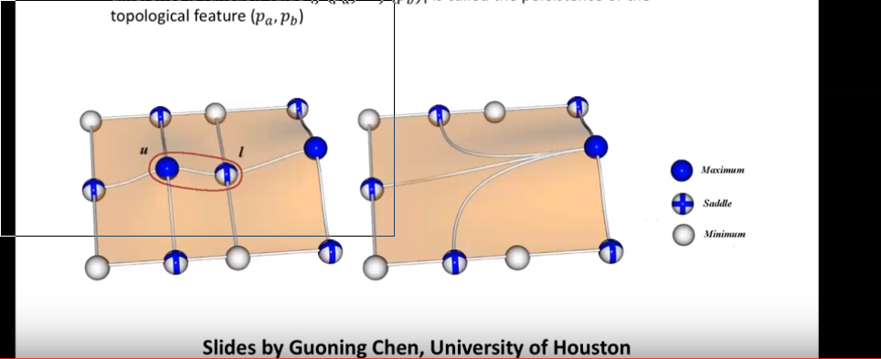\

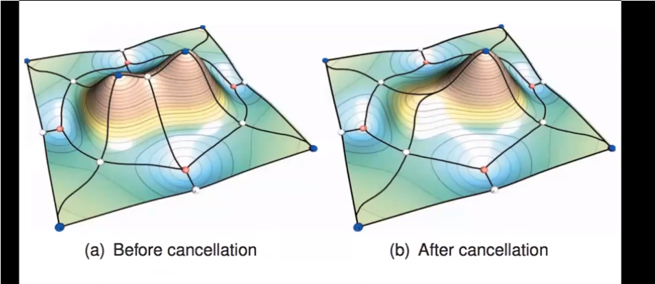

Can use persistent homology to measure "importance" of critical points.

# Stein to Weinstein

## Stein

Moral: rigid, complex-analytic.

**Definition (a)**:
$M^{2n}$ complex-analytic, *properly embedded* in some $\CC^N$ (biholomorphically, can take $N = 2n+1$) such that complex structure is inherited from ambient space.

> Note: *properly embedded* here seems to mean $f:X\to Y$ where $f(\bd X)=f(X) \intersect \bd Y$ and $f(X) \transverse \bd Y$.

**Examples**:

- Any complex projective manifold $X\subset \CP^N$,
  - I.e. a manifold that is a projective variety; locus of polynomial equations in $\PP^n_\CC$.
  - Any algebraic variety over $k = \CC$ is (essentially) birationally equivalent to such a manifold.

- Any connected non-compact Riemann surface (or closed with a puncture).

- Any smooth compact $2n$ dimensional manifold with $n>2$ and handles of index $\leq n$.
  - $n=2$ case works with modification
  - Every smooth $4$ manifold admits a bisection into two Stein 4-manifolds.

**Why useful**:
- Supposed to be an analog of affine varieties (as per Wikipedia, but should probably be quasi-projective).
- Every Stein manifold is Kahler (compatible complex + Riemannian + symplectic structures), large class interesting to AG
- Amenable to Hodge Theory
- Homotopy types of CW complexes (admits a homotopy equivalence, as do all manifolds)

**Definition (b)**:

Consider $(M^{2n}, J_$ where $M$ is a complex manifold and $J$ the structure of complex multiplication on $T_p M$.

- Pick a smooth functional $\phi:M\to \RR$
- Associate the 1-form $d^\CC \phi \definedas d\phi \circ J$.
- Associate the 2-form $\omega_\phi \definedas -dd^\CC \phi$.
- Suppose $\phi$ is $J\dash$convex if the function $g_\phi(v, w) \definedas \omega_\phi(v, Jw)$ defines a Riemannian metric
- Then $\omega_\phi$ is a symplectic form compatible with $J$, i.e. $H_\phi \definedas g_\phi - i\omega_\phi$ is a Hermitian metric
- Suppose $\phi$ is *exhausting*, i.e. preimages of compact sets are compact and $\phi$ is bounded from below (?)

> Note on exhausting J-convex functions: origins seem to be in analysis of multiple complex variables. In nicest cases, boils down to the "Levi matrix" (analog of Hessian for $\del, \bar \del$) is positive semidefinite. This is an equivalent condition.

> The subspace of J-convex functions in $C^\infty(M, \RR)$ is open and contractible, so well-approximated by Morse functions (and the bigger class of *generalized Morse functions*: nondegenerate, restricted critical points).

Theorem (Grauert, Bishop-Narasimhan)
: $M$ is Stein iff it fits this description.

Theorem
: If $n=2$, $M$ admits a Morse function $f$ such that away from critical points, taking complex tangencies at the preimages $M_c\definedas f\inv(c)$ yield contact structures inducing orientations on $M_x$ agreeing with the induced boundary orientation on $f\inv(-\infty, c)$.

> A type of filling? Etnyre seems to work on this kind of thing.

## Weinstein

Moral: flexible, symplectic object.

**Definition**
A Weinstein manifold is the data of

- $M^{2n}$ a smooth manifold,
- $\omega$ a symplectic form,
- $\phi: M\to \RR$ an exhausting generalized Morse function
- $\xi$ a complete Liouville vector field which is gradient-like for $\phi$.

Subdefinitions:

- Exhausting: proper and bounded from below
- Generalized Morse function: non-degenerate critical points of only birth-death type
- Liouville: $\mathcal L_X \omega = \omega$, i.e. the Lie derivative preserves the symplectic form.
  - Recall
  $$
  \mathcal L: \Gamma(TM)\cross \Gamma(TM^{\tensor k}) \to \Gamma(TM^{\tensor k}) \quad \mathcal (\xi, E) \mapsto \mathcal L_\xi(E)
  $$ acts on vector fields and arbitrary tensor fields, in particular alternating tensor fields, i.e. $n\dash$forms.
  - Measures change of a tensor field wrt a vector field, giving a new tensor field. Reduces to lie bracket when $k=1$.
- Complete: flow curves of $\xi$ exist for all time.

[Flow Curves](figures/2020-03-31-18:35.png)\

## Stein to Weinstein

## Weinstein to Stein

## Questions

Do these structures satisfy an h-principle?

The main theorem:

Theorem (1.5, Stein Existence)
: ?

