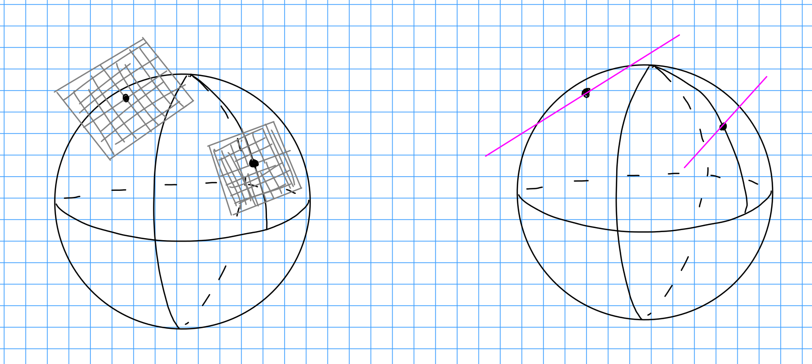
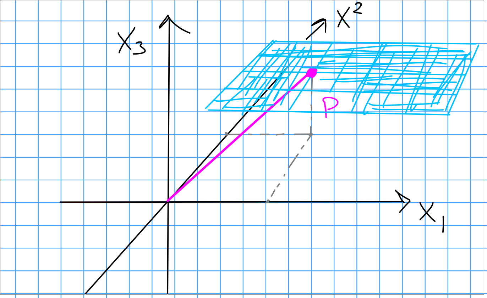
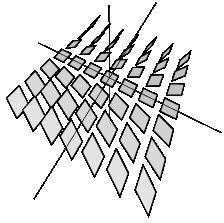
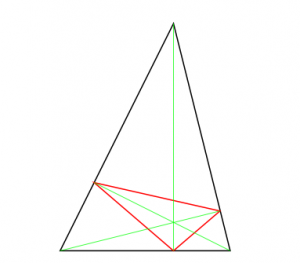

Convention: 
All manifolds discussed will be smooth, real, Hausdorff, second-countable, connected, not necessarily closed/compact, possibly with boundary.

Goal #1:
Understand foliations and their relation to contact structures.

Recall the geometric definition of the tangent bundle $TM = \disjoint_{p\in M} T_pM$, which fits into the vector bundle $\RR^n \to TM \to M$ so $T_p M \cong \RR^n$.
Recall that $T_p M = \spanof_\RR\theset{\partial x_i}$

Since $T_p M$ is a vector space, we can consider its dual $T_p\dual M$, and similarly the cotangent bundle $\RR^n \to T\dual M \to M$.
Recall that $T_p\dual M = \spanof_\RR\theset{dx_i}$.

Recall that a section of $TM$ is a vector field, and a section of $T\dual M$ is a 1-form.
More generally, differential $k\dash$forms are given by elements of $\Omega^k(M) \definedas \Gamma(\Lambda^k T\dual M)$, i.e. sections of exterior powers of the cotangent bundle.

Definition:
A *hyperplane* field $\xi$ is a codimension 1 sub-bundle $\RR^{n-1} \to \xi \to M$ of the tangent bundle $\RR^n \to TM \to M$.

Example:
Take $M=S^2$, so we have $\RR^2 \to TS^2 \to S^2$.
The tangent spaces are planes, and codimension 1 spaces are lines:

Example:
Let $M = \RR^3$ so $TM \cong \RR^3$. 
Write $T_pM = \spanof_\RR\theset{\partial x_1, \partial x_2, \partial x_3}$ and $T_p\dual M = \spanof_\RR\theset{dx_1, dx_2, dx_3}$ locally and define $\xi$ by the condition $dx_3 = 0$.

Idea: no movement in the $x_3$ direction, constrained to move only in $x_1, x_2$ directions. Assigns a "horizontal" hyperplane to each point in $\RR^3$.

> Note: want to show that this lifts to a differential 1-form on $M$, but how can it be written?

Note that this is the kernel of a tangent covector at every point, thus the kernel of a section of the cotangent bundle -- i.e. a 1-form. This is a prototypical feature.

Example:
For $M=\RR^3$, write $T\dual \RR^3 = \spanof_\RR\theset{dx, dy, dz}$, and take $\omega = dz + xdy \in \Omega^1(\RR^3)$.
This is the "standard contact structure" on $\RR^3$, and assigns hyperplanes that look like this:

Note that this has a more twisted structure, which is what geometrically makes it contact -- no embedded (hyper) surface in $\RR^3$ can have an open subset $U$ such that $\xi$ is tangent to $p$ for every $p\in U$.

These are important because of their ties to *foliations*.

Definition (Foliation):
A *foliation* on $M$ is a hyperplane field $\xi$ satisfying one of two equivalent conditions:

1. A family of embedded surfaces $\Sigma_i \injects M$ such that $M = \disjoint_i \Sigma_i$ uniquely.
2. $\xi$ is locally diffeomorphic to the horizontal hyperplane field $dx_n = 0$.

> Note: the foliation is usually referred to by the collection $\Sigma_i$.

Example:
As in example 1, take $\RR^3 = \disjoint_{t\in \RR} ~t + H_{xy}$ where $H_{xy} = \theset{(x,y,z) \in \RR^3 \suchthat z=0}$ is the $xy\dash$plane and $t+ H_{xy} = \theset{(x,y,z) \in \RR^3 \suchthat t = z}$ are the vertical translates.

General open problem:
Does every triangular billiards admit a periodic orbit?

Answer (1775): Yes for acute triangles:

For arbitrary triangles: unknown!

Historically, the study of periodic orbits motivated the definition on contact structures.

Theorem:
Every contact-type hypersurface in the symplectic manifold $(\RR^{2n}, \omega)$ contains a periodic orbit.

