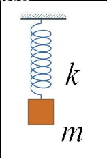
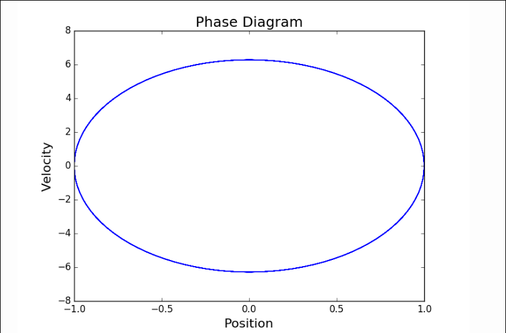

# Motivation

**Example (Hypersurfaces of contact type):**
The level sets of a Hamiltonian on $\RR^{2n} = \spanof_\RR\theset{\vector p, \vector q}$  given by $H  = K + U$ where $K = \frac 1 2 \norm{\vector p}^2$ and $U = U(\vector q)$ is a function of only $\vector q$.
(Usually kinetic + potential energy.)

> Remark: all hypersurfaces of contact type $(X, \omega)$ look locally like $X \injects \mathrm{Sp}(X)$, i.e. $X$ embedded into its symplectification.

Basic Questions: 

- Basic question: when does the flow of a vector field admit a *periodic orbit*?
- Does every/any vector field on a smooth manifold $M$ admit a closed orbit?
  - Corollary: does every/any vector field on $M$ admit a fixed point?
  - Note that if $\chi(M) \neq 0$, the Poincare-Hopf index theorem forces every vector field to have a fixed point.
- Does every vector field on $S^3$ admit a closed orbit?
  - Answer: no, very difficult to show, but turns out to hold for all 3-manifolds.

> *Remark*:
> The orbit of a Hamiltonian flow is contained in a single level set.

Example: Simple Harmonic Oscillator.

- $K = \frac 1 2 mv^2 = \frac{p^2}{2m}$ where $p=mv$ is the momentum, given by $F = ma$
- $U = \frac 1 2 kx^2$, given by Hooke's law
- $H(x, p) = U + K = \frac 1 2 mv^2 = \frac{p^2}{2m} + \frac 1 2 kx^2 \sim p^2 + x^2$
- Has "phase space" $\Phi = \RR^2 = \spanof_\RR\theset{x, p}$, i.e. a position and momentum completely characterize the system at any fixed time.
- Conservation of energy shows that the time evolution of the system is governed by $\dd{x}{t} = -\dd{H}{p}$ and $\dd{p}{t} = \dd{H}{x}$
  - Corresponds to a path $\gamma: \RR \to \Phi$ along which $H$ is constant, i.e. a constant energy hypersurface corresponding (roughly) to $p^2 + q^2 = \mathrm{const}$

	

	- If the Hamiltonian evolved over time, this region would travel around phases space, with the *volume* of this region invariant.

Definition: Hamiltonian flow.

**Definition (Reeb flow):**

**Definition (Reeb vector field):**

**Theorem:**
A Liouville vector field $X$ satisfies $\mathcal{L}_X \omega = \omega$, where $\mathcal{L}_X$ is the Lie Derivative.

*Proof:*
\begin{align*}
\mathcal{L}_X \omega = [d, \iota_X] \omega = \iota_X(d\omega) + d(\iota_x \omega) = \iota_x(d\omega) + d\lambda = \iota_X(0) + d\lambda = d\lambda = \omega
.\end{align*}

> Use the fact that $\omega$ is closed, so $d\omega = 0$.

$\qed$

*Corollary:*
The induced flow $\phi_t$ satisfies $\phi_t^* \omega = e^t \omega$.

**Theorem:**
There are no closed (compact and boundaryless) exact symplectic manifolds.

*Proof:*
\begin{align*}
\int_{\bd M} \lambda \wedge \omega^{n-1} 
&= \int_M d(\lambda \wedge \omega^{n-1}) \\ 
&= \int_M d\lambda \wedge \omega^{n-1} + (-1)^{\abs \lambda}\lambda\wedge d\omega^{n-1} \\
&= \int_M \omega \wedge \omega^{n-1} + (-1)^{\abs\lambda} \lambda \wedge 0 \\
&= \int_M \omega^n \\
&= \mathrm{Vol}_{\text{Sp}}(M) \\
&> 0
,\end{align*}

so $\bd M \neq 0$, and thus $M$ can not be closed.

## Big Theorems

For regular values (pullback to points $p$ where the induced map on $T_pM$ is surjective) $r\in \RR$ of the  Hamiltonian, $H\inv(r) \subset M$ is a submanifold of $M$ with a smooth vector field $X_H$ called a "regular level set" $Y$. 
Does $X_H$ have a closed orbit on every regular level set?

What conditions do you need to guarantee the existence of a closed orbit?
Turns out not to depend on $H$, and only on the hypersurface $Y$.
The existence of a closed orbit is equivalent to the existence of a closed embedded curve $\gamma$ that is everywhere tangent to $\ker(\restrictionof{\omega}{Y})$.

When is such a curve guaranteed to exist?
Theorem (Weinstein, 1972): If $Y$ is convex.
Theorem (Rabinowitz) If $Y$ is "star-shaped" (exists a point $p$ that can "see" all points via straight lines)

**Theorem (1987):**
Every contact-type hypersurface in the symplectic manifold $(\RR^{2n}, \omega)$ contains a periodic orbit.

**Conjecture (Weinstein, 1978):**
Let $(M, \xi)$ be a closed (compact) contact manifold with a Reeb vector field $X$ and $H^1(M; \RR) = 0$. Then $X$ admits a periodic orbit.

**Theorem (Weinstein, Dimension 3, Overtwisted. 1993):**
Let $(M, \lambda, \xi)$ be a closed contact 3-manifold where $\lambda$ is overtwisted. 
Then the Reeb vector field $X$ admits a periodic orbit.

