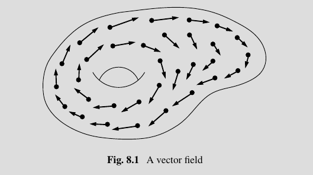

# Motivation

Basic question: when does the flow of a vector field admit a *periodic orbit*?

Definition: Contact form.
A 1-form $\lambda$ such that $\lambda \wedge (d\lambda)^n  > 0$.

> Note that $\lambda \wedge (d\lambda)^n = 0$ defines a foliation?

Definition: Hypersurface of contact type
For $(X, \omega)$ a symplectic manifold, a hypersurface $\Sigma \injects X$ is of *contact-type* iff there is a contact form $\lambda$ such that $d\lambda = \restrictionof{\omega}{Y}$.

Example:
The level sets of a Hamiltonian on $\RR^{2n} = \spanof_\RR\theset{\vector p, \vector q}$  given by $H  = K + U$ where $K = \frac 1 2 \norm{\vector p}^2$ and $U = U(\vector q)$ is a function of only $\vector q$.
(Usually kinetic + potential energy.)

> Remark: all hypersurfaces of contact type $(X, \omega)$ look locally like $X \injects \mathrm{Sp}(X)$, i.e. $X$ embedded into its symplectification.

Definition:
A *vector field* $X$ on $M$ is a section of the tangent bundle $TM \mapsvia{\pi} M$, i.e. a continuous map $X: M \to TM$.

Definition:
An *closed orbit* of a vector field $X$ on $M$ is an element in the loop space $\gamma \in \Omega M$ (equivalently a map $\gamma: S^1 \to M$) satisfying the ODE $\dd{\gamma}{t}(t) = X(\gamma(t))$.

> In words: the ODE says that the tangent vector at every point along the loop $\gamma$ should precisely be the tangent vector that the vector field $X$ prescribes at that point.

> Note: Every fixed point of $X$ is trivially a closed orbit.

Basic Questions: 

- Does every/any vector field on a smooth manifold $M$ admit a closed orbit?
  - Corollary: does every/any vector field on $M$ admit a fixed point?
  - Note that if $\chi(M) \neq 0$, the Poincare-Hopf index theorem forces every vector field to have a fixed point.
- Does every vector field on $S^3$ admit a closed orbit?
  - Answer: no, very difficult to show, but turns out to hold for all 3-manifolds.

Remark:
The orbit of a Hamiltonian flow is contained in a single level set.

Definition: Symplectic manifold
$(M, \omega \in \Omega^2(M))$ is symplectic iff $\omega^n \neq 0$ everywhere.

> Why care about symplectic forms? 
> They induce an isomorphism $TM \cong T\dual M$, which allows us to moved between vector fields and 1-forms.
> MOST IMPORTANTLY: for any smooth functional $f: M \to \RR$, we can associate to it a vector field $X_f$.

Definition: Hamiltonian vector field.
Given a smooth functional $H: (M, \omega) \to \RR$, the associated *Hamiltonian vector field* is the unique field $X_H$ satisfying $\omega(X_H, \wait) = dH$.

Consequence: Conservation of energy
Since $\omega$ is alternating,
\begin{align*}
X_H(H) = dH(X_H) = \omega(X_H, X_H) = 0
.\end{align*}

Example: Simple Harmonic Oscillator.

- $K = \frac 1 2 mv^2 = \frac{p^2}{2m}$ where $p=mv$ is the momentum, given by $F = ma$
- $U = \frac 1 2 kx^2$, given by Hooke's law
- $H(x, p) = U + K = \frac 1 2 mv^2 = \frac{p^2}{2m} + \frac 1 2 kx^2 \sim p^2 + x^2$
- Has "phase space" $\Phi = \RR^2 = \spanof_\RR\theset{x, p}$, i.e. a position and momentum completely characterize the system at any fixed time.
- Conservation of energy shows that the time evolution of the system is governed by $\dd{x}{t} = -\dd{H}{p}$ and $\dd{p}{t} = \dd{H}{x}$
  - Corresponds to a path $\gamma: \RR \to \Phi$ along which $H$ is constant, i.e. a constant energy hypersurface corresponding (roughly) to $p^2 + q^2 = \mathrm{const}$

	

	- If the Hamiltonian evolved over time, this region would travel around phases space, with the *volume* of this region invariant.

Definition: Hamiltonian flow.

Definition: Reeb flow.

Definition: Reeb vector field.

Definition: Liouville vector field
A vector field $X$ such that $

## Big Theorems

For regular values (pullback to points $p$ where the induced map on $T_pM$ is surjective) $r\in \RR$ of the  Hamiltonian, $H\inv(r) \subset M$ is a submanifold of $M$ with a smooth vector field $X_H$ called a "regular level set" $Y$. 
Does $X_H$ have a closed orbit on every regular level set?

What conditions do you need to guarantee the existence of a closed orbit?
Turns out not to depend on $H$, and only on the hypersurface $Y$.
The existence of a closed orbit is equivalent to the existence of a closed embedded curve $\gamma$ that is everywhere tangent to $\ker(\restrictionof{\omega}{Y})$.

When is such a curve guaranteed to exist?
Theorem (Weinstein, 1972): If $Y$ is convex.
Theorem (Rabinowitz) If $Y$ is "star-shaped" (exists a point $p$ that can "see" all points via straight lines)

**Theorem (1987):**
Every contact-type hypersurface in the symplectic manifold $(\RR^{2n}, \omega)$ contains a periodic orbit.

**Conjecture (Weinstein, 1978):**
Let $(M, \xi)$ be a closed (compact) contact manifold with a Reeb vector field $X$ and $H^1(M; \RR) = 0$. Then $X$ admits a periodic orbit.

**Theorem (Weinstein, Dimension 3, Overtwisted. 1993):**
Let $(M, \lambda, \xi)$ be a closed contact 3-manifold where $\lambda$ is overtwisted. 
Then the Reeb vector field $X$ admits a periodic orbit.

**Definition:**
$(M, \xi)$ is *overtwisted* iff there exists an embedded disc $D^n \mapsvia{i} M$ such that $T(\bd D^n)_p \subset \xi_p$ pointwise for all $p \in \bd D^n$ and $TD^n_p$ is transverse to $\xi$ for every $p\in  (D^n)^\circ$.

