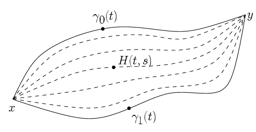
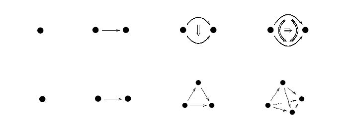
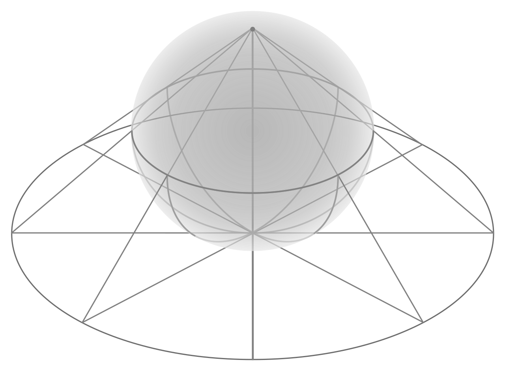
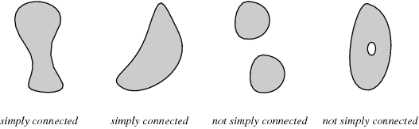
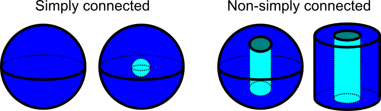
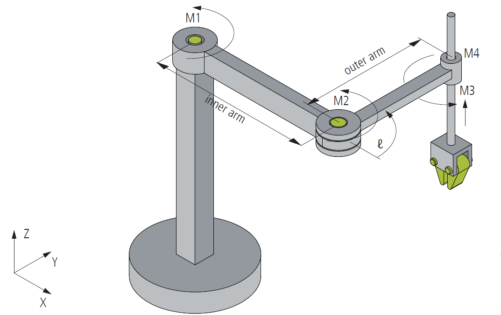
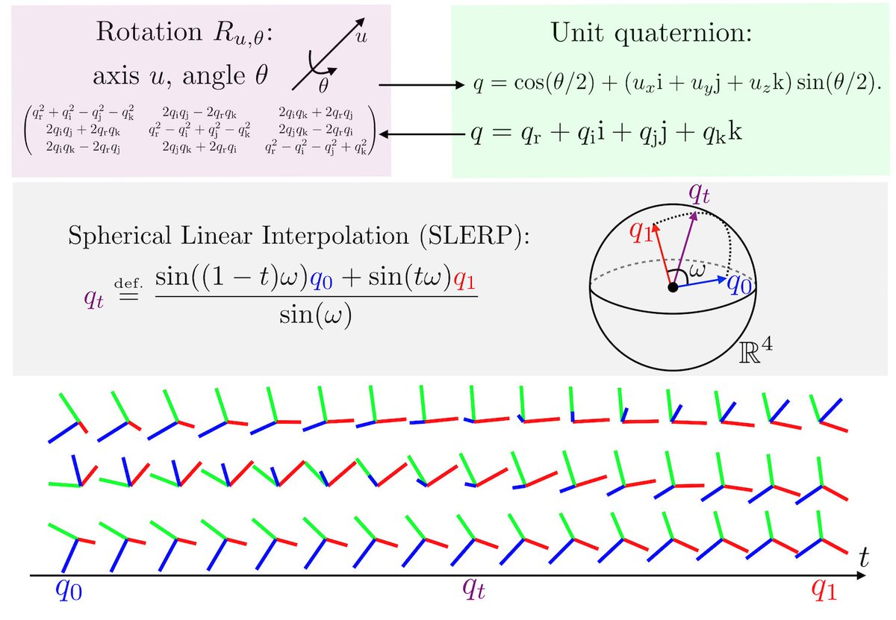

# Big Points

- Homotopy as a means of classification somewhere between homeomorphism and cobordism
- Comparison to homology
- Higher homotopy groups of spheres exist
- Homotopy groups of spheres govern gluing of CW complexes
- CW complexes fully capture that homotopy category of spaces
- There are concrete topological constructions of many important algebraic operations at the level of spaces (quotients, tensor products)
- Relation to framed cobordism?
- "Measuring stick" for current tools, similar to special values of L-functions
- Serre's computation

# History

- 1860s-1890s: (Roughly) defined by Jordan for complex integration, "combinatorial topology"
  - Original motivation: when does a path integral depend on a specific path? (E.g. a contour integral in $\CC$)
- 1895: Poincare, *Analysis situs* ("the analysis of position") in analogy to Euler *Geometria situs* in 1865 on the Kongisberg bridge problem
    Attempts to study spaces arising from gluing polygons, polyhedra, etc (surfaces!), first use of "algebraic invariant theory" for spaces by introducing $\pi_1$ and homology.
- 1920s: Rigorous proof of classification of surfaces (Klein, Möbius, Clifford, Dehn, Heegard), captured entirely by $\pi_1$ (equivalently, by genus and orientability).
- 1925-1928: Noether, Mayer, Vietoris develop general algebraic theory of homology, now "algebraic topology"
- 1931: Hopf discovers a nontrivial (not homotopic to identity) map $S^3 \to S^2$
  - Compare to homology: $H^k S^n = 0$ for $k\geq n$ is an easy theorem!
- 1932/1935: Cech (resp Hurewicz) introduce higher homotopy groups, gives a map relating homotopy to homology, shows they are abelian groups for $n\geq 2$.
  - Withdrew his paper because of this theorem!
- 1937: Freudenthal suspension theorem, investigation into "stable" phenomena.
- 1938: Pontrayagin shows link between homotopy groups of spheres and framed cobordism classes of submanifolds of $S^n$.
  - Direction of computation: using cobordism classes (geometric) to compute $\pi_k S^n$. Modern day: run the computation backwards to compute cobordism groups.
- 1940: Eilenberg, obstruction theory
- 1949: Whitehead introduces homotopy types, CW complexes, equivalences = weak equivalences. Importance of homotopy classes of maps between spheres becomes apparent
- 1951: Serre uses spectral sequences to show that *all* groups $\pi_k S^n$ are torsion except $k=n$, and $k\equiv 3\mod 4, n\equiv 0 \mod 2$.
  - In first case, $\ZZ$, in second case, $\ZZ \oplus T$ for some torsion group.
  - Tight bounds on where $p\dash$torsion can occur.
- 1953: Whitehead shows the homotopy groups of spheres split into stable and unstable ranges. 
- Today: We know $\pi_{n+k}S^n$ for 
  - $k \leq 64$ when $n\geq k+2$ (stable range)
  - $k \leq 19$ when $n < k+2$ (unstable range) 
  - We *only* have a complete list for $S^0$ and $S^1$, and know *no* patterns beyond this!

# Actual Outline

- Definitions of spheres and balls
- Definition of homotopy of maps
  - Motivations from complex analysis
- Functoriality 
- Examples of spaces that are homotopy equivalent and *aren't*.
- Example where homotopy distinguishes homologically equivalent spaces

# Images

[Hopf Fibration Visualizer](http://philogb.github.io/page/hopf/#)

A bundle

<!--\begin{center}-->
<!--\begin{tikzcd}-->
<!--S_1 \ar[r] & S^3\ar[d] \\-->
<!--& S^1-->
<!--\end{tikzcd}-->
<!--\end{center}-->

Visualization: the same way $S^2\setminus\pt \to \RR^2$ via stereographic projection, we take $S^3\setminus\pt \to \RR^3$.
Realizes $S^3$ as a family of circles parameterized by a 2-sphere, fiber above each point is a circle.

# Application: SO3

Application: $\pi_1(\SO(n, \RR)$, the lie group of rigid rotations in 3-space.
The fibration $\SO(n, \RR) \to \SO(n+1, \RR) \to S^n$ yields a LES in homotopy:
\begin{center}
\begin{tikzcd}
\pi_2 (SO(n, \RR)) \ar[r] &
\pi_2 (SO(n, \RR)) \ar[r] &
\pi_2 (S^n) \ar[dll] \\
\pi_1 (SO(n, \RR)) \ar[r] &
\pi_1 (SO(n, \RR)) \ar[r] &
\pi_1(S^n) \\
\end{tikzcd}
\end{center}

which reduces to 

<!--\begin{align*}-->
<!--\pi_2(SO(n, \RR)) \ar[r]-->
<!--\pi_2(SO(n+1, \RR)) \ar[r]-->
<!--0 \ar[ddl] \\-->
<!--\pi_1(SO(n, \RR)) \ar[r]-->
<!--\pi_1(SO(n+1, \RR)) \ar[r]-->
<!--0 \\-->
<!--\end{align*}-->

and thus $\pi_1(\SO(3, \RR)) \cong \pi_1(\SO(4, \RR)) \cong \cdots$ and it suffices to compute $\pi_1(\SO(3, \RR))$.
Use the fact that "accidental" homeomorphism in low dimension $\SO(3, \RR) \cong_{\text{Top}} \RP^3$, and algebraic topology I yields $\pi_1 \RP^3 \cong \ZZ/2\ZZ$.

> Can also use the fact that $\SU(2, \RR) \to \SO(3, \RR)$ is a double cover from the universal cover.

Important consequence: $\SO(3, \RR)$ is not simply connected! See "plate trick", there is a loop of rotations that is not contractible, but squares to the identity.
Causes problems in robotics (leads to paths in configuration spaces that encounter singularities) and compute graphics (smoothly interpolating between e.g. quaternions for rotated camera views).

Explains certain $4\pi\dash$periodicity in Quantum Mechanics, described why fermions the appearance of certain *half* integer quantities, e.g. angular momentum in fermions.

Corollary: $\GL(n, \RR)^+$ is not simply connected.

Follows from the fact that it deformation retracts onto $\SO(n, \RR)$ by modifying the Gram-Schmidt process to be a linear interpolation (i.e. a homotopy!).
In particular, shows that we can not always smoothly interpolate between any two nonsingular, positive determinant matrices.

<!--\begin{center}-->
<!--\begin{tikzcd}-->
      <!--& $\pi_{1}$    & $\pi_{2}$    & $\pi_{3}$    & $\pi_{4}$        & $\pi_{5}$        & $\pi_{6}$         & $\pi_{7}$                             & $\pi_{8}$         & $\pi_{9}$         \\ -->
<!--$S^0$ & 0            & 0            & 0            & 0                & 0                & 0                 & 0                                     & 0                 & 0                 \\-->
<!--$S^1$ & $\mathbb{Z}$ & 0            & 0            & 0                & 0                & 0                 & 0                                     & 0                 & 0                 \\-->
<!--$S^2$ & 0            & $\mathbb{Z}$ & $\mathbb{Z}$ & $\mathbb{Z}_{2}$ & $\mathbb{Z}_{2}$ & $\mathbb{Z}_{12}$ & $\mathbb{Z}_{2}$                      & $\mathbb{Z}_{2}$  & $\mathbb{Z}_{3}$  \\-->
<!--$S^3$ & 0            & 0            & $\mathbb{Z}$ & $\mathbb{Z}_{2}$ & $\mathbb{Z}_{2}$ & $\mathbb{Z}_{12}$ & $\mathbb{Z}_{2}$                      & $\mathbb{Z}_{2}$  & $\mathbb{Z}_{3}$  \\-->
<!--$S^4$ & 0            & 0            & 0            & $\mathbb{Z}$     & $\mathbb{Z}_{2}$ & $\mathbb{Z}_{2}$  & $\mathbb{Z}$$\times$$\mathbb{Z}_{12}$ & $\mathbb{Z}_{22}$ & $\mathbb{Z}_{22}$ \\-->
<!--$S^5$ & 0            & 0            & 0            & 0                & $\mathbb{Z}$     & $\mathbb{Z}_{2}$  & $\mathbb{Z}_{2}$                      & $\mathbb{Z}_{24}$ & $\mathbb{Z}_{2}$  \\-->
<!--$S^6$ & 0            & 0            & 0            & 0                & 0                & $\mathbb{Z}$      & $\mathbb{Z}_{2}$                      & $\mathbb{Z}_{2}$  & $\mathbb{Z}_{24}$ \\-->
<!--$S^7$ & 0            & 0            & 0            & 0                & 0                & 0                 & $\mathbb{Z}$                          & $\mathbb{Z}_{2}$  & $\mathbb{Z}_{2}$  \\-->
<!--$S^8$ & 0            & 0            & 0            & 0                & 0                & 0                 & 0                                     & $\mathbb{Z}$      & $\mathbb{Z}_{2}$  \\ -->
<!--\end{tikzcd}-->
<!--\end{center}-->

# Example: Knowing Homotopy Equivalence is Useful

**Proposition**:
Let $B$ be a CW complex; then isomorphism classes of $\RR^1\dash$bundles over $B$ are given by $H^1(X, \ZZ/2\ZZ)$.

Use the fact that for any fixed group $G$, the functor
\begin{align*}
h_G(\wait): \text{hoTop}^\op \to \Sets \\
X &\mapsto \text{}
.\end{align*}

representable by a space called $BG$ (Brown's representability theorem).
I.e., letting $I(G, X) =\theset{G\dash\text{bundles} / B}/\sim$, there is an isomorphism $I(G ,X) \cong [X, BG]$.
In general, identify $G = \aut(F)$ the automorphism group of the fibers -- for vector bundles of rank $n$, take $G = GL(n, \RR)$.

> Note that for a poset of spaces $(M_i, \injects)$, the space $M^\infty \definedas \directlim M_i$.
> This are infinite dimensional "Hilbert manifolds".

Proof:
\begin{align}
I(\RR^1, X) 
&= [X, B(\GL(1, \RR))]\\
&= [X, \Gr(1, \RR^\infty)] \\
&= [X, \RP^\infty] \\
&= [X, K(\ZZ/2\ZZ, 1)] \\
&= H^1(X; \ZZ/2\ZZ)
\end{align}

Corollary:
There are 2 distinct line bundles over $X = S^1$ (the cylinder and the mobius strip), since $H^1(S^1; \ZZ/2\ZZ) \cong \ZZ/2\ZZ$.

Corollary:
A Riemann surface $\Sigma_g$ satisfies $H^1(\Sigma_g; \ZZ/2\ZZ) = \qty{\ZZ/2\ZZ}^{2g}$ and thus there are $2^{2g}$ distinct real line bundles over any such surface.

> Note: the work being swept under the rug here is in identifying the homotopy type of the target representing space.

$ Theorems and Definitions

A map $f: X \to Y$ is called a *weak homotopy equivalence* if the induced maps $f^*_i: \pi_i(X, x_0) \to \pi_i(Y, f(x_0))$ are isomorphisms for every $i \geq 0$.
If a map $X \mapsvia{f} Y$ satisfies $f(X^{(n)}) \subseteq Y^{(n)}$, then $f$ is said to be a *cellular map*.
Any map $X \mapsvia{f} Y$ between CW complexes is homotopic to a cellular map.
For every topological space $X$, there exists a CW complex $Y$ and a weak homotopy equivalence $f: X \to Y$. Moreover, if $X$ is $n\dash$dimensional, $Y$ may be chosen to be $n\dash$connected and is obtained from $X$ by attaching cells of dimension greater than $n$.
**Abbreviated statement**: if $X, Y$ are CW complexes, then any map $f: X \to Y$ is a weak homotopy equivalence if and only if it is a homotopy equivalence.
(Note: $f$ must induce maps on all homotopy groups simultaneously.)
If $X$ is an $n\dash$ connected CW complex, then there are maps $\pi_i X \to \pi_{i+1} \Sigma X$ which is an isomorphism for $i\leq 2n$ and a surjection for $i=2n+1$.

- Theorem: $\pi_1 S^1 = \ZZ$
  - *Proof*: Covering space theory

- Theorem: $\pi_{1+k} S^1 = 0$ for all $0 < k < \infty$
  - *Proof*: Use universal cover by $\RR$
  - Theorem: Covering spaces induce  $\pi_i X \cong \pi_i \tilde X, i \geq 2$

- Theorem: $\pi_1 S^n = 0$ for $n \geq 2$.
  - $S^n$ is simply connected.

- Theorem: $\pi_n S^n = \ZZ$
  - Alternatively:
    - LES of Hopf fibration gives $\pi_1 S^1 \cong \pi_2 S^2$
    - Freudenthal suspension: $\pi_k S^k \cong  \pi_{k+1} S^{k+1}, k \geq 2$

- Theorem: $\pi_k S^n = 0$ for all $1 < k < n$
  - *Proof*: By cellular approximation: For $k < n$,
    - Approximate $S^k \mapsvia{f} S^n$ by $\tilde f$
    - $\tilde f$ maps the $k\dash$skeleton to a point,
    - Which forces $\pi_k S^n = 0$?
  - Alternatively: Hurewicz

- Theorem: $\pi_k S^2 = \pi_k S^3$ for all $k > 2$

- Theorem: $\pi_k S^2 \neq 0$ for any $2 < k < \infty$
  - Corollary: $\pi_k S^3 \neq 0$ for any $2 < k < \infty$

- Theorem: $\pi_k S^2 = \pi_k S^3$
  - *Proof*: LES of Hopf fibration

- Theorem: $\pi_3 S^2 = \ZZ$
  - *Proof*: Method of killing homotopy

- Theorem: $\pi_4 S^2 = \ZZ_2$
  - *Proof*: Continued method of killing homotopy

- Theorem: $\pi_{n+1} S^n = \ZZ$ for $n \geq 2$?
  - *Proof*: Freudenthal suspension in stable range?

- Theorem: $\pi_{n+2} S^n = \ZZ_2$ for $n \geq 2$?
  - *Proof*: Freudenthal suspension in stable range?

