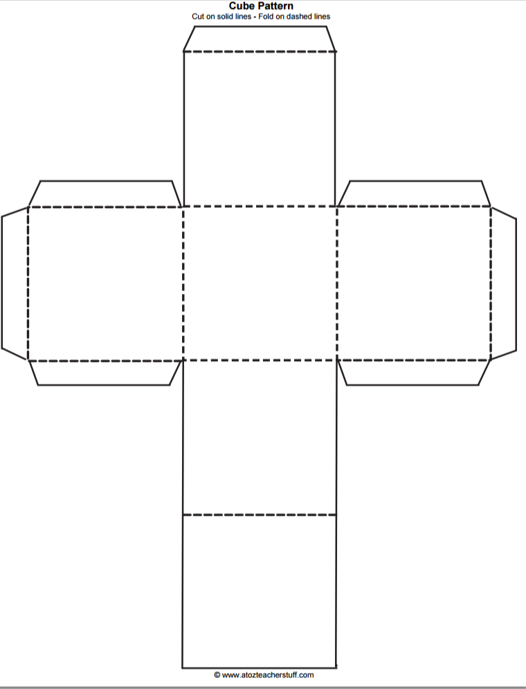
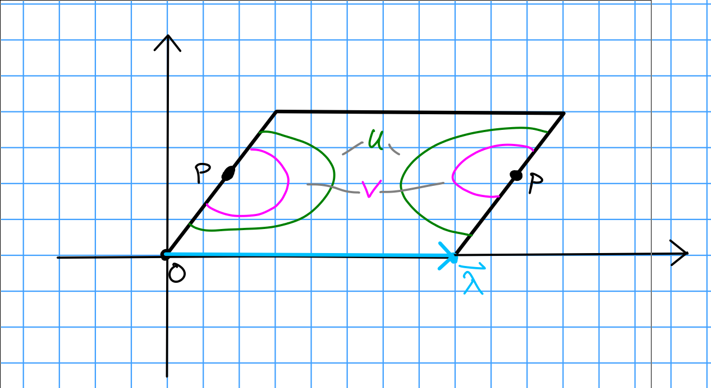
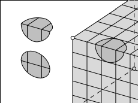
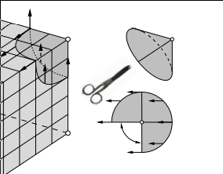

# Thursday, Week 1 

> Reference: [https://arxiv.org/abs/math/0609392](https://arxiv.org/abs/math/0609392)

Motivation: Gauss' Unicursal Problem.
How many distinct curves $\alpha: I \to \RR^2$ with are there with no triple crossings?

Note that if we compactify the plane to the Riemann sphere (and possibly take the curve to be piecewise linear) then we obtain a *tiling* of the sphere.
We can also take a *dual tiling* by taking the barycenters of each polygon and connecting them by an edge iff their corresponding polygons share an edge.

Definition:
A *translation surface* is the 2-dimensional topological manifold obtained by taking any set of polygons in $\RR^2$ and gluing their edges by translations.

Example:
Any elliptic curve (topologically a torus).

We take equivalence up to cutting, pasting, and rearranging.

Lemma:
Two elliptic curves (of genus 2) are isomorphic iff the translation surfaces differ by a homothety, i.e. a rotation and scaling.

> Note: we will eventually see that the data of a translation surface is equivalently a holomorphic 1-form.

Definition:
A *half-translation surface* is a translation surface where we now additionally allow gluing by rotations of $\pi$ radians.

Example:

\begin{tikzpicture}
	\begin{pgfonlayer}{nodelayer}
		\node[fill=black, shape=circle]  (0) at (-3, 3) {};
		\node[fill=black, shape=circle]  (1) at (3, 3) {};
		\node[fill=black, shape=circle]  (2) at (-3, -3) {};
		\node[fill=black, shape=circle]  (3) at (3, -3) {};
		\node[fill=black, shape=circle]  (4) at (0, 3) {};
		\node[fill=black, shape=circle]  (5) at (0, -3) {};
	\end{pgfonlayer}
	\begin{pgfonlayer}{edgelayer}
		\draw (1.center) to node [auto] {$a$} (3.center);
		\draw (0.center) to node [left] {$a$} (2.center);
		\draw (0.center) to node [above] {$b$} (4.center);
		\draw (4.center) to node [above] {$b$} (1.center);
		\draw (2.center) to node [below] {$c$} (5.center);
		\draw (5.center) to node [below] {$c$} (3.center);
	\end{pgfonlayer}
\end{tikzpicture}

> Note that the gluing $b$ now requires a rotation.

This glues to a "hot pocket" surface:

\begin{tikzpicture}[
	none/.style={text opacity=0,opacity=0,fill opacity=0},
	dashed/.style={text opacity=0,opacity=0,fill opacity=0}
]
	\begin{pgfonlayer}{nodelayer}
		\node [style=none] (0) at (-3, 3) {};
		\node [style=none] (1) at (3, 3) {};
		\node [style=none] (2) at (-3, -4) {};
		\node [style=none] (3) at (3, -4) {};
		\node [style=none] (4) at (-3, 2) {};
		\node [style=none] (5) at (3, 2) {};
		\node [style=none] (6) at (-3, -0.5) {};
		\node [style=none] (7) at (3, -0.5) {};
		\node [style=none] (8) at (-3, -2.75) {};
		\node [style=none] (9) at (3, -2.75) {};
	\end{pgfonlayer}
	\begin{pgfonlayer}{edgelayer}
		\draw (0.center) to (2.center);
		\draw (2.center) to (3.center);
		\draw (3.center) to (1.center);
		\draw (0.center) to (1.center);
		\draw [bend right] (4.center) to (5.center);
		\draw[dotted] [bend left=15] (4.center) to (5.center);
		\draw [bend right] (6.center) to (7.center);
		\draw[dotted] [bend left=15] (6.center) to (7.center);
		\draw [bend right] (8.center) to (9.center);
		\draw[dotted] [bend left=15] (8.center) to (9.center);
	\end{pgfonlayer}
\end{tikzpicture}

**Lemma:**
Any game of *rectangular billiards* yields a half-translation surface.

Given any domain for rectangular billiards, we inflate it to a surface:

\begin{tikzpicture}[
	none/.style={text opacity=0,opacity=0,fill opacity=0},
	dashed/.style={text opacity=0,opacity=0,fill opacity=0}
]
	\begin{pgfonlayer}{nodelayer}
		\node [style=none] (0) at (-5, 6) {};
		\node [style=none] (2) at (0, 0) {};
		\node [style=none] (3) at (0, 4) {};
		\node [style=none] (4) at (3, 4) {};
		\node [style=none] (5) at (3, 2) {};
		\node [style=none] (6) at (6, 2) {};
		\node [style=none] (7) at (6, 6) {};
		\node [style=none] (8) at (-5, 0) {};
		\node [style=none] (9) at (-2.5, 6) {};
		\node [style=none] (10) at (-2.5, 0) {};
		\node [style=none] (11) at (1.5, 6) {};
		\node [style=none] (12) at (1.5, 4) {};
		\node [style=none] (13) at (4.5, 6) {};
		\node [style=none] (14) at (4.5, 2) {};
	\end{pgfonlayer}
	\begin{pgfonlayer}{edgelayer}
		\draw (0.center) to (8.center);
		\draw (8.center) to (2.center);
		\draw (2.center) to (3.center);
		\draw (3.center) to (4.center);
		\draw (4.center) to (5.center);
		\draw (5.center) to (6.center);
		\draw (6.center) to (7.center);
		\draw (0.center) to (7.center);
		\draw [bend right] (9.center) to (10.center);
		\draw[dotted] [bend left=15] (9.center) to (10.center);
		\draw [bend right=40] (11.center) to (12.center);
		\draw[dotted] [bend left=40, looseness=0.75] (11.center) to (12.center);
		\draw [bend right, looseness=0.75] (13.center) to (14.center);
		\draw[dotted] [bend left=15] (13.center) to (14.center);
	\end{pgfonlayer}
\end{tikzpicture}

We can then cut along everything but the bottom edge to "unwrap" it into a half-translation surface:

\begin{tikzpicture}[
	none/.style={text opacity=0,opacity=0,fill opacity=0},
	dashed/.style={text opacity=0,opacity=0,fill opacity=0}
]
	\begin{pgfonlayer}{nodelayer}
		\node [style=none] (0) at (-5, 6) {};
		\node [style=none] (2) at (0, 0) {};
		\node [style=none] (3) at (0, 4) {};
		\node [style=none] (4) at (3, 4) {};
		\node [style=none] (5) at (3, 2) {};
		\node [style=none] (6) at (6, 2) {};
		\node [style=none] (7) at (6, 6) {};
		\node [style=none] (8) at (-5, 0) {};
		\node [style=none] (9) at (-2.5, 6) {};
		\node [style=none] (10) at (-2.5, 0) {};
		\node [style=none] (11) at (1.5, 6) {};
		\node [style=none] (12) at (1.5, 4) {};
		\node [style=none] (13) at (4.5, 6) {};
		\node [style=none] (14) at (4.5, 2) {};
		\node [style=none] (17) at (-5, -6) {};
		\node [style=none] (18) at (6, -6) {};
		\node [style=none] (22) at (0, -4) {};
		\node [style=none] (23) at (3, -4) {};
		\node [style=none] (24) at (6, -2) {};
		\node [style=none] (29) at (3, -2) {};
	\end{pgfonlayer}
	\begin{pgfonlayer}{edgelayer}
		\draw (0.center) to node [auto] {$a$} (8.center);
		\draw (8.center) to (2.center);
		\draw (2.center) to node [auto] {$b$}  (3.center);
		\draw (3.center) to (4.center);
		\draw (4.center) to (5.center);
		\draw (5.center) to (6.center);
		\draw (6.center) to (7.center);
		\draw (0.center) to (7.center);
		\draw (8.center) to node [auto] {$a$} (17.center);
		\draw (17.center) to (18.center);
		\draw (2.center) to  node [auto] {$b$} (22.center);
		\draw (22.center) to (23.center);
		\draw (23.center) to (29.center);
		\draw (29.center) to (24.center);
		\draw (24.center) to (18.center);
	\end{pgfonlayer}
\end{tikzpicture}

Some questions related to rectangular billiards:

1. Given a random starting point and direction, what proportion of the total region is traversed?
  Will the trajectory entire a given region?
  How long does the billiard spend in any given region?

**Theorem:**
The percentage of time spent in a given area is equal to the proportion of its area to the total area.

> This requires some ergodic theory.

2. If you shine a laser from a given spot, is the entire region illuminated?

Theorem:
No! There is a counterexample with 18 sides.
Moreover, no positive-area region can be avoided, but certain finite sets can.

Definition:
A *flat surface* is a generalization of translation surfaces that now allows gluing by any isometry of $\RR^2$.

Example:
A cube is a flat surface, noting that there is a planar gluing diagram for it that now requires rotations of $\pi/2$ radians:

Note that we can form higher genus surfaces using polygon gluing:
\begin{tikzpicture}[
	none/.style={fill=black,shape=circle,scale=0.5},
	dashed/.style={text opacity=0,opacity=0,fill opacity=0}
]
	\begin{pgfonlayer}{nodelayer}
		\node[style=none] (0) at (-0.75, 2.5) {};
		\node [style=none] (1) at (0.75, 2.5) {};
		\node [style=none] (2) at (-1.75, 1.25) {};
		\node [style=none] (3) at (1.75, 1.25) {};
		\node [style=none] (4) at (-1.75, -0.25) {};
		\node [style=none] (5) at (1.75, -0.25) {};
		\node [style=none] (6) at (-0.75, -1.5) {};
		\node [style=none] (7) at (0.75, -1.5) {};
		\node [style=none] (8) at (-1.75, 1.25) {};
	\end{pgfonlayer}
	\begin{pgfonlayer}{edgelayer}
		\draw (0.center) to node [auto] {$d$}  (8.center);
		\draw (8.center) to node [auto] {$a$}  (4.center);
		\draw (4.center) to node [auto] {$b$}  (6.center);
		\draw (6.center) to node [auto] {$c$}  (7.center);
		\draw (7.center) to node [auto] {$d$}  (5.center);
		\draw (5.center) to node [auto] {$a$}  (3.center);
		\draw (3.center) to node [auto] {$b$}  (1.center);
		\draw (1.center) to node [auto] {$c$}  (0.center);
	\end{pgfonlayer}
\end{tikzpicture}

Exercise: 
Check that there is only one vertex in this polygon.

In general, the vertices may have total angle greater than $\2pi n$.
We refer to these as *cone points*, and the total angle as the *cone angle*.

Exercise:
Check that the cone angle in the above example is $6\pi$ by taking a loop around the cone point.

> Note on a weird phenomenon: it seems difficult to find $\ZZ^2$ or $\QQ^2$ points on the sloped edges of a regular polygon, based on computer drawings.

Remark:
This flat surface admits charts to $\CC$ with the following transition functions.
Let $P$ denote the single cone point.

Then there is a 3-fold cover give by the following space, thought of as a singular helical

\begin{tikzpicture}[
	none/.style={fill=black,shape=circle,scale=0.5},
	dashed/.style={text opacity=0,opacity=0,fill opacity=0}
]
	\draw (0, 0) circle (3cm);
	\node [style=none, label=P] (0) at (0, 0) {};
	\node [style=none] (1) at (3, 0) {};
	\draw (0.center) to node [above] {$C$} node [below] {$A$} (1.center);

	\draw (0, -7) circle (3cm);
	\node [style=none, label=P] (0) at (0, -7) {};
	\node [style=none] (1) at (3, -7) {};
	\draw (0.center) to node [above] {$A$} node [below] {$B$} (1.center);

	\draw (0, -14) circle (3cm);
	\node [style=none, label=P] (0) at (0, -14) {};
	\node [style=none] (1) at (3, -14) {};
	\draw (0.center) to node [above] {$B$} node [below] {$C$} (1.center);

\end{tikzpicture}

which maps onto the unit disc in $\CC$:

\begin{tikzpicture}[
	none/.style={fill=black,shape=circle,scale=0.5},
	dashed/.style={text opacity=0,opacity=0,fill opacity=0}
]
	\draw (0, 0) circle (3cm);

	\node [style=none, label=P] (P) at (0, 0) {};
	\node [style=none] (u1) at  ({1*360/3}: 3cm){};
	\node [style=none] (u2) at  ({2*360/3}: 3cm){};
	\node [style=none] (u3) at  ({3*360/3}: 3cm){};

	\draw (P) to (u1);
	\draw (P) to (u2);
	\draw (P) to (u3);

	\node [label=1] (u1) at  ({1*360/6}: 1.5cm){};	
	\node [label=2] (u1) at  ({3*360/6}: 1.5cm){};
	\node [label=3] (u1) at  ({5*360/6}: 1.5cm){};

\end{tikzpicture}

The covering map from the former to the latter is given by $z\mapsto z^{\frac 1 3}$, which coincides with the fact that the cone angle at $P$ is $3(2\pi)$.

One can also imagine this space in $\RR^3$ with a projection onto the plane:
\pgfplotsset{compat=1.16,width=10cm,height=14cm}
\begin{tikzpicture}
\begin{axis}[trig format plots=rad,
		view={-40}{6*pi},
		colormap={adopted}{
			rgb255(0cm)=(219,0,70);
	    rgb255(1cm)=(55,70,170);
			rgb255(2cm)=(219,0,70)
		},
		z buffer=sort,
		zmin=0]
\addplot3 [surf,domain=0.001:4,domain y=-pi/2:6*pi-pi/2,samples=25,samples y=40]
({x*cos(y)},{x*sin(y)},{ln(x)+y});
\end{axis}
\end{tikzpicture}

Proposition:
In a neighborhood of a cone point $P$ with cone angle $2\pi n$, the map $z\mapsto z^{\frac 1 n}$ will be a local chart for any $z$ in a neighborhood of $P$.

This gives the resulting surface the structure of a *Riemann surface*, i.e. a surface admitting charts to $\CC$ with holomorphic transition functions.

Let $X$ be a Riemann surface, we can look at the *canonical bundle* over $X$ with sections that are compatible collections of $f_u(z_u) ~dz_u$ for each chart $z_u$, and for each such chart a holomorphic function $f_u(z_u)$ on $z_u(U)$ where on overlaps

\begin{align*}
f_u(z_u) ~dz_u &= f_v(z_v) ~dz_v \\
&= f_v(z_v \circ z_u) z_v'(z_u) ~dz_u
.\end{align*}

**Updated Definition:**
A translation surface is a Riemann surface with a section of its canonical bundle.

Example:
$C/\Lambda$ for $\Lambda$ any rank-2 lattice:

> Note that the translation here is given by $\vector \lambda$.

Definition:
A holomorphic 1-form is a section of the canonical bundle.

Example:
For the above surface, we have $z_v = z_u + \vector \lambda$ and thus $dz_u = dz_v$ is nonvanishing.

Note that $dz$ is a holomorphic 1-form on the complement of the vertex/vertices of the polygon.

Claim:
$dz$ extends holomorphically to charts containing cone points with cone angle $2\pi n$ and has a zero of order $n-1$ at such cone points.

Example:
For the chart $z=w^3$ where $w$ is the local coordinate, we have $dz = 3w^2$, yielding a zero of order 2.

# Notes on Paper

Flat surfaces are characterized as surfaces with a flat metric and (finitely many?) cone-like singularities.
These surfaces appear to be isomorphic to moduli spaces of holomorphic 1-forms.
It is profitable to study the orbit of the surface under the Teichmüller geodesic flow, as well as a $\GL_n$ action.

Some introductory surveys:

- A. Eskin [E], 
- G. Forni [For2], 
- P. Hubert and T. Schmidt [HuSdt5] 
- H. Masur [Ma7],

- H. Masur and S. Tabachnikov [MaT] 
- J. Smillie [S].

We usually associate

- Constant positive curvature = $S^2$
- Constant zero curvature = $S^1 \cross S^1 \definedas T^1 = \Sigma_1$
- Constant negative curvature = $\Sigma_g$ for $g\geq 2$, a surface of higher genus

Proposition:
Any surface can be given a flat metric, possibly introducing singular points.

> Idea: Push all of the curvature into a cone point.

Example:
The standard cube embedded in $\RR^3$.

This is a flat surface with 8 cone points located at the vertices.
Note that the metric is non-degenerate on the edges, since any neighborhood of a point on an edge is still homeomorphic to $\RR^2$:

Any neighborhood of a vertex is isometric to the vertex of the usual notion of a cone.
The cone angle can be measured by cutting a cone from the base to the vertex, yielding a flat pattern that sits in $\RR_2$, and measuring the "missing" angle in the resulting circle:

This shows that the cone angle of the cube is $3\pi/2$, which coincides with the fact that there are 3 square (and thus 3 right angles) adjacent to any cone point.

Definition:
Geodesic (todo)

Definition:
Ergodic (todo)

> Here this means that a typical geodesic will visit any region in phase space and time spent in a region is proportional to volume.

General (wildly open) problem:

- Describe the behavior of a generic geodesic on a surface
- Prove that the geodesic flow is ergodic on a typical flat surface
- Does almost every surface have a closed geodesic that does not pass through singular points?
  - If so, how many?
  - Find the (asymptotic) number of such closed geodesics of length shorter than $L$

This remains unsolved for $S^2$ with 3 singularities (equivalent to a certain billiards problem). 
It is not even known if any flat sphere admits a single closed geodesic.

Flat surfaces have nontrivial holonomy, which makes them resemble Riemannian manifolds more than flat torii.

If we take the surface and puncture the conical points, it is locally isometric to the punctured Euclidean plane.
This allows a notion of parallel transport of tangent vectors.

Parallel transports along homotopically trivial loops are always the identity; otherwise, for homotopically nontrivial loops this rotates the vector by some angle.
Parallel transport around a cone point rotates by exactly the cone angle.
Nontrivial holonomy forces geodesics to self-intersect many times.

> Exercise: parallel transport a vector around the cone point of a cube.

The flat torus has trivial linear holonomy -- all geodesics either close up, or never self-intersect and produce a dense winding path.

Definition:
A translation surface is closed orientable surface with a flat metric, a finite number of conical singularities, and trivial linear holonomy.

Note that trivial linear holonomy implies that cone angles are all integer multiples of $2\pi$.
