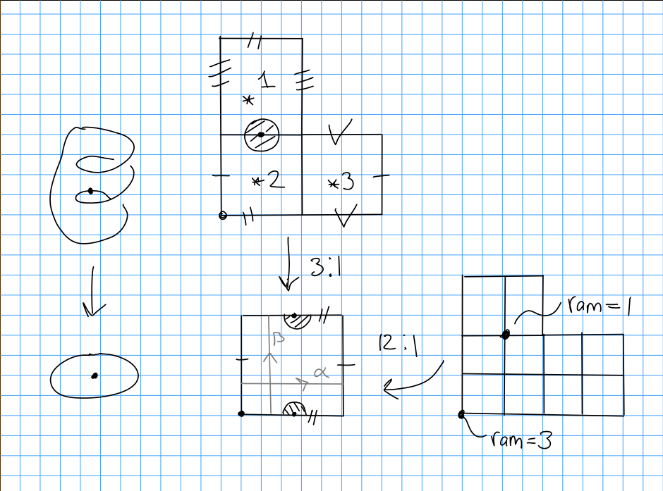
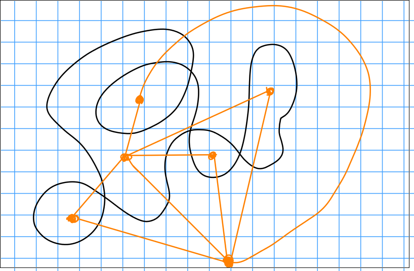

Square tiled surfaces in $\mch(k)$ with $d$ squares correspond to degree $d$ branched covers of the identification square, branched over the origin, with profile (?).

To count square-tiled surfaces: label squares, look at inverse images of $\ast$ by $\theset{1 ,\cdots, d}$.
Consider the monodromy representation $\rho: \pi_1( \TT \setminus \theset{0}, \ast ) \to S_d$ where $\sigma = \rho(\alpha) = (1)(23)$ and $\tau = \rho(\beta) = (12)(3)$.
We compute ramification orders by considering the commutators $[\alpha, \beta]$.
Then $\rho([\alpha, \beta] )$ has cycle type $(1, 1, \cdots 1, 1+k, \cdots, 1+ k_n)$.
Note that $[(23), (12)]$ is a 3 cycle.

\

**Conclusion:**
The number of square-tiled surfaces in $\mch(k)$ with $d$ squares is exactly $\frac{1}{d!} \abs{\sigma, \tau \in S_d \suchthat [\sigma, \tau] \in C_{1, \cdots, 1, 1+k, \cdots, 1+ k_n}}$.

Note that the division is due to the artificial labeling of squares.

Presentation next week:
Eskin-Okounov, Branched Covers of Torus.

Main theorem:
The generating function $f_\kappa(q)\definedas \sum_{d\geq 1} \#\theset{\text{Square tiled, $d$ squares in $\mch(k)$}} q^d$ is a modular form.
Follows from taking $q = e^{2\pi i \tau}$ which is holomorphic on $\HH$ the upper half-plane, satisfying a transformation rule with respect to $\tau \mapsto -1/\tau$, which is a finite-dimensional space.

> Actual: quasimodular mixed form.

The weights are bounded by $\abs \kappa + \ell(\kappa)$.

Concretely, $f_\kappa \in \QQ[E_2, E_4, E_8]$ where $E_k(q) = \text{const} + \sum_{d \geq 1} \sigma_{k-1}(d) q^d$, where $\sigma_{k-1}(d) = \sum_{e\divides d} e^{k-1}$.
This is the ring of quasimodular forms.

- $1$ is weight 0,
- $E_2$ is weight 2,
- $E_2^2, E_4$ are weight 4,
- $E_2^3, E_2 E_4, E_6$ are weight 6, etc

Example:
Take $\kappa = \theset{2} \iff \mch(2)$, then $\abs \kappa + \ell(\kappa) = 3$ and $f_{\theset z}(q) = c_1 + c_2 E_2(q)$.
In this case $[q^1] = [q^2] = 0$.

Note that surfaces in $\mch(2)$ have 1 vertex of cone angle $6\pi$ and all others of angle $2\pi$, corresponding to an abelian differential with a single zero of order 2.

A special type of square-tiled surfaces: 1 cylinder surfaces, where $\rho(\alpha)$ is a full length cycle.

This is in $\mch(3, 1)$, and corresponding surface $(\Sigma, \omega)$, which is a holomorphic 1-form with a triple zero and a single zero.
By Riemann-Hurwitz, $2g-2 = \deg \omega = 3+1 \implies g = 3$.

> Note: difficult to compute otherwise!

Another paper:
"One Cylinder Surfaces", Delecroix, Goujard, Zovrch, Zograf. See Phil for appendix.

Result:
1-cylinder surfaces have roughly a $1/d$ proportion in all square tiled surfaces, where $d = \dim \mch(\kappa)$.

Recall that we can get a square tiled surface from any unicursal curve

Note that these aren't always translation surfaces:

Recall

- $(\Sigma, dz) \iff$ translation surfaces
- $(\Sigma, (dz)^2) \iff \frac 1 2 \dash$translation surfaces
- $(\Sigma, (dz)^4) \iff \frac 1 4\dash$translation surfaces
