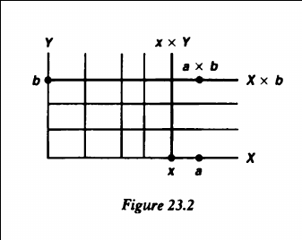

Next time:
19,22,23,27,30

Definition:
A space $X$ is connected iff it can not be written as $X = U \disjoint V$ with $U,V$ nonempty, disjoint, and open.

# Problem 19

Prove that the product of two connected spaces is connected.

**Solution:**

Use the fact that a union of spaces containing a common point is still connected.
Fix a point $(a, b) \in X \cross Y$.
Since the horizontal slice $X_b\definedas X \cross \theset{b}$ is homeomorphic to $X$ which is connected, as are all of the vertical slices $Y_x \definedas \theset{x} \cross Y \cong Y$ (for any $x$), the "T-shaped" space $T_x \definedas X_b \union Y_x$ is connected for each $x$.

Note that $(a, b) \in T_x$ for every $x$, so $\union_{x\in X} T_x = X \cross Y$ is connected.

# Problem 22
?

# Problem 23

Note: this is precisely the cofinite topology.

1. $\RR\in \Tau$ since $\RR\setminus \RR = \emptyset$ is trivially a finite set, and $\emptyset \in \Tau$ by definition.
2. If $U_i \in \Tau$ then $(\union_i U_i)^c = \intersect U_i^c$ is an intersection of finite sets and thus finite, so $\union_i U_i \in \tau$.
3. If $U_i \in \Tau$, then $(\intersect_{i=1}^n U_i)^c = \union_{i=1}^n U_i^c$ is a finite union of finite sets and thus finite, so $\intersect U_i \in \Tau$.

So $\Tau$ forms a topology.

To see that $(\RR, \Tau)$ is compact, let $\theset{U_i} \rightrightarrows \RR$ be an open cover by elements in $\Tau$.

Fix any $U_\alpha$, then $U_\alpha^c = \theset{p_1, \cdots, p_n}$ is finite, say of size $n$.
So pick $U_1 \ni p_1, \cdots, U_n \ni p_n$; then $\RR \subset U_\alpha \union_{i=1}^n U_i$ is a finite cover.

# Problem 27

$\implies$:

If $X$ is totally bounded, let $\varepsilon  = \frac 1 n$ for each $n$.
For $n=1$, pick a finite open cover $\theset{U_i}_n$ such that $\diam{U_i} < \frac 1 n$ for each $i$.

# Problem 30
?
