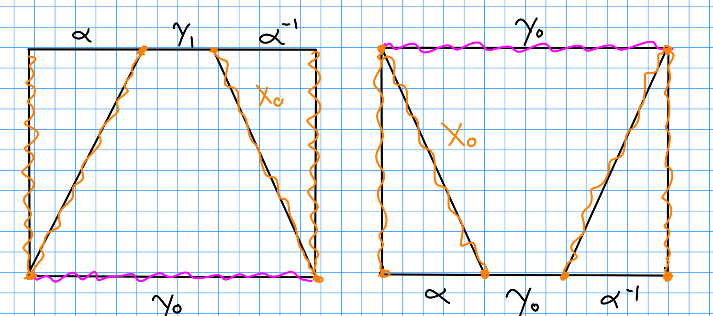
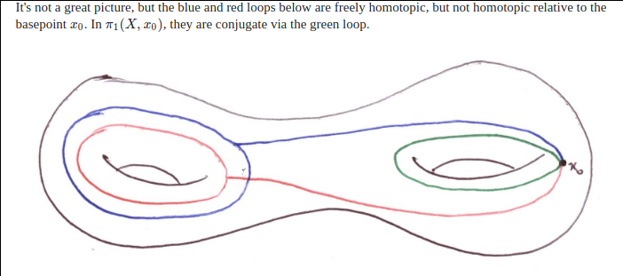

# The Fundamental Group

## 1

Proposition:
$\gamma_1 \homotopic \gamma_2 \iff \gamma_1, \gamma_2$ are conjugate in $\pi_1(X, x_0)$, i.e. $\exists [\alpha] \in \pi_1$ such that $[\gamma_1] = [\alpha][\gamma_2][\alpha]\inv$.

Proof:

$\implies$:
Clear, since $\gamma_1 \sim \gamma_2 \implies [\gamma_1] = [\gamma_2] \in \pi_1(X)$, so take $\alpha(t) = x_0$ the constant loop for all $t$.

$\impliedby$:
? Forgot how these arguments go.

\

$\qed$

Counterexample where homotopic loops are not equal in $\pi_1$, but just conjugate:

\

# Covering Spaces

## 1b

Homotopy lifting property:

\begin{tikzcd}
                                                                   &  & \tilde X \arrow[dd, "\pi"] \\
                                                                   &  &                            \\
Y\cross I \arrow[rr, "H"] \arrow[rruu, "\exists \tilde H", dashed] &  & X                         
\end{tikzcd}

$\pi$ clearly induces a map $p_*$ on $\pi_1$ by functoriality, so we'll show that $\ker p_*$ is trivial.
Let $\gamma: S^1 \to \tilde X \in \pi_1(\tilde X)$ and suppose $\alpha \definedas p_*(\gamma) = [e] \in \pi_1(X)$. 
We'll show $\gamma \homotopic [e]$ in $\pi_1(\tilde X)$.

Since $\alpha = [e]$, $\alpha \homotopic \const$ and thus there is a homotopy $H: I\cross S^1 \to X$ such that $H_0 = \const(x_0)$ and $H_1 = \gamma$.
By the HLP, this lifts to $\tilde H: I\cross S^1 \to \tilde X$.
Noting that $\pi\inv(\const(\xo))$ is still a constant loop, this says that $\gamma$ is homotopic to a constant loop and thus nullhomotopic. 
