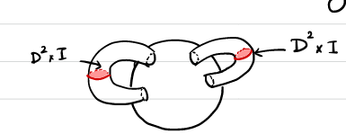
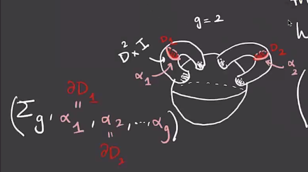
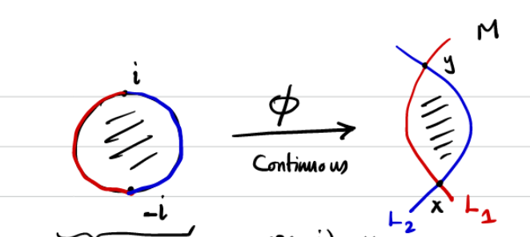
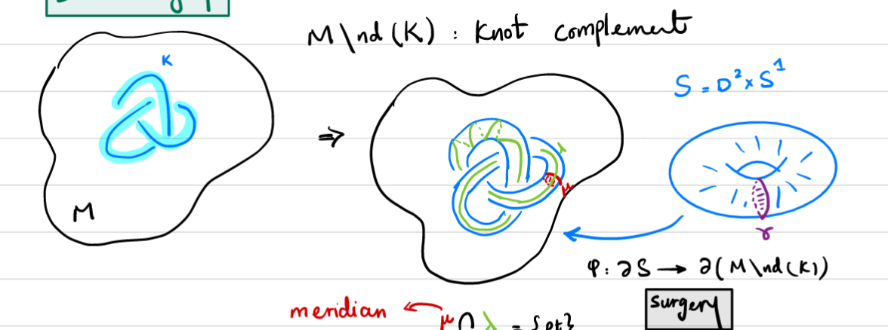
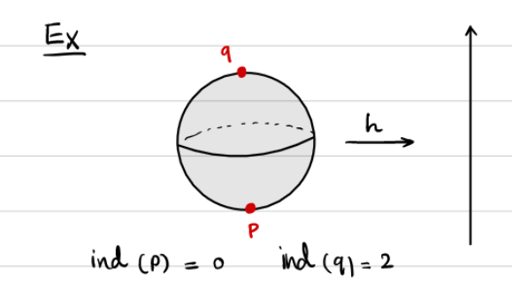
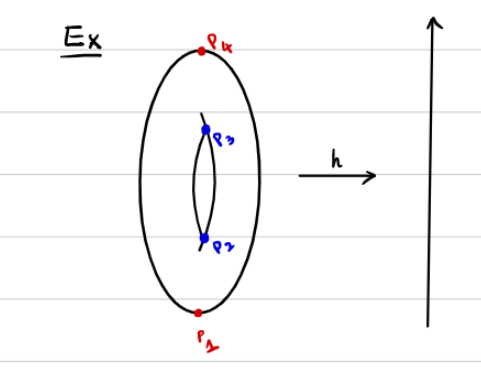
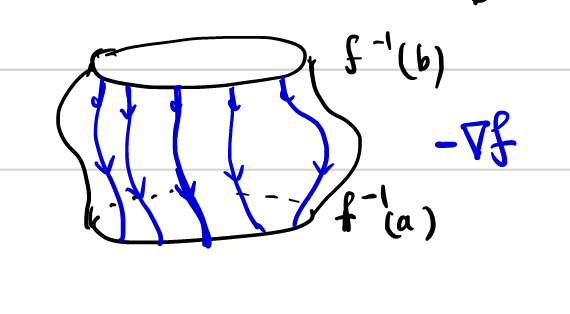
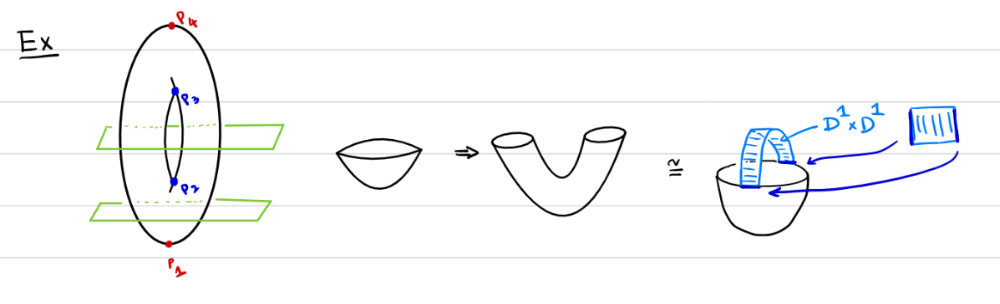
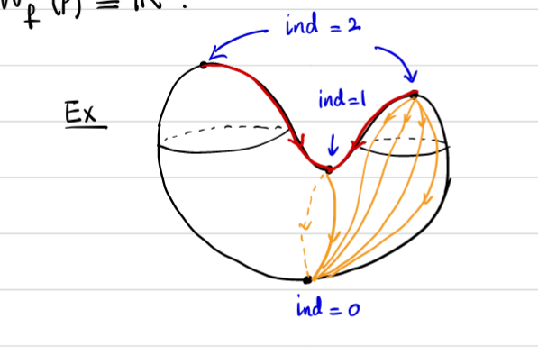

# Lecture 2 (Tuesday, January 19)

\todo[inline]{Copy in references recommended by Akram!}

:::{.remark}
For Morse Theory, there are some good exercises in Audin's book -- essentially anything other than the existence questions.
The first 8 look good on p. 18.
:::

Today: 

1. Overview of the construction of HF, and

2. A discussion of Morse Theory.

## Constructing Heegard Floer

First goal: discuss how the name "Heegard" fits in.

:::{.definition title="Genus $g$ handlebody"}
A **genus $g$ handlebody** $H_g$ is a compact oriented 3-manifold with boundary obtained from $B^3$ by attaching $g$ solid handles (a neighborhood of an arc).

:::

:::{.example title="Attaching $g=2$ handles to a sphere"}
For $g=2$ attached to a sphere, we glue $D^2 \cross I$ by its boundary to $S^2$.

In general, $\bd H_g = \Sigma_g$ is a genus $g$ surface, and $H_g \sm \disjoint_{i=1}^g D_i = B^3$.
We can keep track of the data by specifying $(\Sigma, \alpha_1, \alpha_2, \cdots, \alpha_g)$ where $\bd D_i = \alpha_i$.

:::

:::{.definition title="Heegard Decomposition"}
A **Heegard diagram** is $M = H_1 \union_\bd H_2$ where $H_i$ are genus $g$ handlebodies and there is a diffeomorphism $\bd H_1 \to \bd H_2$.
:::

:::{.theorem title="?"}
Every closed 3-manifold has a Heegard decomposition, although it is not unique.
:::

:::{.definition title="Heegard Diagram"}
A **Heegard diagram** is the data $(\Sigma_g, \alpha = \ts{ \alpha_1, \cdots, \alpha_g}, \beta = \ts{ \beta_1, \cdots, \beta_g})$ where the $\alpha$ correspond to $H_1$ and \( \beta \) to $H_2$ and \( \Sigma_g = \bd H_1 = \bd H_2 \).
:::

## Lagrangian Floer Homology

This is essentially an infinite-dimensional version of Morse homology.

:::{.definition title="Symplectic Manifold"}
A **symplectic manifold** is a pair $(M^{2n}, \omega$ such that

- \( \omega \) is *closed*, i.e. \( d \omega = 0 \), and 
- \( \omega \) is *nondegenerate*, i.e. \( \wedge^n \omega \neq 0 \).
:::

:::{.definition title="Lagrangian"}
A **Lagrangian submanifold** is an $L^n \subseteq M$ such that \( \ro{\omega}{L} = 0 \).
:::

\[
\bd x = \sum_y \sum_{\mu(\varphi) = 1} \# \hat{\mathcal{M}} (\varphi)y &&  \hat{\mathcal{M}}(\varphi) = \mathcal{M}(\varphi) / \RR  
.\]

:::{.definition title="Dehn Surgery"}
?
:::

:::{.definition title="$p/q$ Surgery"}
?
:::

## Morse Theory

:::{.definition title="Critical Point"}
?
:::

:::{.definition title="Hessian / Second Derivative"}
?
:::

:::{.definition title="Nondegenerate Critical Points"}
?
:::

:::{.definition title="Index of a critical point"}
?
:::

:::{.definition title="Morse Function"}
?
:::

:::{.theorem title="Morse Lemma"}
?
:::

\[
\begin{bmatrix}
-2&&&&&&\\
&\ddots&&&&&\\
&&-2&&&&\\
&&&2&&&\\
&&&&\ddots&&\\
&&&&&2&\\
&&&&&&2
\end{bmatrix}
.\]

:::{.example title="Sphere"}

:::

:::{.example title="Torus"}

:::

:::{.lemma title="?"}
If $f ^{-1} ([a, b])$ has no critical point, then $f ^{-1} (a) \cong f ^{-1} (b)$ and $M_a \cong M_b$.
:::

:::{.proof title="?"}

:::

:::{.theorem title="?"}
Suppose $f ^{-1} ([a, b])$ contains exactly one critical point $p$ with $\ind(p) = \lambda$ and $f(p) = c$. 
Then
\[
M_b = M_a \union \qty{ D^ \lambda \cross D^{n - \lambda} }
\]
where $n \da \dim M$.
:::

:::{.example title="?"}

:::

:::{.definition title="Unstable Submanifold"}
\[
W_f^u(p) \da \ts{p} \union \ts{
\dot{\gamma(t)} = -\nabla f(\gamma(t)),\, \lim_{t\to -\infty} \gamma(t) = p,\, t\in \RR
}
.\]
:::

:::{.lemma title="?"}
If $\ind(p) = \lambda$ then $W_f^u(p) \cong \RR^ \lambda$.
:::

:::{.example title="?"}

:::

:::{.example title="?"}

:::

:::{.definition title="Stable Manifold"}
\[
W_f^s(p) \da \ts{p} \union \ts{
\dot{\gamma(t)} = -\nabla f(\gamma(t)),\, \lim_{t\to +\infty} \gamma(t) = p,\, t\in \RR
}
.\]
:::

:::{.lemma title="?"}
If $\ind(p) = \lambda$ then $W_f^s(p) \cong \RR^{n- \lambda}$.
:::

:::{.definition title="$C^\infty$ "}
$C^ \infty (M; \RR)$ is defined as smooth function $M\to |RR$, topologized as:

- ?
- ?

And a basis for open neighborhoods around $p$ is given by 
\[
N_g(f) = \ts{
g:M\to \RR \st
\abs{
\dd{^k g}{\del x _{i_1} \cdots \del x _{i_k} }(p)
- 
\dd{^k f}{\del x _{i_1} \cdots \del x _{i_k} }(p)
} < \infty\, \forall \alpha,\, \forall p\in h_ \alpha(C_ \alpha)
}
.\]
:::

:::{.theorem title="?"}
The set of Morse functions on $M$ is open and dense in $C^ \infty (M; \RR)$.
:::

