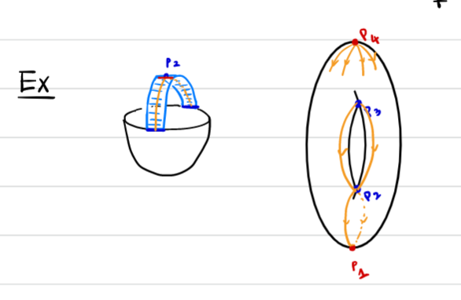

# Lecture 2 (Tuesday, January 19)

:::{.definition title="Genus $g$ handlebody"}
?

:::

:::{.definition title="Heegard Decomposition"}
?
:::

:::{.definition title="Heegard Diagram"}
?
:::

:::{.definition title="Symplectic Manifold"}
?
:::

:::{.definition title="Lagrangian"}
?
:::

\[
\bd x = \sum_y \sum_{\mu(\varphi) = 1} \# \hat{\mathcal{M}} (\varphi)y &&  \hat{\mathcal{M}}(\varphi) = \mathcal{M}(\varphi) / \RR  
.\]

:::{.definition title="Dehn Surgery"}
?
:::

:::{.definition title="$p/q$ Surgery"}
?
:::

## Morse Theory

:::{.definition title="Critical Point"}
?
:::

:::{.definition title="Hessian / Second Derivative"}
?
:::

:::{.definition title="Nondegenerate Critical Points"}
?
:::

:::{.definition title="Index of a critical point"}
?
:::

:::{.definition title="Morse Function"}
?
:::

:::{.theorem title="Morse Lemma"}
?
:::

\[
\begin{bmatrix}
-2&&&&&&\\
&\ddots&&&&&\\
&&-2&&&&\\
&&&2&&&\\
&&&&\ddots&&\\
&&&&&2&\\
&&&&&&2
\end{bmatrix}
.\]

:::{.example title="Sphere"}

:::

:::{.example title="Torus"}

:::

:::{.lemma title="?"}
If $f ^{-1} ([a, b])$ has no critical point, then $f ^{-1} (a) \cong f ^{-1} (b)$ and $M_a \cong M_b$.
:::

:::{.proof title="?"}

:::

:::{.theorem title="?"}
Suppose $f ^{-1} ([a, b])$ contains exactly one critical point $p$ with $\ind(p) = \lambda$ and $f(p) = c$. 
Then
\[
M_b = M_a \union \qty{ D^ \lambda \cross D^{n - \lambda} }
\]
where $n \da \dim M$.
:::

:::{.example title="?"}

:::

:::{.definition title="Unstable Submanifold"}
\[
W_f^u(p) \da \ts{p} \union \ts{
\dot{\gamma(t)} = -\nabla f(\gamma(t)),\, \lim_{t\to \infty} \gamma(t) = p,\, t\in \RR
}
.\]
:::

:::{.lemma title="?"}
If $\ind(p) = \lambda$ then $W_f^u(p) \cong \RR^ \lambda$.
:::

:::{.example title="?"}

:::

:::{.example title="?"}

:::

