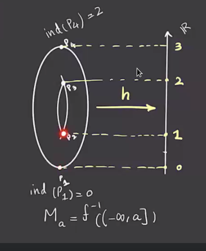
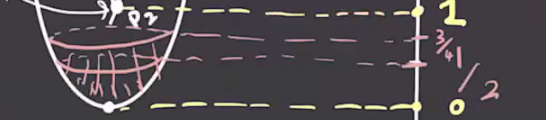
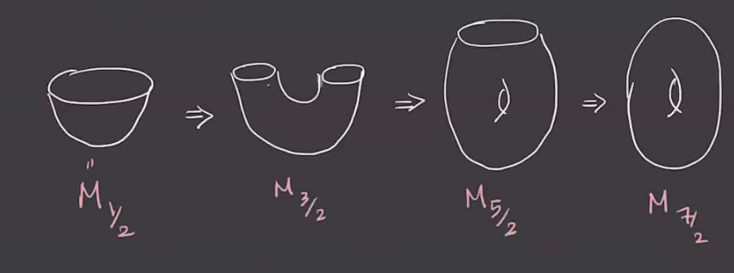
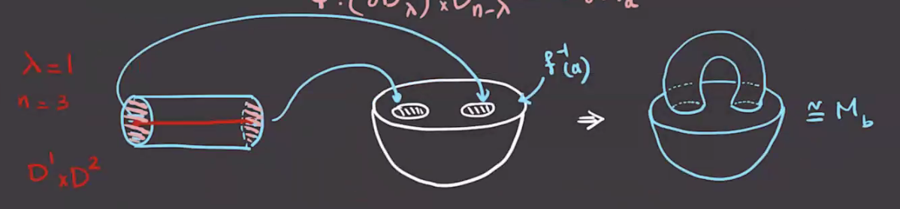

# Tuesday, January 26

Goal: we want to use Morse functions (smooth, nondegenerate critical points) to study the topology of $M$.
Recall that the torus had 4 critical points, 

We defined the index as the number of negative eigenvalues of the Hessian matrix. 
Here the highest index will be the dimension of the manifold, and by the Morse lemma the two intermediate critical points will be index 1.
We want to use the Morse function to decompose the manifold, so we consider \( M_a \da f ^{-1} ((- \infty , a ]) \).
If \( f ^{-1} [a, b] \) does not contain a critical point, then $M_a \cong M_b$ and $f ^{-1} (a) \cong f ^{-1} (b)$.
So taking $M_{1/2}$ and $M_{3/4}$ here both yield discs:

Passing through critical points does change the manifold, though:

:::{.theorem title="?"}
Suppose \( f ^{-1} [a, b] \) contains exactly *one* critical point of index \( \lambda \) then 
\[
M_b \cong M_a \union_{\varphi} (D_ \lambda \cross D_{n - \lambda})
,\]
where \( \varphi: (\bd D_ \lambda \cross D_{ n - \lambda}) \injects \bd M_a \).

:::

:::{.example title="?"}
For the case \( \lambda= 1, n = 3 \), we have the following situation:

:::

