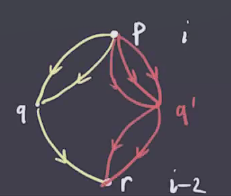
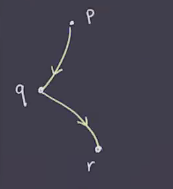

# Morse Homology and Lagrangian Floer Homology (Thursday, January 28)

Last time: defined the Morse complex.
Assumed $(f, g)$ was a Morse-Smale pair, where $f$ is a Morse function and $g$ is a Riemannian metric, and this guarantees that if $p, q\in \crit(f)$ with $\ind(p) - \ind(q) = 1$, then (among other things) there are finitely many gradient trajectories $p\leadsto q$.
We denoted this \( \mathcal{M}(p, q)  \).
The chain complex was defined by $C_i(f, g) \da \bigoplus_{\ind(p) = i} \ZZ_2 \gens{ p }$ with differential $\bd_i: C_i \to C_{i-1}$ was defined by sending an index $i$ critical point $p$ to $\sum_{\ind(q) = i-1} \# \mathcal{M}(p, q) q \mod 2$. 

:::{.theorem title="The Morse Complex is a Chain Complex"}
$\bd_{i} \circ \bd_{i+1} = 0$.
:::

Idea of the proof:
we can directly compute
\[
\bd(\bd p) 
&= \bd \qty{ \sum_{\ind(q) = i-1} \# \mathcal{M}(p, q) q }
&= \sum_{\ind(q) = i-1} \# \mathcal{M}(p, q) \bd q \\
&= \sum_{\ind(q) = i-1} \# \mathcal{M}(p, q) \qty{ \sum_{\ind(r) = i-2 \# \mathcal{M}(q, r) r  }}   \\
&= \sum_{\ind(r) = i-2} \qty{\sum_{\ind(q) = i-1} \# \mathcal{M}(p, q) \# \mathcal{M}(q, r) }  r \\
&= \sum_{\ind(r) = i-2} c_{p,q,r} r \\
&= 0 && \text{(claim)}
.\]

This happens if and only if $c_{p, q, r} = 0 \mod 2$ for all $r$ with $\ind(r) = i-2$.
This is multiplication of the number of trajectories:

In other words, this is the total number of trajectories $p\leadsto r$ that pass through $q$.
These trajectories "break" at $q$, and so we refer to these as **broken trajectories**.

:::{.definition title="Broken Trajectories"}
Suppose $\ind(r) = \ind(p) - 2$, then a **broken trajectory** from $p$ to $r$ is a trajectory from $p$ to $q$ followed by a trajectory $q$ to $r$ where $\ind(q) = \ind(p)-1 = \ind(r) + 1$.

:::

Why is the number of broken trajectories even?
We can check that $\dim \mathcal{M}(p, r) = \dim \qty{ W^u(p) \transverse W^s(r)}/\RR = (\ind(p) - \ind(r)) - 1 = 2-1 = 1$.
We can compactify \( \mathcal{M}(p, r)  \) by adding in all of the broken trajectories to define \( \overline{\mathcal{M}(p, r)} \union \qty{ \Union_{\ind(q) = i-1} \mathcal{M}(p, q) \cross \mathcal{M}(q, r) } \). 
This is useful here because we can appeal to the classification of smooth compact 1-dimensional manifolds, which are unions of copies of $S^1$ and $D_1 = I$.
In particular, the number of boundary points is even.

