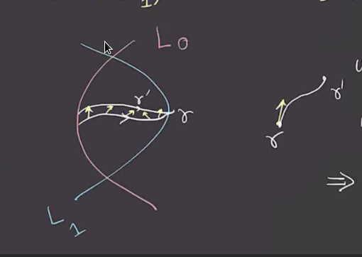

# Tuesday, February 02

:::{.remark title="Setup"}
We're working with a symplectic manifold, i.e. a pair $(M^{2n}, \omega)$ where \( \omega \in \Omega^2 \) is closed, i.e. \( d \omega = 0 \), and nondegenerate, i.e. $\Vee^n \omega \neq 0$.
We were also consider $L^n_0, L^n_1 \subset M$ Lagrangian submanifolds, i.e. $\ro{ \omega }{L_i} = 0$.
The goal is to do something like Morse homology on \( \mathcal{P}(L_0, L_1)  \) where the critical points corresponds to intersection points $L_0 \intersect L_1$, where we'll assume \( L_0 \transverse L_1 \).
:::

:::{.question}
What is the analog of a Morse function?
:::

:::{.remark}
The functional $f$ is defined on the *universal cover* \( \univcover{\Path}(L_0, L_1) \to \RR \). 
We can get around knowing much about $f$ because we only ever need derivatives $df$ and a metric $g$ on the path space to talk about the gradient $\gradient_g f$.
We'll define a 1-form \( \alpha: T \Path(L_0, L_1) \to \RR \), where we can define this tangent space as \( T_{\gamma} \Path(L_0, L_1)  \) where \( \gamma(s): I \to M \).
Set $u(s, t)$ to be a path from \( \gamma \) to \( \gamma' \) where $u(s, 0) = \gamma$ and $u(s, 1) = \gamma'$ and \( \dd{u}{t}\evalfrom_{t=0} \), which is a tangent vector to \( \gamma \) and thus \( \dd{u}{t}(s, 0) \in T_{\gamma(s)}M \).

Upshot: tangent vectors in \( T_{\gamma} \Path(L_0, L_1) \) are given by \( \xi(s) \in T_{\gamma(s)}M \) for every \( s \in I \), i.e. a way to push the path off of itself to obtain a new path.

We can thus define
\[
\alpha: T\Path(L_0, L_1) &\to \RR \\
( \gamma, \xi \in T_{\gamma} \Path ) &\mapsto \alpha_{\gamma}{\xi} \da \int_0^1 \omega( \dot{\gamma}(s), \xi(s)) ds
.\]
Does this have the property we want?
I.e. is it zero when \( \gamma \) is the constant path?
:::

:::{.lemma title="?"}
\[
\alpha _{\gamma} \equiv 0 \iff \gamma(s) \text{ is constant} \iff \dot{ \gamma(s)} = 0 \text{ for all } \gamma \iff \gamma(s) \in L_0 \intersect L_1
.\]
:::

:::{.proof title="?"}
\[
\alpha _{\gamma} \equiv 0 \iff \int_0^1 \omega( \dot{\gamma}(s), \xi(s)) ds = 0 \text{ for all } \xi\not\equiv 0
.\]

:::{.claim}
If \( \dot{\gamma}(s) \neq 0 \) for some $s$ then this is also true in an open neighborhood by smoothness, so one can find a \( \xi \) such that 

- \( \omega( \dot{\gamma(s)}, \xi(s) ) \geq 0  \), and
- There is some open subinterval \( (a, b) \subseteq [0, 1] \) on which \( \xi \) is nonzero, and thus the integral is strictly positive. 

:::

We'll need a few tools:

:::{.definition title="Almost Complex Structure"}
An **almost complex structure** is a bundle automorphism $J: TM\to TM$ such that $J \circ J = - \one_{TM}$.
It is said to be **compatible** with \( \omega \) if and only if 

- Positivity: For every $v\neq 0$, \( \omega(v, Jv) > 0 \).
- "Symplectic Isometry": For all $v, w \in TM$, \( \omega(Jv, Jw) = \omega(v, w) \).

In this case, there is a Riemannian metric defined by $g(v, w) = \omega(v, Jw)$.
Conversely, given an almost complex structure $J$ and a metric $J$, there is a symplectic form defined by \( \omega(v, w) = \omega(Jv, Jw) \da g(Jv, w) \).

\todo[inline]{This may not be a closed form? Need to check later!}

:::

:::{.exercise title="?"}
Check that \( \omega \) is a symplectic form compatible with $J$ and $g$ is the corresponding metric.
:::

:::{.exercise title="?"}
Given a symplectic form \( \omega \) and a Riemannian metric $g$ there exists a canonical almost complex structure $J$ compatible with \( \omega \) such that the previous process sends \( (\omega, J) \) to $g$.
:::

:::{.corollary title="?"}
Any symplectic manifold $(M, \omega)$ has a compatible almost complex structures $J$.
:::

:::{.theorem title="?"}
The space of all almost complex structures on $M$ compatible with \( \omega \) is contractible.
:::

Here we can use that \( \xi(s) = J \dot{ \gamma}(s) \) which implies \( \omega( \dot{\gamma}(s), J \dot{\gamma(s)}) = \omega( \dot{ \gamma(s)}, \xi(s) ) > 0 \), which happens if and only if $\dot{ \gamma}(s) \neq 0$.

So pick an almost complex structure compatible with \( \omega \) and produce a metric $g$.
We'll define a metric on $\Path(L_0, L_1)$ by the following: for \( \xi, \eta \in T_{\gamma} \Path \), recalling that $\xi = \xi(s), \eta = \eta(s) \in T_{\gamma(s)}M$, set 
\[
g_{\gamma}^\Path( \xi, \eta) \da \int_0^1 g( \xi(s), \eta(s) ) ds = \int_0^1 \omega(\xi, J \eta) ds
.\]

:::{.exercise title="?"}
Check that $g^\Path$ is a metric on \( \Path(L_0, L_1) \).
:::

We'll now define a **gradient vector field**:
\[
g_{\gamma}^\Path( -\gradient, \wait) = \alpha(\wait)
.\]
So here \( \alpha \) will play the role of $-df$.
We can write 
\[
\int_0^1 \omega( - \gradient, J \xi) ds = \int_0^1 \omega( \cdot{\gamma}, \xi) ds
.\]
Using compatibility, the LHS is equal to 
\[
\cdots = \int_0^1 \omega(-J \gradient, J^2 \xi) ds 
= \int_0^1 \omega(J \gradient, \xi) ds
.\]
So the RHS is equal to this for every \( \xi \), which means that $J \gradient = \dot{\gamma}$.
Multiplying both sides by $J$ yields $\gradient = -J \dot{\gamma}$
What are the trajectories of $J \cdot{ \gamma}(s)\in T_{\gamma} \Path$?
We can compute
\[
\dd{u}{t} (s, t) = J \dd{u}{s}(s, t)
.\]
Here $t$ is the parameter that moves between paths, and $s$ moves along a given path:

:::

