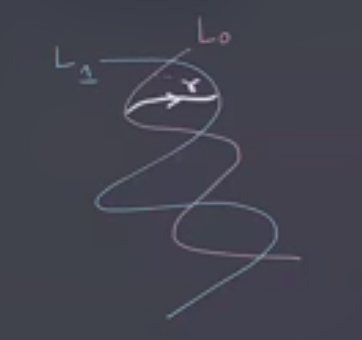

# Lecture 7 (Thursday February 04)

## Lagrangian Floer Homology

Recall that we had a symplectic manifold $(M^{2n}, \omega)$ with $L_0, L_1 \subset M$ two Lagrangians.
We wanted to do something like Morse theory on $\Path(L_0, L_1)$.

What ingredients do we need?

- Something to replace $-df$: $\alpha$

- Something to replace the vector field \( -\gradient \): we defined a metric $g^\Path$ using $\alpha$

To define \( \alpha \) we needed to look at 
\[
T_{ \gamma} \Path = \ts{ \xi: I\to TM \st \xi(s) \in T_{\gamma(s)}M } 
,\]
which is like a collection of tangent vectors along \( \gamma \) giving a way to deform the path.
Since \( \alpha\in \Omega^1(\Path) \), for any \( \gamma \) it induces a map 
\[
T_{ \gamma} M &\mapsvia{\alpha} \RR \\
\xi &\mapsto \alpha_{ \gamma} (\xi) \da \int_0^1 \omega( \dot{ \gamma}, \xi)\ds
.\]

:::{.observation}
\( \alpha_{ \gamma} = 0 \iff \gamma \) is constant, which happens if and only if \( \gamma\in L_0 \intersect L_1 \).
:::

