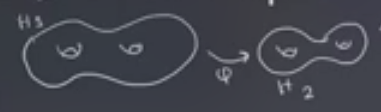

# Thursday, February 04

:::{.remark}
Goal: we want to use **Lagrangian Floer homology** to defined invariants of *closed* 3-manifolds, where here closed means that \( \bd M^3 = \emptyset \).
One example of Lagrangian Floer homology is **Heegard Floer homology**.
We'll want some symplectic manifold with two Lagrangian submanifolds.
Oszvath-Szabo used a 2-dimensional description of closed 3-manifolds called **Heegard diagrams**.
We'll need Heegard splittings to define these, and handlebodies to define the splittings.
:::

:::{.definition title="Handlebody of genus $g$"}
A **handlebody** of genus $g$ will mean a compact 3-manifold obtained from $\BB^3$ by attaching $g$ solid 1-handles, i.e. $\DD^1 \cross \DD^2$.
These are glued in via two copies of $\bd \DD^1 \cross \DD^2$:

Alternatively, these can be defined as a regular neighborhood of $\Vee_{i=1}^g S^1 \subset \RR^3$.
We'll write $H_g$ for a genus $g$ handlebody, and $\bd H_g$ will be a genus $g$ surface.
:::

:::{.definition title="Heegard Splitting"}
A **Heegard splitting** of genus $g$ is a decomposition $M = H_1 \disjoint_{\varphi} H_2$ where \( \varphi: \bd H_1 \to \bd H_2 \) is a diffeomorphism.

Explicitly, we have
\[
H_1 \disjoint_{ \varphi} H_2 \da { H_1 \disjoint H_2 \over \gens{ x \sim \varphi(x) \st \forall x \in \bd H_1 } }
.\]

:::

:::{.example title="?"}
We can write $S^3 = B_3 \disjoint_{\one} B^3$, where both are just genus $0$ handlebodies.
Note that if you attach a solid 1-handle to $B^3$, this yields $S^1 \cross \DD^2$, i.e. a solid torus:

Think of $S^3$ as the one-point compactification of $\RR^3$, we can write (and visualize) a decomposition $S^3 = (S^1 \cross \DD^2) \disjoint_{\varphi} (S^1 \cross \DD^2)$.
The first copy will be a neighborhood of a circle in the plane:

Labeling this circle as $H^1 \da \ts{ x^2 + y^2 = 1, z = 0}$, the complement $H_2 \da S^3 \sm H_1$ will be a regular neighborhood of the $z\dash$axis union $\ts{\infty }$:

:::

:::{.example title="?"}
We can write a Heegard splitting of $S^1 \cross S^2$. 
Note that $S^2 = \DD^2 \disjoint_{\one} \DD^2$, so splitting the product over the union yields $(S^1 \cross \DD^2) \disjoint_{\one} (S^1 \cross \DD^2)$.

:::

