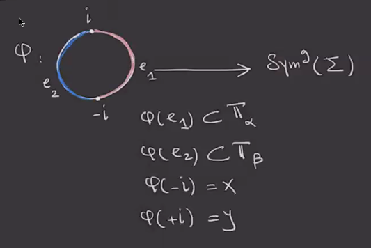
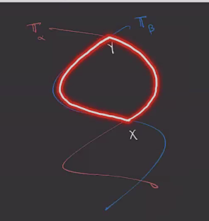
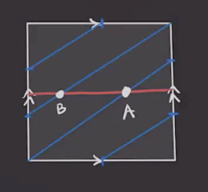
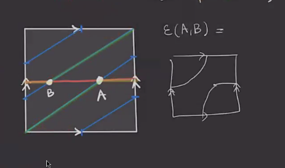
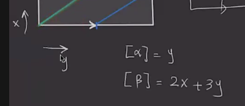

# Tuesday, February 23

## Whitney Discs 

:::{.remark}
For $x,y \in \TT_{ \alpha} \intersect \TT_{ \beta}$, recall that we had the following situation:

Then $\pi_2(x, y)$ was defined to be the homotopy classes of discs connecting $x$ to $y$.
The obstruction to the existence of such discs was denoted $\eps(x, y) \in H_1(M)$ for $M\in \Mfd^3$.
We're checking if there exist two paths connecting $x$ to $y$,
\[
a: I &\to \TT_{ \alpha} \\
b: I &\to \TT_{ \beta}
\]
such that $a-b$ is nullhomotopic.
In this case, $\pi_2(x, y) \neq \emptyset$.

We had a theorem that $\pi_1(\Sym^g \Sigma) \cong H_1( \Sym^g \Sigma)$, so we can replace nullhomotopic with nullhomologous above.
We can also use the fact that \( H_1( \Sym^g \Sigma) \cong H_1 \Sigma \).
Note that $[a-b]$ isn't well-defined, since we can append any loop to $a$ for example, but the following is well-defined:
\[
\eps(x, y) 
\da [a-b] \in { H_1 \Sym^g \Sigma \over H_1 \TT_{ \alpha} \oplus H_1 \TT_{ \beta} 
\cong {H_1 \Sigma \over \gens{ [ \alpha_1], \cdots, [ \beta_1 ], \cdots }} 
\cong H_1 M 
.\]

How can we compute $\eps$ using the Heegard diagrams?
Recall that a path in $\Sym^g \Sigma$ was a union of $g$ paths in \( \Sigma \).
So choose arcs \( a_1 \union \cdots \union a_g \) on \( \Sigma \) such that \( a_i \subseteq \alpha_i \) is sub-arc and \( \bd( a_1 \union \cdots \union a_g ) = y_1 + \cdots + y_g - x_1 - \cdots - x_g \), and similarly choose \( b_1 \union \cdots \union b_g \).
Note that if $\eps(x, y) \neq 0$ then $\pi_2(x, y) = \emptyset$.

:::

:::{.example title="$L(2, 3)$"}
The following is a Heegard diagram for $L(2, 3)$ of minimal genus, where we take \( \alpha \) to be the horizontal line and \( \beta \) will be a line of slope $2/3$:

Then \( \TT_{ \alpha} \intersect \TT_{ \beta} = \ts{ A, B } \).
Now draw arcs connecting $A$ and $B$, e.g. the ones in orange and green here:

Note that we have two generators of homology for the torus, say $x,y$, and we can write

Then the union of the two arcs is exactly $x+y$, so we can write 
\[
H_1( L(2, 3)) 
= { \ZZ \gens{ x, y } \over \gens{ y, 2x + 3y }}  
.\]
Moreover, $\eps(A, B) = x + y \neq 0$ in this quotient, so there is not Whitney disc connecting $A$ to $B$ and $\pi_2(A, B) = \emptyset$.
:::

:::{.remark}
We'll define $x\sim y \iff \eps(x, y) = 0$, and this turns out to be an equivalence relation which partitions the set of paths.

- $\eps(x, y) = 0 \implies \eps(y, x) = 0$, which follows from \( \eps(x, y) = [a-b] = [b-a] = \eps(y, x) \)

- $\eps(x, x) = 0$ by picking $a,b$ constant.

:::

:::{.exercise title="?"}
Show that \( \eps(x, y) + \eps(y, z) = \eps(x, z) \).
:::

:::{.corollary title="?"}
If $x\sim y$ and $y\sim z$, so $\eps(x, y) = \eps(y, z) = 0$, we have $\eps(x, z) = 0 \implies x \sim z$.
:::

:::{.exercise title="?"}
Find the equivalence classes under $\sim$ for the Poincaré homology sphere using the genus 2 Heegard diagram.
:::

:::{.remark}
For \( \varphi\in \pi_2(x, y) \), the **shadow** is the 2-chain \( D( \varphi ) \) on \( \Sigma \) defined in the following way: remove the \( \alpha, \beta \) arcs to obtain
\[
\Sigma \sm (\alpha\union \sigma) = \Disjoint_{i=1}^m D_i
,\]

where ${}^{o}$ denotes that the set is open.
Then \( D( \varphi) = \sum_{i=1}^m a_i D_i \).
:::

:::{.definition title="?"}

:::

