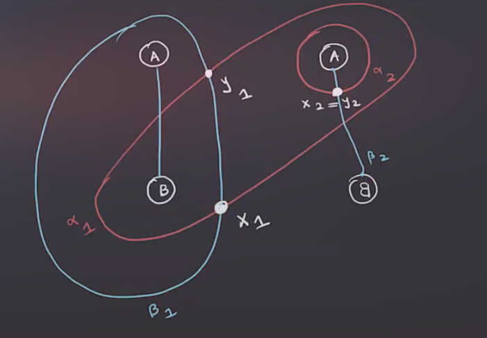
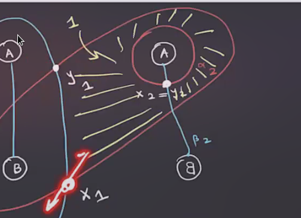
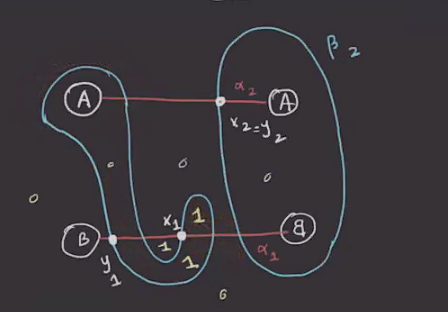

# Thursday, February 25

## Whitney Discs

Recall that we discussed the domains of discs: for \( \varphi\in \varphi_2(x, y) \) we defined the 2-chain \( D( \varphi) = \sum_{i=1}^n a_i D_i \) where we've written \( \Phi \sm \alpha\union \beta = \disjoint_{i=1}^m \open{D_i} \) and $a_i$ is the number of points in $\im( \varphi) \intersectL_{z_i}$ for $z_i \in D_i$.

\todo[inline]{Put a circle above the D_i for "open"}

:::{.exercise title="?"}
For \( \varphi\in \pi_2(x, y) \), \( \bd D( \varphi) \) is a 1-chain in \( \alpha \union \beta \).
Then 
\[ 
\ro{ \bd D( \varphi )}{ \alpha} = \sum_{i=1}^g y_i - \sum_{i=1}^g x_i 
\ro{ \bd D( \varphi )}{ \beta} = \sum_{i=1}^g x_i - \sum_{i=1}^g y_i 
\]
where $x_i, y_i \in \alpha_i$.
:::

:::{.corollary title="?"}
For \( \varphi\in \pi_2(x, y) \), consider an intersection point $w$ which labels 4 nearby regions with coefficients $a,b,c,d$:

Consider several cases:

1. $w\not\in x$ and $w\not\in y$:
  Then \( \bd\qty{ \bd \ro{D( \varphi)}{ \alpha} } \not\ni w  \).
  We can expand this out as 
  \[
  D( \varphi) = a D_1 + bD_2 + c D_3 + dD_4 \\
  \bd^2 D( \varphi) = \bd \qty{ a \bd D_1 } + {\cdots} 
  .\]
  Now restrict this to \( \alpha_i \) to yield
  \[
  \bd^2 D( \varphi) = ae_1 + be_2 -ce_2 -de_1
  .\]
  Checking coefficients of $w$ contributes $-aw + bw - cw -d(-w)$, and these should sum to zero.
  This yields $a+c = b+d$, and similarly if $w\int x \intersect y$, this also yields $a+c = b+d$.

2. $w\in x$ and $w\not \in y$ implies that $a+c = b +d +1$.

3. $w\not\in x$ and $w\in y$ implies $a+c+1 = b+d$.

:::

:::{.remark}
So if you want to check to see if some 2-chain could be the domain of a Whitney disc, this local condition can be checked, i.e. this is an obstruction to existence.
It turns out that this is an if and only if condition.
:::

:::{.definition title="?"}
A 2-chain $A \da \sum_{i=1}^m a_i D_i$ **connects** $x$ to $y$ if and only if the following local linear conditions are satisfied:
\[
\bd^2 \ro{A}{ \alpha} &= y-x \\
\bd^2 \ro{A}{ \beta} &= x-y \\
.\]
:::

:::{.proposition title="?"}
Suppose $g>1$.
If a 2-chain $A$ connects $x$ to $y$ then there exists a Whitney disc \( \varphi\in \pi_2(x, y) \) such that $D( \varphi) = A$.
If $g>2$, \( \varphi \) is uniquely determined by $A$.
:::

:::{.remark}
See proof in Osvath-Szabo paper.
:::

:::{.example title="?"}
Think of the screen as a plane, and circled letters are handles attached out of the page according to their orientations.
Consider the following diagram along with the indicated intersection points:

Set the coefficients of the unlabeled regions to zero, and let \( x \da \ts{ x_1, x_2} \) and \( y \da \ts{ y_1, y_2 } \).
We can check that if the following yellow region has coefficient 1, it can be the domain of a Whitney disc:

This follows from checking the local conditions (there is a mnemonic involving the diagonal sums for the various cases).
:::

:::{.example title="?"}
Consider a new diagram, changed by an isotopy (here: a "finger move"):

Is there a Whitney disc connecting \( x \da \ts{ x_1, x_2 } \mapsvia{\varphi} y \da \ts{ y_1, y_2 } \)?
Checking the diagonals, all of the local conditions hold, so yes.
:::

:::{.exercise title="?"}
Find the 3-manifold that these two diagrams represent.
:::

## Holomorphic Discs

Ultimately these are what we want to define the differential in the chain complex.
We'll set up a correspondence:
\[
\correspond{
  (\text{Riemann surfaces } F, {\color{red} \bd_{ \alpha}}F, {\color{blue}\bd_{\beta}}F)
  \mapsvia{\pi_{\Sigma}} ( \Sigma, {\color{red} \alpha}, {\color{blue} \beta }) \\
  \downarrow\text{$g\dash$fold branched cover $\pi_D$} \\
  (D, e_1, e_2)
}
&\mapstofrom
\correspond{
\text{holomorphic }
u: (D^2, e_1, e_2) \to (\Sym^g(\Sigma), \TT_{ \alpha}, \TT_{ \beta})
  \text{}
}
\]

