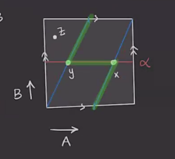

# The Heegard-Floer Chain Complex & Maslov Index (Tuesday, March 02)

## Pointed Heegard Diagrams

:::{.remark}
Last time: to strengthen the homology theory, take a **pointed** Heegard diagram \( (\Sigma, \alpha, \beta, z \in \Sigma\sm \alpha\union \beta \) and define a new chain complex
\[
\Hat{CF}( \Sigma, \alpha, \beta, z) = \bigoplus_{ x\in \TT_ \alpha \intersect \TT_ \beta} \ZZ/2 \gens{ x } \\
\bd x = \sum_{y \in \TT_ \alpha \intersect\TT_ \beta} \sum_{ \varphi\in \pi_2(x, y), \mu( \varphi) = 1, n_z(\varphi) = 0} \# \hat{ \mathcal{M}}(\varphi) y 
.\]
Note that \( n_z( \varphi) = 0 \) means that the coefficient attached to the region containing $z$ is zero.
Recall that we had diagram moves, how do they translate to the pointed setting?

- Allow *pointed isotopies*, which are isotopies disjoint from $z$.
- Allow *pointed handleslides*, where now the bounded pair-of-pants is disjoint from $z$:

- Allow isotopies of the base point.

:::

:::{.lemma title="?"}
Any two pointed Heegard diagrams for a 3-manifold $M^3$ can be connected by a sequence of the following moves:

- Stabilization or destabilization,
- Pointed isotopy,
- Pointed handleslides,
- Isotopes of the basepoint away from \( \alpha, \beta \).

:::

:::{.exercise title="?"}
Prove this lemma.
:::

:::{.example title="$S^3$"}
Here is the simplest Heegard diagram from $S^3$:

Here there is just one one intersection point, so $\hat{\CF} = \ZZ/2\gens{ x } $ is 1-dimensional, and \( \bd x = 0 \).
So $\hat{\HF} = \ZZ/2$.
:::

:::{.example title="$\RP^3$"}
We can write $\RP^3 = L(2 ,1)$ and produce the following Heegard diagram:

Is there a disc between $x$ and $y$?
We can check the obstruction $\eps(x, y)$ by labeling the generators in homology and tracing the following green path:

We obtain
\[
\eps(x, y) = [B] \in { H_1(T^2) \over \gens{ [\alpha] = [A], [\beta] = [A + 2B] } }
.\]
In this quotient, $[B] \neq 0$, and this quotient is $\ZZ/2 = \gens{ [B] }$ so that $2B = 0$. 
So there are no disks in $\pi_2(x, y)$, making $\bd x = \bd y = 0$.
So $\hat{HF}(\RP^3) = \ZZ/2 \oplus \ZZ/2$.

:::

:::{.exercise title="?"}
Compute $\hat{\HF}(L(p, 1))$.
Use that $\eps(x, y) + \eps(y, z) = \eps(x, z)$.
:::

## Maslov Index

:::{.remark}
Recall that we had a natural concatenation operation on Whitney discs:
\[
\ast: \pi_2(x, y) \cross \pi_2(y, z) \to \pi_2(x, z)
,\]
using the identification of these discs with paths in the path space and using concatenation of paths there.
There is an inverse
\[
\pi_2(x, y) &\to \pi_2(y, x)
\varphi &\mapsto \varphi\inv(s, t) \da \phi(s, -t)
,\]
which reverses the parameterization and runs the path backward.
There is also a *sphere addition*
\[
\pi_2( \Sym^g( \Sigma), x) \cross \pi_2(x, y) &\to \pi_2(x, y) \\
(S, \varphi) &\mapsto S \ast \varphi
.\]

:::

