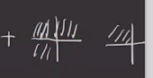
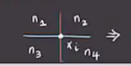
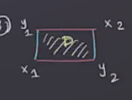
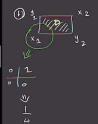
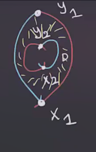
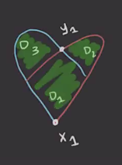

# Maslov Index Formula (Thursday, March 04)

Recall that for $x,y \ion \TT_ \alpha \intersect \TT_ \beta$, there is a map
\[
\mu: \pi_2(x, y) &\to \ZZ \\
&\mu &= \ind(D \delbar_J)
.\]

This index is the expected dimension of $M(\varphi)$.
The following theorem can be found in the paper "A cylindrical reformulation of Heegard Floer homology":

:::{.theorem title="Lipschitz"}
Let \( x = \ts{ x_1, \cdots, x_g } \)  and \( y = \ts{ y_1, \cdots, y_g } \)  and \( \varphi\in \pi_2(x, y) \).
Then 
\[
\mu( \varphi) = e( D( \varphi) ) + n_x( D( \varphi ) ) + n_y( D( \varphi ) )
.\]
where $e(\wait)$ is the **Euler measure** and $n_x(\cdots), n_y(\cdots)$ is referred to as the **point measure**.
Note that these only depend on the domain of \( \varphi \).
:::

:::{.definition title="Euler Measure"}
Let $D( \varphi) = \sum_{i=1}^m n_{z_i} ( \varphi) D_i$, then
\[
e (D (\varphi)) \da \sum_{i=1}^m n_{z_i}( \varphi) e(D_i) && e(D_i) \da \chi(D_i) + {1\over 4} C_1 - {1\over 4}C_2
.\]
Here we use the fact that all regions are polygons whose corners occur in one of two types:

So we define $C_1$ to be the number of corners of the first type and $C_2$ the number of the second type.
The point measure is defined as 
\[
n_x (D( \varphi ) ) \da \sum_{i=1}^g n_{x_i}( D( \varphi ) ) = {n_1 + n_2 + n_3 + n_4 \over 4}
,\]

where the $n_i$ are the surrounding regions' coefficients:

:::

:::{.example title="?"}
Let $x = \ts{ x_1, x_2 }, y = \ts{ y_1, y_2 }$ and compute \( \mu( \varphi) \) where \( D( \varphi) \) is one of the following domains:

1. The first type:

   

  

  - Here $D( \varphi) = 0$ and $e(D) = 1 + {1\over 4}(0) - {1\over 4} (0) = 0$.
  - $n_x(D (\varphi ) ) = n_{x_1}( D ) + n_{x_2}(D)F = {1\over 4} + {1\over 4} = {1\over 2}$.
  - $n_y(D ( \varphi ) ) = n_{y_1}(D) + n_{y_2}(D) + {1\over 4} + {1\over 4} = {1\over 2}$.
  - So $\mu( \varphi) = 1$.

2. A second type:

  

  - Here we have an annulus and $D( \varphi) = D$ implies that $e(D (\varphi)) = e(D) = \chi(D) + \cdots = 0 + {1\over 4}(0) - {1\over 4}( 4) = -1$.
  - \( n_{x} (D( \varphi ) ) = n_{x_1}( D) + n_{x_2}(D) = {1\over 4} + {1\over 4} = {1\over 2} \)
  - $\mu( \varphi) = -1 + {1\over 2} + {1\over 2} = 0$.

3. A third type:

  

  - Here $x_2 = y_2$ and are disjoint from $D_1, D_2, D_3$:
  - $D( \varphi) = D_1 + D_2 + D_3$.
  - $e(D ( \varphi ) ) = \sum e(D_i) = \qty{1 - {1\over 4}(4) } + \qty{1 - {1\over 4}(2) } + \qty{1 - {1\over 4}(2)} = 0 + {1\over 2} + {1\over 2} = 1$.

:::

