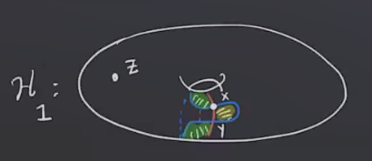
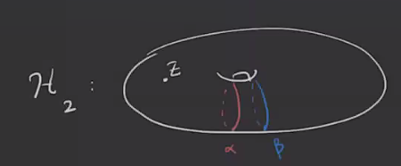
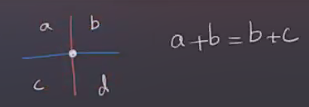
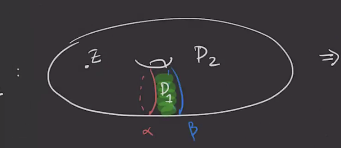
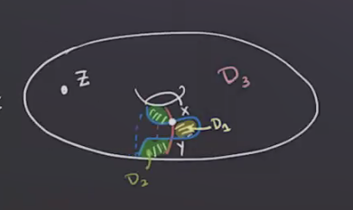
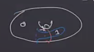

# Tuesday, March 09

Recall that we were working with a diagram for $S^1 \cross S^2$:

Here we have \( \bd x = 2y = 0 \) since we're working mod 2, and \( \bd y = 0 \), so we have
\[
\hat{\HF}(H_1) = {\ker \bd \over \im \bd} = { \gens{ x, y }\over 1} = (\ZZ/2)^{\oplus 2} 
.\]

However, with a different diagram, we get a different result:

Here $\hat{\HF}(H_2) = 0$.
To prevent this, we'll have some class of *admissible* diagrams.

:::{.definition title="Periodic Domains"}
A 2-chain \( P = \sum_{i=1}^m a_i D_i \) is called a **periodic domain** if and only if 

1. The local multiplicity of $P$ at $z$ is zero, i.e. $n_z(P) = 0$, and
2. $\bd P$ is a linear combination of \( \alpha, \beta \).
:::

:::{.remark}
Note that for (2), the boundary could involve 1-chains, so this condition avoids corners on \( \bd P \).
The local picture is the following:

:::

:::{.example title="?"}
In this picture, $P = nD_1$ will be a periodic domain for any $n$;

:::

:::{.example title="?"}
Labeling the first picture, we have

We should have $n_1 + n_2 = 0$, so any $P = n(D_1 - D_2)$ will be a periodic domain.
Checking the boundary yields \( \bd P = n \alpha \pm n \beta \).
In fact there is single "generator" for the periodic domains here:

:::

