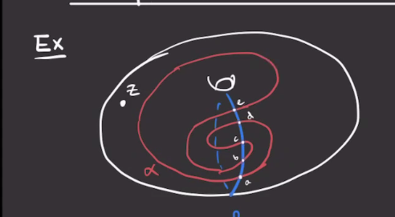
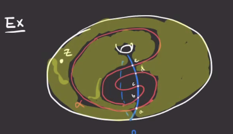

# Thursday, March 11

:::{.remark}
Recall the example from last time: we are trying to show that changing a diagram by isotopy doesn't change the homology.

Here we have $g=1$ and so \( \Sym^1(T^2) = T^2 \), and \( \alpha \intersect \beta = \ts{ a,b,c,d,e } \).
So \( \hat{\CF}( \Sigma, \alpha, \beta, z) = \ZZ/2 \gens{ a,b,c,d,e }  \).

First mark the component that contains the base point $z$:

We can make this part bigger:

:::

