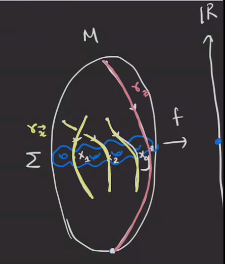

# Thursday, March 18

## $\Spinc$ Structures and Invariance

:::{.remark}
Recall that given a Heegard diagram \( ( \Sigma, \alpha, \beta, z ) \) gives an equivalence relation
\[
x \sim y \iff \eps(x, y) = 0 \in H_1(M) \equalsbecause{\PD} H^2(M)
.\]
This yields a decomposition of $\hat{\CF}$ into a direct sum over equivalence classes of subcomplexes defined by $\Spinc$ structures.
Note that the differential will preserve each direct summand.
We defined $\Spinc(M)$ as the set of nowhere vanishing vector fields on $M$ modulo being homotopic outside finitely many 3-balls in $M$.
We had a map 
\[
\TT_{ \alpha} \intersect \TT_{\beta} \mapsvia{s_z} \Spinc(M)
,\]
recalling that the left-hand side are the generators of $\hat{\CF}$.
We took a self-indexing Morse function on $M$, took the inverse image of $3/2$ to get the Heegard surface, and each intersection point $x_i$ gave a flow line from an index 2 critical point to an index 1 critical point passing through $x_i$:

We proceeded by cancelling adjacent flow lines (at the level of vector fields), and then modifying $\gamma_z$ (the flow line passing through the basepoint $z$ connecting the index 0 to the index 3) to get a nowhere vanishing vector field.
We then took a trivialization $\tau: TM \to M \cross\RR^3$ defined a map
\[
\Spinc(M) &\mapsvia{\gamma^ \tau} H^2(M) \\
s = [v] &\mapsto f_v^*( \alpha)
.\]
where \( \alpha \) is the volume form of $S^2$ and 
\[
f_v: M &\to S^2 \\
x &\mapsto \hat{v_x} \da { v_x \over \norm{v_x} }
.\]
Note that \( \delta^\tau \) a priori depends on \( \tau \), but 
\[
\delta(s_1, s_2) = \delta^{ \tau}(s_1) - \delta^{ \tau}(s_2) \in H^2(M)
,\]
and the difference is independent of \( \tau \).
:::

:::{.lemma title="?"}
For $x, y\in \TT_{ \alpha} \intersect \TT_{ \beta}$, defining $s_1 - s_2 = \delta(s_1, s_2) \in H^2(M)$, we have
\[
s_z(y) - s_z(x) = \PD[\eps(x, y) ]
.\]

As corollaries,

1. If $x\sim y$ then $s_z(y) = s_z(x)$, and
2. If $x\not\sim y$ then the above equation holds.

:::

:::{.exercise title="?"}
Prove this!

*Hint, take the Poincaré dual of the link below to get the formula:*
\[
s_z(y) - s_z(x) = \PD[ \gamma_y \union (- \gamma_x)]
.\]
*This implies that the two vector fields are equal everywhere outside of a tubular neighborhood of the link.
Then show that \( [ \gamma_x \union (-\gamma_x) = [ \eps(x, y) ] \).*
:::

:::{.remark}
We thus have
\[
\hat{\CF}( \Sigma, \alpha, \beta, z)
= \bigoplus _{\mfs \in \Spinc(M)} 
\hat{\CF}( \Sigma, \alpha, \beta, z, \mfs)
.\]
:::

:::{.remark}
We have several properties of $\Spinc$ structures.
There is a map
\[
J: \Spinc(M) &\to \Spinc(M) \\
s = [v] &\mapsto \conj{s} \da [-v]
.\]
There is also a first Chern class
\[
c_1: \Spinc(M) &\to H^2(M) \\
s &\mapsto s - \conj{s}
,\]
i.e. $c_1(s) = \delta(s, \conj{s})$.
:::

:::{.theorem title="Topological Invariance"}
The association
\[
( \Sigma, \alpha, \beta, z), J \leadsto 
\hat{\HF}
( \Sigma, \alpha, \beta, z)
\]
does not depend on the choice of Heegard diagram or the almost complex structure $J$, so this yields a well-defined invariant of $M$ which we'll denote \( \hat{\HF}(M) \) for \( M\in \Mfd^3(\RR) \).
:::

:::{.remark}
There are few things to discuss:

1. The almost complex structure $J$:

2. Isotopies

3. Handle slides

4. Stabilization

Remarks on these:

1. This involves a standard argument from Lagrangian Floer homology.

2. There are two cases:

  - If the isotopy doesn't create a new intersection, we have a 1-to-1 correspondence between generators for any two choices, and changing $J$ to $J'$ will give a correspondence between the differentials.
  So this reduces to showing 1.
  - If is *does* create new intersection points, there are again standard arguments in Lagrangian Floer homology for this.

:::

