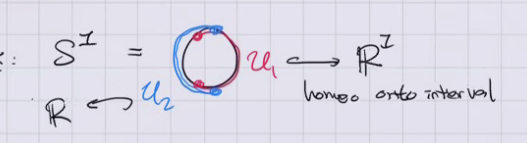

# Tuesday, January 12

## Background

Further Reading: There are very few references in the notes, and I'll try to update them to include more as we go. Personally, I found the following online references particularly useful: 

Dietmar Salamon: Spin Geometry and Seiberg-Witten Invariants
https://people.math.ethz.ch/~salamon/PREPRINTS/witsei.pdf

Richard Mandelbaum: Four-dimensional Topology: An Introduction
https://projecteuclid.org/download/pdf_1/euclid.bams/1183545202

This book has a nice introduction to surgery aspects of four-manifolds, but as a warning: It was published right before Freedman's famous theorem. For instance, the existence of an exotic R^4 was not known. This actually makes it quite useful, as a summary of what was known before, and provides the historical context in which Freedman's theorem was proven.

Danny Calegari: Notes on 4-Manifolds
https://math.uchicago.edu/~dannyc/courses/4manifolds_2018/4_manifolds_notes.pdf

Yuli Rudyak: Piecewise Linear Structures on Topological Manifolds
https://hopf.math.purdue.edu/Rudyak/PLstructures.pdf

Akhil Mathew: The Dirac Operator
https://math.uchicago.edu/~amathew/dirac.pdf

Tom Weston: An Introduction to Cobordism Theory
https://people.math.umass.edu/~weston/oldpapers/cobord.pdf

A wide variety of lecture notes on the Atiyah-Singer index theorem, which are available online.

## Introduction

Recall that a **topological manifold** (or $C^0$ manifold) $X$ is a Hausdorff topological space *locally homeomorphic* to $\RR^n$ with a countable topological base, so we have charts $\phi_u: U\to \RR^n$ which are homeomorphisms from open sets covering $X$.

:::{.example title="The circle"}
$S^1$ is covered by two charts homeomorphic to intervals:

:::

:::{.remark}
Maps that are merely continuous are poorly behaved, so we may want to impose extra structure.
This can be done by imposing restrictions on the transition functions, defined as 
\[
t_{uv} \da \varphi_V \to \varphi_U ^{-1} : \varphi_U(U \intersect V) \to \varphi_V(U \intersect V)
.\]
:::

:::{.definition title="Restricted Structures on Manifolds"}
\envlist

- We say $X$ is a **PL manifold** if and only if $t_{UV}$ are piecewise-linear.
  Note that an invertible PL map has a PL inverse.

- We say $X$ is a **$C^k$ manifold** if they are $k$ times continuously differentiable, and **smooth** if infinitely differentiable.

- We say $X$ is **real-analytic** if they are locally given by convergent power series.

- We say $X$ is **complex-analytic** if under the identification $\RR^n \cong \CC^{n/2}$ if they are holomorphic, i.e. the differential of $t_{UV}$ is complex linear.

:::

