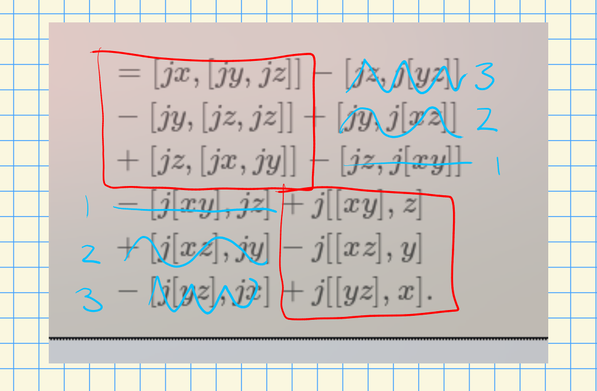

# Section 7.6 (Wednesday, April 28)

:::{.remark}
Today: filling in some previous things, including proofs for Whitehead's second lemma and Levi's theorem.
:::

:::{.definition title="?"}
Let $\lieg\in\liealg_{/k}$ for $k\in \CRing$ and let $M\in \kmod$ viewed as a trivial $\lieg\dash$ module.
An **extension of $\lieg$ by $M$** is a SES in $\liegmod$ of the following form:
\[
0 \to M \mapsvia{\iota} E \mapsvia{\pi} \lieg \to 0
.\]
:::

:::{.remark}
Given such an extension, thinking of $M \subset E$, $M$ becomes a $\lieg\dash$module in a natural way: given $m\in M$ and $x\in\lieg$, choose $\tilde x\in E$ such that $\pi(\tilde x) = x$ and set
\[
x\cdot m \da [\tilde x, m]_E \in M \normal E
,\]
noting that $M$ is the kernel of a morphism and thus an ideal.
Is this well-defined?
If $\tilde x'\in \pi\inv(E)$, we have \( \pi(\tilde x' - \tilde x) = 0 \) which implies $\tilde x' -\tilde x\in \ker \pi = M$ by exactness.
So we can write $\tilde x' = m' + \tilde x$ for some $m'\in M$, and since $M$ is abelian and its elements bracket to zero, we have
\[
[\tilde x ', m] = [m' + \tilde x, m] = [\tilde x, m]
.\]
:::

:::{.remark}
The extension problem: given a $\lieg\dash$module $M$ viewed as an abelian Lie algebra, how many (equivalence classes of) extensions of $\lieg$ by $M$ are there for which the induced action above agrees with the given action?
Here we view equivalence as existence of an isomorphism making the following diagram commute:

\begin{tikzcd}
	0 && M && E && \lieg && 0 \\
	\\
	&&&& {E'}
	\arrow["\sim", dashed, from=1-5, to=3-5]
	\arrow["{\iota'}"', from=1-3, to=3-5]
	\arrow[from=1-1, to=1-3]
	\arrow["\iota", from=1-3, to=1-5]
	\arrow["\pi", from=1-5, to=1-7]
	\arrow[from=1-7, to=1-9]
	\arrow["{\pi'}"', from=3-5, to=1-7]
\end{tikzcd}

> [Link to Diagram](https://q.uiver.app/?q=WzAsNixbMCwwLCIwIl0sWzIsMCwiTSJdLFs0LDAsIkUiXSxbNiwwLCJcXGxpZWciXSxbOCwwLCIwIl0sWzQsMiwiRSciXSxbMiw1LCJcXHNpbSIsMCx7InN0eWxlIjp7ImJvZHkiOnsibmFtZSI6ImRhc2hlZCJ9fX1dLFsxLDUsIlxcaW90YSciLDJdLFswLDFdLFsxLDIsIlxcaW90YSJdLFsyLDMsIlxccGkiXSxbMyw0XSxbNSwzLCJcXHBpJyIsMl1d)

Write $\Ext_{\Liealg}(\lieg, M)$ for the set of equivalence classes of such extensions.
:::

:::{.remark}
We can form semidirect products $M\semidirect \lieg$ of Lie algebras in the following way: 
start with the \(k\dash\)module $M \cross \lieg$ with bracket
\[
[(m, x), (n, y)] \da (x\cdot n - y\cdot m, [xy]) && m,n\in M,\,\, x,y\in\lieg
.\]
One checks that this is anticommutative and satisfies the Jacobi identity.
This is a Lie algebra containing $M \cross 0$ as an abelian ideal and $0 \cross \lieg$ as a subalgebra, which fits into a SES
\[
0 \to M \mapsvia{\iota}  M\semidirect \lieg \mapsvia{\pi}  \lieg \to 0
.\]
Moreover, the naturally induced action described previously agrees with this semidirect action.
Identifying elements with their inclusions, we have
\[
[(0, x), (m, 0)] = (x\cdot m - 0, [0, 0] ) = (x\cdot m, 0)
.\]
Thus there is always at least one extension, called the **split extension**.
There is a classification:
:::

:::{.theorem title="Classification of Extensions"}
Let $M\in \liegmod$, then there is a bijection of sets
\[
\Ext(\lieg, M)
&\mapstofrom
H^2(\lieg; M)
\]
:::

:::{.remark}
Note that the map $\pi$ makes $M$ into an $E\dash$module and makes $M$ into a trivial $M\dash$module.
See Weibel for a functorial proof, using the same correspondence between $\Ext_R^1(A, B)$ and extensions of $A$ by $B$.
Note that we have an algebra, an ideal, and its quotient, which is precisely the setup for the LHS spectral sequence for cohomology with coefficients in $M$.
There was an associated 5-term exact sequence, which contains a **classifying map**
\[
\Hom_\liegmod(M, M) &\mapsvia{d^2} \Hom_{\liegmod}(\lieg, M) \\
\one_M &\mapsto d^2(\one_M)
.\]
One checks that this only depends on the equivalence class of extensions, and turns out to be a bijection.
Weibel's proof uses some facts about free Lie algebras that we haven't discussed yet, so we'll instead do a slightly more down-to-earth proof from Knapp's book using the Koszul complex.
:::

:::{.proof title="of classification theorem"}
We'll need to assume $k\in \Field$.
Choose a splitting of the following SES as a $k\dash$vector space:
\begin{tikzcd}
	0 && M && E && \lieg && 0
	\arrow[from=1-1, to=1-3]
	\arrow["\iota", from=1-3, to=1-5]
	\arrow["\pi", shift left=2, from=1-5, to=1-7]
	\arrow[from=1-7, to=1-9]
	\arrow["j", shift left=3, dotted, from=1-7, to=1-5]
\end{tikzcd}

> [Link to Diagram](https://q.uiver.app/?q=WzAsNSxbMCwwLCIwIl0sWzIsMCwiTSJdLFs0LDAsIkUiXSxbNiwwLCJcXGxpZWciXSxbOCwwLCIwIl0sWzAsMV0sWzEsMiwiXFxpb3RhIl0sWzIsMywiXFxwaSIsMCx7Im9mZnNldCI6LTJ9XSxbMyw0XSxbMywyLCJqIiwwLHsib2Zmc2V0IjotMywic3R5bGUiOnsiYm9keSI6eyJuYW1lIjoiZG90dGVkIn19fV1d)

So here $\pi \circ j = \one_\lieg$.
Note that we can use $j(x)$ for our $\tilde x$.
From section 7.7, we can characterize $H^2(\lieg; M)$ is a subquotient of $\Hom_k\qty{ \Extalg^2 \lieg, M}$, recalling that we canceled a $\Ug$ when taking the resolution 
\[
\Ug \tensor \Extalg^* \lieg \surjectsvia{\eps} k
\]
and applying $\Hom_k(\wait, M)$.
Specifically, it is $\ker \delta / \im \delta$ for the coboundary $\delta$ from corollary 7.7.3.
Recall that we define a hom from an $n$th piece of an exterior algebra is equivalence to an alternating $n\dash$argument function, and define $w\in \Hom_k\qty{ \Extalg^2 \lieg, M }$ by 
\[
w(x, y) = [jx, hy]_E - j\qty{ [xy]_M } \in E
,\]
where we'll omit parentheses and bracket subscripts immediately.
We want to detect if this is in $M$, so use that $M = \ker \pi$ and check
\[
\pi ([jx, jy] - j[xy]) 
&= [\pi j x, \pi j y] - \pi j[xy] \\ 
&= [xy] - [xy] \\
&= 0
,\]
and so $w(x, y) \in M$ as needed.
We now want to compute $\delta w$ to compute the action $x\cdot m \da [\tilde x, m]_M$, so take $\tilde x \da j(x)$.
Use that $\delta$ has graded degree $+1$, so
\[
\delta w(x,y,z) 
&= x\cdot w(y,z) - y\cdot w(x, z) + z\cdot w(x, y) 
\\
&\quad -w([xy], z) + w([xz], y) - w([yz], x) 
\\ \\
&= 
[jx, [jy, jz]] - [jz, j[yz]]
\\
&- [jy, [jz, jz]] + [jy, j[xz]]
\\
&+ [jz, [jx, jy]] - [jz, j[xy]] \\
&- [j[xy], jz] + j [[xy], z] \\
&+ [j[xz], jy] - j [[xz], y] \\
&- [j[yz], jx] + j [[yz], x]
.\]

There is a lot of cancellation here!
Use the Jacobi identity for terms in red, and sign rules to cancel the rest:

So $w\in \ker \delta$.

> To be continued.

:::

:::{.remark}
One should check that choices differ by coboundaries, along with a few other things that we're eliding.
:::

