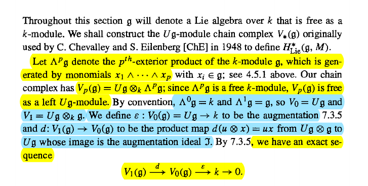
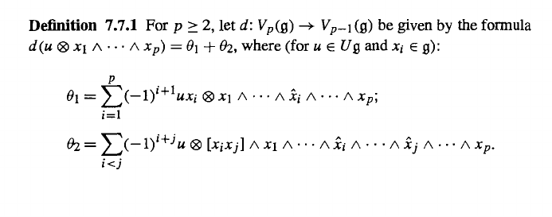

# Problem Set 7 

:::{.problem title="Weibel 7.2.1"}
1. Let $f:M\to N$ be a morphism of $\lieg\dash$modules over a field $k$.
  Show that the $k\dash$modules $\ker(f), \im(f), \coker(f)$ are the kernel, image, and cokernel respectively of $f$ in the category $\liegmod$

2. Show that a monic (resp. epi) in $\liegmod$ is also a monic (resp. epi) in $\kmod$.
  Use (1) to show that $\liegmod$ is an abelian category.
:::

:::{.problem title="Weibel 7.2.2"}
For $M\in \kmod$, let $E \da \Endo_{\kmod}(M) \in \kalg$ be the associative algebra of $k\dash$module endomorphisms of $M$.
Show that there is a correspondence
\[
\correspond{
  \text{Maps $\lieg \tensor M \to M$} \\
  \text{making $M$ a $\lieg\dash$module}
}
&\mapstofrom
\correspond{
  \text{Lie algebra morphisms}\\
  \lieg \to \Lie(E)
}
\]
Conclude that a $\lieg\dash$module may also be described as an $M\in\kmod$ together with a morphism of Lie algebras
\[
\lieg \to \Lie\qty{ \Endo_{\kmod}(M) }
.\]
:::

:::{.solution}
Define maps
\[
\ts{ f: \lieg \tensor_k M \to M \in \kmod} &
\mapscorrespond{\Theta}{\Psi} 
\ts{ \lieg \to \Lie\qty{\Endo_{\kmod}(M) } \in \liealg} \\
f & \mapsto \Theta_f \da (g \mapsto f(g, \wait) )
,\]
so $\Theta_f(g)(m) = f(g, m)$.

:::{.claim}
$\Theta_f$ defines a morphism of Lie algebras.
:::

Writing $[\wait, \wait]_\lieg$ for the bracket on $\lieg$ and $[\wait, \wait]_{\Endo}$ for the bracket on $\Lie(\Endo_{\kmod}) (M)$ defined by $[x, y]_{\Endo} \da x\circ y - y\circ x$. 

:::

:::{.problem title="Weibel 7.3.2"}
Given an $M\in \kmod$, consider the Lie algebra $\Lie(T(M))$ underlying the tensor algebra $T(M)$.
Let $\mathfrak{f}$ denote the Lie subalgebra generated by $M$, so elements of \( \mathfrak{f}  \) are iterated brackets of elements: 
\[
f \in \mathfrak{f} \implies f = [x_1\, [x_2\, [ \cdots x_n]]] && x_i \in M
.\]
Show that \( \mathfrak{f}  \) satisfies the universal property of a free Lie algebra of $M$ (see 7.1.5).
:::

:::{.problem title="Weibel 7.3.4"}
Let $M, N \in \modsleft{\lieg}$ and make $\Hom_{\kmod}(M, N)$ into a $\lieg\dash$module via the action
\[
(xf)(m) \da xf(m) - f(xm) && x\in \lieg, m\in M
.\]
Show that there is a natural isomorphism
\[
\Hom_{\liegmod}(M, N) \mapsvia{\sim} \Hom_{\kmod}(M, N)^{\lieg}
.\]

:::

:::{.problem title="Weibel 7.7.1"}
In the following construction, verify that $d^2 = 0$ and conclude that $V_* \in \Ch(\liegmod)$.

> Hint: write $d(\theta_{i_1}) = \theta_{i_1} + \theta_{i_2}$ and show that $-\theta_{i_1}$ is the $i=1$ part of $\theta_{2, 1}$ and $\theta_{2, 2} = 0$.
> Then show that $-\theta_{1, 2}$ is the $i>1$ part of $\theta_{2, 1}$.

:::
