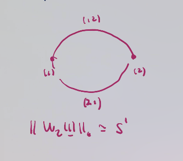
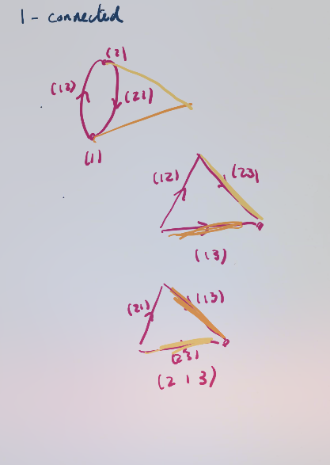
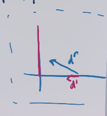
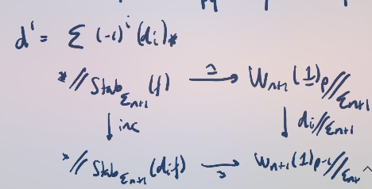
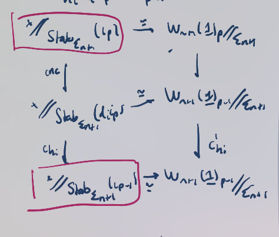
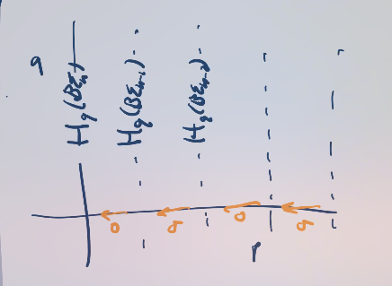

# Lecture 2 (Thursday, May 06)

## Setup and Strategy

References: see Randal-Williams and Wahl.

We'll follow a strategy going back to Quillen, reconstructed from some sun-bleached physical notes.

:::{.theorem title="Nakaoka"}
The following sequence exhibits homological stability:
\[
\B \Sigma_0 \mapsvia{\sigma} \B \Sigma_1 \mapsvia{\sigma} \B \Sigma_2 \to \cdots
.\]

More precisely, the following map is a surjection for $i\leq n/2$ and an isomorphism if $i\leq (n-1)/2$:
\[
\sigma_*: H_i (\B \Sigma_n; \ZZ) \to H_i(\B \Sigma_{n+1}; \ZZ)
.\]
:::

:::{.remark}
Modern: identify $\sSet \cong \Spaces$ and categories with their nerves.
For \(G\dash\)sets, we can take homotopy quotients by the action of $G$.
Can construct $\B G$ as geometric realization of a nerve, or a homotopy quotient: $\B G \homotopic \pt \hq G$.
:::

:::{.fact}
Some properties of $X \hq G$:

- They are natural, in the sense that if $X \mapsvia{f} Y$ is $G\dash$equivariant, so $gf(x) = f(gx)$, then there is a map $X \hq \to Y\hq G$?

- They preserve **homological connectivity**, where $f:X\to Y$ is homologically $n\dash$connected if $f_*$ is surjective for $i\leq d$ and an isomorphism for $i\leq d-1$.
  So if $X \mapsvia{f} Y$ is $d\dash$connected, then $f\hq G: X\hq G \to Y\hq G$ is $d\dash$connected

- They commute with geometric realisations:
  If $X_\bullet$ is a semi-simplicial $G\dash$space, then $\norm{X_\bullet} \hq G \homotopic \norm{ X_\bullet \hq G}$.

- Homotopy quotients of transitive \(G\dash\)sets, so 
\[
\B \Stab_G(s) \cong \ts{ s } \hq \Stab_G(s) \homotopic S \hq G
.\]
:::

:::{.remark}
We'll use these properties to make inductive arguments.
:::

## Injective Words

:::{.remark}
We'll define $\Delta$ as non-empty finite ordered sets and order-preserving maps, and write $[p] \da (0 < \cdots < p)$.
A **simplicial category** is a functor
\[
\Delta\op \mapsvia{X_\bullet} \cat{C} 
,\]
where you can take $\cat{C} = \Set, \Top$, etc.
We'll define $X_p \da X([p])$.
There are face maps $\delta_i: [p-1] \to [p]$ which skips $i$, and degeneracy maps $\sigma_i: [p] \to [p-1]$ which double the $i$th entry.
We can then define
\[
\norm{X_\bullet} \da \qty{ \disjoint_{p\geq 0} \Delta^p \cross X_p} / \sim
.\]
Life will be easier if we forget the degeneracy maps, these will be **semi-simplicial sets**.
Slightly better homotopically behave, can ignore some cofibrancy conditions, and importantly these are *smaller* than simplicial sets.
:::

:::{.remark}
First step: in $\pt \hq \Sigma_n$, replace $\pt$ with $\norm{\complex{X}}$ for $\complex{X} \in \sSet^\semi$.
Notationally, we'll write $X$ as $\complex{ W_n( \ul{1} ) }$.
We'll build a category $\FI \leq \Finset$ in the next lecture, whose objects are finite sets and morphisms are injections.
We'll define $W_n(\ul 1)_p$ as the semisimplicial set whose $p\dash$simplices are given by $\Hom_{\FI}([p], \ul{n} )$ where $\ul{n} = \ts{ 1, 2, \cdots, n }$.
The face maps are induced by precomposing with $\delta_i$.
:::

:::{.example title="Injective words"}
Set $W_n(\ul 1) _p$ to be sequences $(m_0, m_1, \cdots, m_p)$ with each $m_i \in \ul{n}$.
:::

:::{.example title="?"}
$W_2(1)_\bullet$: note that $W_n$ has up to $n\dash$simplices in general, and here

- 0-simplices: $(1), (2)$,
- 1-simplices: $(1,2), (2, 1)$.

Taking the geometric realization yields a circle:

:::

:::{.example title="?"}
$\complex{ W_3(\ul 1)}$:

- 0-simplices: $(1), (2), (3)$
- 1-simplices: there are 6 
- 2-simplices: again 6

In general, the number of $(n-1)\dash$simplices is $n!$.

One can check homological connectivity.
After the gluing loops will become nullhomotopic:

Here it's easy to just compute the fundamental groupoid.
:::

:::{.proposition title="?"}
\envlist

1. $\norm{ \complex{ W_n(\ul 1) }}$ is homologically $(n-1)/2\dash$connective.
2. $W_n(\ul 1)_p$ is a transitive $\Sigma_n\dash$set and the stabilizer of $x\in W_n(\ul 1)_p$ is isomorphic to $\Sigma_{n-p-1}$.

:::

:::{.remark}
**Upshot**: $\norm{ \complex{ W_n(\ul 1) }}$ can serve as a replacement for $\pt$ in $\pt\hq \Sigma_n$ in the ranges we are interested in.
:::

:::{.remark}
Next step: exploit the fact that geometric realizations come with a natural filtration, and thus there is a spectral sequence.
The filtration is given by
\[
F_r \norm{ \complex{X}} \da \qty{ \disjoint_{0\leq p\leq r} \Delta^p \cross X_p } / \sim
.\]
We can recover $\normcomplex{X} = \colim F_i \normcomplex{X}$:

\begin{tikzcd}
	{F_0\normcomplex{X}} && {F_0\normcomplex{X}} && {F_0\normcomplex{X}} \\
	&&& {} \\
	{X_0} && {\Sigma(X_1)_+} && \cdots
	\arrow[from=1-1, to=3-1]
	\arrow[from=1-3, to=3-3]
	\arrow[from=1-5, to=3-5]
	\arrow[from=1-1, to=1-3]
	\arrow[from=1-3, to=1-5]
\end{tikzcd}

> [Link to Diagram](https://q.uiver.app/?q=WzAsNyxbMCwwLCJGXzBcXG5vcm1jb21wbGV4e1h9Il0sWzIsMCwiRl8wXFxub3JtY29tcGxleHtYfSJdLFs0LDAsIkZfMFxcbm9ybWNvbXBsZXh7WH0iXSxbMCwyLCJYXzAiXSxbMiwyLCJcXFNpZ21hKFhfMSlfKyJdLFs0LDIsIlxcY2RvdHMiXSxbMywxXSxbMCwzXSxbMSw0XSxbMiw1XSxbMCwxXSxbMSwyXV0=)

> Here $Y_+$ means adding a disjoint basepoint.

The spectral sequence of a filtration will converge to the reduced homology of the associated graded. (?)

:::

:::{.theorem title="Segal"}
There is a strongly convergent first quadrant spectral sequence:
\[
E_{p, 1}^1 = H_q(X_p; \ZZ) \abuts H_{p+1}( \normcomplex{X}; \ZZ)
.\]
:::

:::{.remark}
The differentials are of bidegree $(-r, r-1)$:

There is an explicit formula for some differentials, e.g. $d^1 = \sum_{i=0}^p (-1)^i (d_i)_*$ where the $d_i$ are the face maps.
The edge homomorphism is induced by $X_0 \injects \normcomplex{X}$.
:::

## Proof of Nakaoka's Theorem

The proof is by strong induction on $n$, where we'll assume $n+1 \geq 3$.

### Step 1

The map $\normcomplex{W_{n+1}(\ul 1)} \to \pt$ is homologically $({n\over 2} + 1)\dash$connected, thus so is the induced map:
\[
\normcomplex{W_{n+1}(\ul 1) } \hq \Sigma_{n+1} \to \pt \hq \Sigma_{n+1}
.\]

### Step 2

Look at the $E^1$ page of the geometric realization spectral sequence.
Use that geometric realization commutes with homotopy quotients, and we'll take the spectral sequence for the right-hand side :
\[
\normcomplex{ W_{n+1}(\ul 1)} \hq \Sigma_{n+1} 
\cong
\norm{ \complex{ w_{n+1}(\ul 1) } \hq \Sigma_{n+1}}
.\]

We get
\[
E_{p, 1}^1 = H_1 ( W_{n+1}(\ul 1) _p \hq \Sigma_{n+1} )
\abuts
H_{p+q} \qty{ \norm{ \complex{ W_{n+1} (\ul 1)} \hq \Sigma_{n+1}  }}
.\]

Note that $W_{n+1}(\ul 1)_p$ is a transitive $\Sigma_{n+1}\dash$set.
Choose some map $f: [p] \injects \ul{n+1}$ to induce a homotopy equivalence
\[
\pt \hq \Stab_{\Sigma_{n+1}}(?) \mapsvia{\sim} W_{n+1}(\ul 1)_p \hq \Sigma_{n+1}
.\]
We'll need to keep track of this choice of $f$, so set $f \da \iota_p$ to be the inclusion of the last $p+1$ elements $(n-p+1, \cdots, n+1)$.
We get $E_{p, q}^1 = H_q( \B \Sigma_{n-p})$, and there is a commutative diagram:

Here the vertical left-hand side map $\inc$ is induced by inclusion of stabilizers.
A problem is that $d_p \iota_p \neq \iota_{p-1}$ in general.
Instead we have $h_i d_i \iota_p = \iota_{p-1}$ and we can get a diagram of the following form:

On the left, one should conjugate by $h_i$ (which is what $ch_i$ means here) and on the left one should act and conjugate simultaneously.
Pick $h_i$ to be the transposition $(n-p+1, n-p+i)$, then this choice will send $\Stab \iota_p\to \Stab \iota_{p-1}$ and yields $(d_i)_* = (ch_i \circ \inc)_*$.
The advantage of this choice is that it acts as the *identity* on $\Sigma_{n-p}$.
We then get
\[
d^1 = \sum_{0\leq i \leq p} (-1)^i \sigma_*
=

\begin{cases}
\sigma_* & p>0 \text { even} 
\\
0 & \text{otherwise}.
\end{cases}
\].

The spectral sequence ends up looking like the following:

The inductive hypothesis will let us say something about $E^2$.

Next time:

- Finish the spectral sequence argument,
- Show $\normcomplex{W_n(\ul 1)}$ is ${n-1 \over 2}$ connected,
- Formalise argument for symmetric monoidal groupoids.

> Note: homology of configuration spaces over Euclidean space is completely known??

