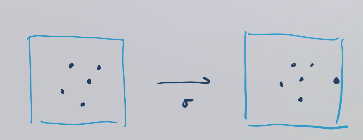
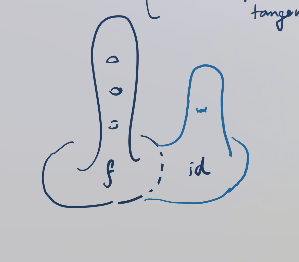
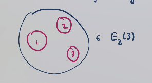
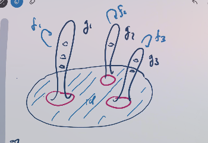

# Lecture 4 (Thursday, May 13)

:::{.remark}
We'll talk about:

- Representation stability, when there's a group action
- Higher-order stability, where there's a meta-stable and stable range and involves higher categorical structures.

There are some other subtle stability phenomena that we won't talk about:

- Stability near the "top" dimension
- Stable stability (for manifolds)
:::

## Representation Stability

:::{.remark}
We'll look at unordered configuration spaces.
Let $\Sigma_n$ be the symmetric group on $n$ points.
:::

:::{.definition title="?"}
Let $X\in \Top$, e.g. $\RR^d$ or a manifold $M$.
The **configuration space of unordered points** on $X$ is defined as 
\[
\Conf_n(X) / \Sigma_n \da 
C_n(X) \da \ts{ \tv{\elts{x}{n} } \in X^n \st x_i \neq x_j \text{ if } i \neq g } / \Sigma_n
.\]
:::

:::{.lemma title="Configuration spaces are highly connected"}
\envlist

1. $\Conf_n(\RR^d)$ is $(d-2)\dash$connected.
2. There is a $(d-1)\dash$connected map
\[
\Conf_n(\RR^d) \to \B\Sigma_n
.\]
:::

:::{.proof title="of 1"}
It's easier to prove a more general statement: $\Conf_n( \RR^d \sm \ts{ \pt}_{i=1}^k )$ is $(d-2)\dash$connected.
Then this result is the $k=1$ case.
Inductively, let $n=1$. 
We have
\[
\Conf_1(\RR^d \sm\ts{\pt}_{i=1}^k )
&\cong_\Top \RR^d \sm\ts{\pt}_{i=1}^k \\
&\homotopic \hWedge_k S^{d-1}
,\]
where the homotopy equivalence follows from a deformation retract:

For the inductive step, take a fibration where you remember on the first $k$ points.
We'll use that the outer terms are $(d-2)\dash$connected and thus so is the middle:
\[
\Conf_1(\RR^d \sm\ts{\pt}_{i=1}^{k+1} )
&\to
\Conf_1(\RR^d \sm\ts{\pt}_{i=1}^k )
&\to \RR^d \sm\ts{\pt}_{i=1}^k
.\]

There is a homotopy coherent diagram:

\begin{tikzcd}
	{C_n(\RR^d)} && {C_{n+1}(\RR^d)} \\
	\\
	{\B\Sigma_n} && {\B\Sigma_{n+1}}
	\arrow["\sigma", from=1-1, to=1-3]
	\arrow["{(d-1)\dash\text{connected}}", from=1-3, to=3-3]
	\arrow["{(d-1)\dash\text{connected}}"', from=1-1, to=3-1]
	\arrow["\sigma"', from=3-1, to=3-3]
\end{tikzcd}

> [Link to Diagram](https://q.uiver.app/?q=WzAsNCxbMCwwLCJDX24oXFxSUl5kKSJdLFsyLDAsIkNfe24rMX0oXFxSUl5kKSJdLFswLDIsIlxcQlxcU2lnbWFfbiJdLFsyLDIsIlxcQlxcU2lnbWFfe24rMX0iXSxbMCwxLCJcXHNpZ21hIl0sWzEsMywiKGQtMSlcXGRhc2hcXHRleHR7Y29ubmVjdGVkfSJdLFswLDIsIihkLTEpXFxkYXNoXFx0ZXh0e2Nvbm5lY3RlZH0iLDJdLFsyLDMsIlxcc2lnbWEiLDJdXQ==)

The map across the top amounts to adding a new point "far" from the existing ones:

:::

:::{.remark}
This yields homological stability for 
\[
C_0(\RR^d) \mapsvia{\sigma} 
C_1(\RR^d) \mapsvia{ \sigma} 
C_2(\RR^d) 
,\]
in degrees $*< d-1$.
With some work, this degree restriction can be removed.
So ordered configuration spaces exhibit homological stability.
:::

:::{.remark}
Note that this doesn't hold for *unordered* configuration spaces.
We can compute the rational homology $H_{d-1}( \Conf_n(\RR^d); \QQ) \cong \QQ^{n-1}$.
Note that there is a $\Sigma_n$ action on both $H_*$ and $\QQ^{n-1}$, so this is a $\QQ[\Sigma_n]\dash$module.
It turns out to the *reduced regular representation*, $\ker\qty{ \QQ[?] \mapsvia{\eps} \QQ}$,
and as a representation is does stabilize. 
We refer to this phenomenon as **representation stability**.
:::

:::{.remark}
Let $\RR^d\to M$ where $d\geq 2$ and $M$ is finite-type (homotopy equivalent to a finite CW complex).
A precise statement needs the classification of finite dimensional $\QQ[\Sigma_n]\dash$modules.
These are classified:

- Irreducible representations $\mapstofrom$ Young diagrams with $n$ boxes $\mapstofrom$ partitions of $n$ into positive integers.

- Trivial representation $\mapstofrom$ ? $\mapstofrom$ the partition $(n-1, 1)$.
:::

:::{.remark}
We can stabilize partitions by adding 1 to the first (largest) part.
Given a sequence \( \ts{ V_n }_{n\geq 0} \) of rational $\Sigma_n\dash$representations, we can ask whether the multiplicity of $(i_1, \cdots, i_k)$ as a partition of $n$ stabilizes in $(i_1 + k, \cdots, i_k)$ as a partition of $n+k$.
This is sometimes called **multiplicity stability**.
:::

:::{.theorem title="Church"}
For $M$ as above, the following sequence exhibits multiplicity stability:
\[
\ts{ H^d \qty{ \Conf_n(M); \QQ} }_{n\geq 0}
.\]
:::

:::{.remark}
Why *cohomology*?
The manifold isn't required to be open, so we can't necessarily bring in a point from far away as in $\RR^d$.
Instead, we have forgetful maps on the ordered points that delete the $i$th point,
\[
\Conf_n(M) \mapsvia{\mathrm{delete}_i} \Conf_{n-1}(M)
,\]
and taking cohomology reverses the order:
\[
H^d( \Conf_{n-1}(M); \QQ)
\mapsvia{\mathrm{delete}_i^*} 
H^d( \Conf_n(M); \QQ)
.\]
Note that this definition doesn't generalize well to unordered spaces, since there's no notion of $i$th element.
We also don't generally have a classification of all representations of a certain form, so as a fix we turn to *categorical representation theory*.
:::

:::{.definition title="$\FI\dash$modules"}
The main observation is that the integral cohomology $H^d( \Conf_n(M); \ZZ)$ along with the forgetful maps assemble to a functor
\[
\FI^{\op} &\to \Ab \\
S &\mapsto H^d( \Conf_S(M); \ZZ) \\
,\]
where we take the forgetful map that leaves out all points not in the images of these injections.
So there is a map on morphisms $(T\injects S) \mapsto (\Conf_T(M) \to \Conf_S(M) )$ and a correspondingly induced map on cohomology making this a functor.
:::

:::{.remark}
Representation stability for $\ZZ$ coefficients becomes equivalent to being a finitely generated $\FI\dash$module.
Ordinary homological stability is essentially representation stability with $N_{\leq }$, where $N_{\leq} \to \Ab$ is finitely generated iff eventually constant.
Need some conditions on categories, e.g. being Noetherian.
:::

## Higher Order Stability

:::{.remark}
The illustrative example: mapping class groups.
Let $\Sigma_{g. 1}$ be a surface of genus $g$ with 1 boundary component, and let $\Diff_\bd(\Sigma_{g, 1})$ be the diffeomorphisms fixing the boundary pointwise in the smooth topology.
Define 
\[
\Gamma_{g, 1} \da \pi_0 \Diff_\bd(\Sigma_{g, 1})
.\]
It turns out that $\B\Gamma_{g, 1} \homotopic \M_{g, 1}$, the moduli space of genus $g$ curves with 1 marked point with a nonzero tangent vector.
Given any such surface, we can take the boundary connect-sum with $\Sigma_{1}$:

Since $f$ restricts to the identity on the boundary, it can be extended into $\Sigma_{1}$ by the identity.
This induces a homomorphism on mapping class groups and thus a map on their classifying spaces
\[
\sigma_*:
H_n( \B\Gamma_g; \ZZ)
&\to
H_n( \B\Gamma_{g+1}; \ZZ)
,\]
which is a surjection for $n\leq 2g/3$ and an isomorphism for $n\leq (2g-2)/3$.
:::

:::{.remark}
Note that this is slightly better than the slope $1/2$ results obtained previously. (?)
The $\Sigma_{g, 1}$ fit together into a braided monoidal groupoid.
Analogy: homology in any fixed degree is eventually constant, so "eventually vanishing first derivative".
Higher order stability should eventually have "vanishing higher derivatives".

Making this precise, the first derivative can be take as the relative homology $H_*(\B\Gamma_{g+1, 1}, \B \Gamma_{g+1}; \ZZ )$.
These vanish when there are isomorphisms by considering the LES.
So secondary stability is a stability for relative homology.
:::

:::{.claim}
There are (provably non-unique) maps
\[
\phi_*: 
H_d( \B\Gamma_{g, 1}, \B\Gamma_{g-1, 1}; \ZZ )
H_{d+2} ( \B\Gamma_{g+3, 1}, \B\Gamma_{g+1, 1}; \ZZ )
.\]
There is a theorem (Galatius-K.-Randal-Williams) that $\phi_*$ is a surjection for $*\leq 3g/4$ and an isomorphism for $*\leq (3g-4)/4$.
:::

:::{.remark}
This is interesting because $2/3 < 3/4$.
:::

### Ingredients in Proof

:::{.remark}
For $G$ a braided monoidal groupoid, $\abs{\Nerve G} \in \Alg(E_2)$.
There is a spectrum of increasing commutativity, where $E_1\dash$algebras are associative and $E_\infty\dash$algebras are commutative.
The spaces of multiplications become increasingly connected. (?)
This can be encoded in an $E_2\dash$operad.

$E_2(n)$ are rectilinear embeddings of $n$ copies of $(\DD^2)^{\times n} \to \DD^2$ with disjoint images

An $E_2\dash$algebra $A$ is a map
\[
E_2(n) \times A^n \to A
.\]

:::

:::{.remark}
How does this apply to mapping class groups?
Given surfaces with boundary and diffeomorphisms $f_i$ lifting the boundary identities, we can form a new surface and a new diffeomorphism:

This yields an algebraic structure on $\B\Gamma_{*, 1} \da \Disjoint_{g\geq 0} \B\Gamma_{g, 1}$.
:::

:::{.remark}
Strategy:

1. Try to build a custom $A\in \Alg(E_2)$ which approximates $\B\Gamma_{*, 1}$ which captures homological stability in some range.
2. Build a small cellular $E_2\dash$algebra by "gluing cells": take iterated pushouts along $\Free^{E_2}(S^{k-1}) \to \Free^{E_2}(\DD^2)$.
3. Determine connectivity of resulting semi-simplicial sets by knowing which $E_2$ cells are required.
4. Determine how to deduce ordinary and secondary stability from this.
  Crucial input: Cohen's computation of the homology of free $E_2\dash$algebras with coefficients in a field.

So now it's reduced to some computation on $A$: it's built out of a small number of cells whose homology we know.

:::

