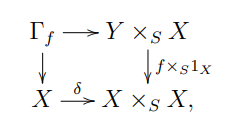
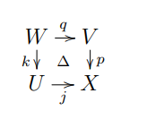

# Wednesday, July 14

> Talk 1: Motivic Complexes

:::{.remark}
Recall the Euler product expansion for the zeta function.
General $L\dash$functions were studied around the 20s, followed by the Weil conjectures in the 40s, and then etale $\ell\dash$adic shaves by Grothendieck et al in the 60s.
Letters from Grothendieck to Serre describe the notion of *weights* in relation to the Weil conjectures, and served as an impetus in the early 70s for *pure motives*.

A second line of study considered number fields and class number formulas, along with special values of $L\dash$functions, going back to Dirichlet.
Lichtenbaum related special values to $K\dash$theory in the 70s, and this along with the theory of perverse sheaves in the early 80s led to the Beilinson conjecture and motivic complexes in the 90s.

As an aside, there is also a notion of \(p\dash \)adic $L\dash$functions and corresponding $p\dash$adic motives.
:::

:::{.remark}
An outline for today:

1. Sheaves with transfers, which is modeled on etale homotopy sheaves?

2. Perfect fields and ??

3. Motivic complexes

For $S$ a Noetherian scheme, ???

\todo[inline]{Missed}

:::

:::{.remark}
There are three main notions for étale sheaves:

1. Those with transfers (see *algebraic cycles*)
2. The (big) smooth Nisnevich site
3. $\AA^1\dash$homotopy?
:::

## Finite Correspondences

:::{.definition title="?"}
For $X,Y\in \sm\Sch_{/S}$, a **finite correspondence** $\alpha$ from $X$ to $Y$ is a formal sum $\alpha = \sum_{i=1}^m m_i [Z_i]$ with $Z_i \subseteq X \fiberproduct{S} Y$ closed and integral with $Z_i\to X$ finite and dominant over a connected component of $X$, i.e. an algebraic cycle in the product.
These form a group denoted $c(X, Y) \in \Grp$, and can be composed without imposing any equivalence relation on algebraic cycles.
We define a symmetric monoidal category $\cat{C} \da \Cor\Sch_{/S}$ whose objects are those of $\smooth\Sch_{/S}$ and $\Mor_{\cat C}(X, Y) = c(X, Y)$, where the monoidal structure is the cartesian product over $S$ on objects and on $c(X, Y)$ is induced by the exterior product of algebraic cycles.
:::

:::{.remark}
Writing $XYZ \da X \fprod{S} Y \fprod{S} Z$, we have smooth projection maps $p: XYZ\to XY, r: XYZ\to XZ, q:XYZ\to YZ$.
Given cycles $\alpha\in c(X, Y), \beta\in c(Y, Z)$, these pull back to $XYZ$ and intersect properly, with their intersection product given by Serre's Tor formula.
:::

:::{.example title="?"}
Let $Y \mapsvia{f} X\in \sm\Sch_{/S}$,
and define the graph as a pullback:

Here $\delta$ is the diagonal immersion of $X/S$, and $\Gamma_f \subseteq YX$ is a closed subscheme, and the associated algebraic cycle $[\Gamma_f]_{XY} \in c(Y, X)$.

Letting $\eps: YX\to XY$ be the permutation of factors, and $\eps_* [\Gamma_f] \in c(X, Y)$ is a finite correspondence denoted $f^t$, the **transpose** of $f$.
:::

:::{.remark}
Several of the operations from the six functor formalism appear here:

- For $T \mapsvia{f} S$, one can define **base change** $f^*: X\to X\fiberprod{S} T$ using pullback on finite correspondences.
- Forgetting the base is given by $p_\sharp: Y/T \to Y/S$ using direct images on finite correspondences.

We now enlarge this category to a larger abelian category.
:::

:::{.definition title="?"}
A **presheaf with transfers** over $S$ is an additive functor $\Cor\Sch_{/S}\op \to \Ab\Grp$.
We write $\Presh^\tr_{/S}$ for this category of presheaves, whose morphisms are natural transformations of additive functors.
:::

:::{.example title="of presheaves with transfers"}
\envlist

- $\GG_m: X/S \to \OO_X(X)\units$ has transfers over $S$.
- For $A\in \Ab\Var_{/k}$, $\Hom(\wait, A)$ has transfers over $k$.
- $H^n(\wait)$ has transfers over $S$ for any mixed Weil cohomology theory
- Not necessarily $K\dash$theory, one instead needs *unramified* $K\dash$theory.

:::

:::{.definition title="Nisnevich Topology"}
A **Nisnevich cover** of $X\in \Sch$ is a family of etale morphisms $W_i \mapsvia{p_i} X$ where for $x\in X$, $p_i(w) = x$ for some $w\in W_i$ inducing a trivial residual extension $\kappa(w) / \kappa(x)$.
:::

:::{.lemma title="?"}
For $F: \smooth\Sch_{/S}\op \to \Ab\Grp$ any abelian presheaf, $F$ is a sheaf for the Nisnevich topology iff $F$ sends distinguished squares $\Delta$ to cartesian squares, where $\Delta$ are given by the following:

Here $j$ is an open immersion, has reduced closed complement $Z$, $p$ is étale, and $p\inv(Z) \mapsvia{\sim} Z$.
:::

:::{.remark}
On why this is a "big" site: ??
:::

:::{.example title="of sheaves with transfers"}
\envlist

1. $X/S$ smooth, take $\ZZ_s^\tr(X) \da c_S(\wait, X)$

:::

:::{.remark}
We have $f^*, p_\sharp, \tensor$ on $\Cor\Sch_{/S}$, and these can be extended to sheaves:

- $f_*(F) \da F \circ f^*$, which yields an adjunction
\[
\adjunction{f^*}{f_*}{\Sh^\tr(S)}{\Sh^\tr(T)}
.\]

- $p:T\to S$ yields
\[
\adjunction{p_\sharp}{p^*}{\Sh^\tr(T)}{\Sh^\tr(S)}
.\]

- $\tensor^h$ on $\Sh^\tr(S)$ yields
\[
\adjunction{\tensor^\tr}{\Hom^\tr}{?}{?}
.\]

:::

:::{.definition title="Homotopy sheaves"}
For $F\in \Sh^\tr(S)$, then $F$ is **$\AA^1\dash$invariant** if for any $X\in \smooth\Sch_{/S}$, the induced map $F(X) \mapsvia{p^*} F(\AA^1_{/X})$ is an isomorphism, where we say $\alpha \sim \beta \in c_S(X, Y)$ when there exists some $H\in c_S(\AA^1 \cross X; Y)$ with $\alpha = H \circ s_0, \beta = H \circ s_1$ where $s_0, s_1$ are the zero and unit sections of $\AA^{1}_{/X}\in \Ring\Sch_{/X}$.
We refer to any $\AA^1\dash$invariant sheaf as a **homotopy sheaf**.
:::

:::{.example title="?"}
\envlist

- $\GG_m, \ul{A}$ are $\AA^1\dash$invariant.

:::

:::{.theorem title="Suslin-Voevodsky"}
Let $S\in \Aff\Sch$ be regular and $C/S$ an affine curve admitting a *good compactification* $\tilde C$, so $\tilde C/S$ is proper, normal, and $C\subseteq \tilde C$ is open/dense and $C_\infty \da \tilde C\sm C$ admits an affine open neighborhood.
Then for any $X\in \smooth\Aff\Sch$, there is a canonical morphism
\[
\pi_S(X, C) &\mapsvia{\sim} \Pic(X \fprod{S} \tilde C \fprod{S} C_\infty) \\
\alpha \in c(X, C) &\mapsto [\OO(\alpha)]
,\]
regarding $\OO(\alpha)$ as a Cartier divisor in $X \fprod{S} \tilde C$.
:::

:::{.remark}
Fix $k \in \Field^\perf$, then a function field over $k$ is any separable and finitely generated $E/k$.
One can define the fiber of a homotopy sheaf $F$ at $E/k$ as a filtered colimit over smooth finitely generated sub $k\dash$algebras $A$:
\[
F(E) \da \colim_{A \leq E} F(\spec A)
.\]
This yields a **fiber functor**, i.e. it is exact and commutes with coproducts.

We define the category $\HI^\tr(S) \leq \Sh^\tr(S)$ to be the category of all homotopy sheaves, which is (Grothendieck) abelian, bicomplete, and there is an adjunction
\[
\adjunction{\Forget}{h_0}{\HI^\tr(k)}{\Sh^\tr(k)}
.\]

:::

:::{.proposition title="Devissage/purity"}
If $F$ is a homotopy sheaf and $Z \mapsvia{i} X$ a codimension 1 closed immersion in $\sm\Sch_{/k}$ with $j: X\sm Z\to X$ an open immersion, then there is a SES of Nisnevich sheaves over $X_\Nis$:
\[
0\to F_X \to j_* F_{X\sm Z} \to i_* F_{-1, Z} \to 0
.\]

:::

:::{.theorem title="Main Theorem"}
If $k\in \Field^\perf$ and $F\in \HI^\tr(k)$, then for all $m$ and all $X \in \sm\Sch_{/k}$, there is an isomorphism
\[
H^n_\Nis(X; F) \mapsvia{p^*, \sim} H_\Nis^n(\AA^1_{/X}; F)
,\]
so the presheaf $H^n_\Nis(\wait, F)$ is homotopy invariant.

:::

:::{.corollary title="Purity theorem"}
For $Z\injects X$ smooth closed of codimension $r$, then 
\[
H_Z^n(X; F) \mapsvia{\sim} H_\Nis^{n-n'}(Z; F_{-n'})
.\]

:::

:::{.corollary title="Gersten resolution"}
For $X$ smooth, $F_x$ is Cohen-Macauly and there is a Cousin complex $C^*(X; F)$, also called the Gersten complex of $F$, and one can compute Nisnevich cohomology as 
\[
H^n_\Nis(X; F) \mapsvia{\sim} H^n(C^*(X; F))
.\]

:::

:::{.theorem title="?"}
Write $S_t^m \da \GG_m^{\tensor ?}$, then for a function field $E$, 
\[
S^m_t(E) \mapsvia{\sim} K_m^n(E)
.\]
Using the Gorsten resolution of $S_t^m$, 
\[
H_\Nis^n(X; S_t^m) \mapsvia{\sim} 
\CH^n(X)
.\]

:::

