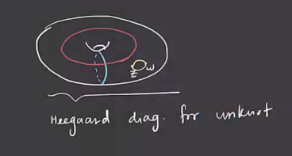
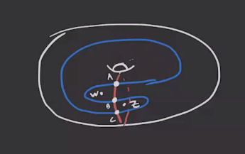
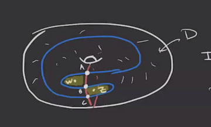
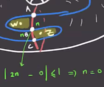
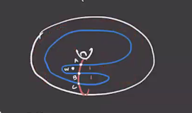

# Knot Floer Homology (Tuesday, April 27)

:::{.remark}
For a knot $K \subset S^3$, we can take a 2-point Heegard diagram and define $\hat{\CFK}(K)$ to be the $\ZZ/2$ span of intersection points with the usual boundary map.
:::

:::{.lemma title="?"}
This yields a chain complex.
:::

:::{.example title="The Unknot"}
For $K$ the unknot, there is an easy Heegard diagram:

Since there is one intersection point, $\bd = 0$ and $\hat{\HFK}(K) = \ZZ/2$.
:::

:::{.example title="Trefoil"}
We can take the following diagram:

There are 3 intersection points, so $\hat{\CFK}(K) = \ZZ/2 \gens{ A, B, C }$. 
There is a  bigon containing $z$, a bigon containing $w$, and the remaining region.
Our discs shouldn't use the regions containing basepoints, so any discs are a multiple of the third region:

So we have $D(\varphi) = nD$.
We can use that diagonally related regions need to have multiplicity differing by $1$, and we can use this to conclude $n=0$:

Thus $\bd = 0$ and $\hat{\HFK}(K) = (\ZZ/2)^{\oplus 3 }$.
:::

:::{.theorem title="Osvath-Szabo"}
$K$ is the unknot iff $\hat{\HFK}(K) \cong \ZZ/2$.
:::

:::{.theorem title="GHW"}
$\rank_{\ZZ/2} \hat{\HFK}(K) = 3$ iff $K$ is the right or left-handed trefoil
:::

:::{.remark}
There are two grading: the Maslov and Alexander grading, the latter of which we have not used.
Recall that for the Maslov grading, we only had a *relative* grading, but this is fixed by assuming a generator of $\hat{\HF}$ was degree zero.
We had $\mu(\vec c) - \mu(\vec y) = \mu( \varphi) - 2 n_w( \varphi)$ where $n_w$ is the number of times the disc $\phi \in \pi_2(\vec x, \vec y)$ goes over the basepoint.
By a corollary, this defined a map
\[
\mu \da \gr_w: \TT_{ \alpha} \TT_{ \beta} \to \ZZ \\
.\]

Since $\mu(\phi)$ takes values in $\ZZ$, using a Heegard diagram for $S^3$ we can produce a grading
\[
\mu \da \gr_z: \TT_{ \alpha} \TT_{ \beta} \to \ZZ \\
.\]

:::

:::{.example title="?"}

Considering again the following diagram:

To compute $\gr_w$, we check

- $\bd B = C$,
- $\bd A = 0 = \bd C$

So 

- $\hat{\CF}(H) = \ZZ/2 \gens{ A, B, C }$
- $\ker \bd = \ZZ/2 \gens{ A, C }$
- $\im \bd = \ZZ/2 \gens{ C }$
- $\implies \hat{\HF}(H) \cong \ZZ/2 \gens{ A }$

Thus $\gr_w(A) = 0$.
We can check that
\[
\gr_w(B) - \gr_w(A) = 1-2 = -1 \implies \gr_w(B) = -1
,\]
and since the differential decreases grading by 1 and $\bd B = C$, we have $\gr_w (C) = -2$.
Repeating the same process, we can compute $\gr_z$ to obtain the following:

|   | $\gr_w$ | $\gr_z$ |
|---|---------|---------|
| A | 0       | -2      |
| B | -1      | -1      |
| C | -2      | 0       |

:::

:::{.remark}
It turns out that

- The Maslov grading is given by $\gr_w$, and is usually denoted $\mu$ or $M$,
- The Alexander grading is given by $(1/2)(\gr_w - \gr_z)$, and is usually denoted $A$.

Moreover, if $\vec y$ has nonzero coefficient in $\bd \vec x$, then there exists a $\phi\in \pi_2(\vec x, \vec y)$ such that $\mu(\phi) = 1$ with $n_z(\phi) = n_w(\phi) = 0$.
In this case, 
\[
\gr_w(\vec x) - \gr_w(\vec y) &\da \mu(\phi) - n_w(\phi) = 1-0 = 1 \\
\gr_z(\vec x) - \gr_z(\vec y) &\da \mu(\phi) - n_z(\phi) = 1-0 = 1 \\
,\]
and so $\bd$ reduces both $\gr_z$ and $\gr_w$ by 1.
Thus $\bd$ reduces the Maslov index by 1, but preserves the Alexander grading.
We can thus decompose
\[
\hat{\CFK}(K) = \bigoplus _{m, s} \hat{\CFK}_m(K, s)
,\]
where each summand is the subspace generated by $\vec x\in \TT_{ \alpha} \intersect \TT_{ \beta}$ where $\mu(\vec x) = m$ and $A(\vec x) = s$.
For a fixed $s$, we have
\[
\bd: \hat{\CFK}_m(K, s) \to \hat{\CFK}_{m-1}(K, s)
,\]
so this defines a chain complex, take its homology, and thus its Euler characteristic.
Writing $\hat{\HFK}(K) = \bigoplus \hat{\HFK}_m(K, s)$.
:::

:::{.theorem title="Osvath-Szabo"}

\[
\sum_s \sum_m (-1)^m \dim \hat{\HFK}_m(K, s)t^s \= \Delta_K(t)
,\]
which is the Alexander polynomial.
Note that this is a graded Euler characteristic.
:::

:::{.remark title="Some properties"}
Assume $\Delta_K(t) = a_0 + \sum_{s>0} a_s (t^s + t^{-s})$, then $\max_s \ts{ a_s \neq 0 } \leq g(K)$, the genus of the knot.
:::

:::{.theorem title="Osvath-Szabo"}
\[
\mas_x \ts{ \hat{\HFK}_m(K, s) \neq 0 \text{ for some } m } = g(K)
.\]
:::

:::{.corollary title="?"}
If $g(K) > 0$, which happens iff $K$ is the unknot, then 
\[
\bigoplus _m \hat{\HFK{_m(K, g(K)) &\neq 0 \\
\bigoplus _m \hat{\HFK{_m(K, -g(K)) &\neq 0 
,\]
and so $\dim \hat{\HFK}(K) \geq 2$.
So the only knot with dimension 1 is the unknot, and so this implies the previous theorem that knot Floer homology detects the unknot.
:::

:::{.remark}
For the Alexander polynomial, if $K$ is fibered then $a_{g(K)} = \pm 1$.
:::

:::{.theorem title="Ghiggini/Ni"}
If $K$ is fibered, then $\hat{\HFK}(K, g(K)) \cong \ZZ/2$.
:::

:::{.exercise title="?"}
Use the above theorem to prove a previous theorem.
:::

:::{.definition title="Alternating Knots"}
A knot $K$ is **alternating** if it has a diagram such that the crossings alternate over/under.
:::

:::{.example title="?"}
The trefoil is alternating:

:::

:::{.remark}
The knot Floer homology of alternating knots is simple.
Writing $\Delta_K(t) = a_0 + \sum_{s>0} a_s (t^s + t^{-s} )$.
Then
\[
\hat{\HFK}_m(K, s) = 
\begin{cases}
(\ZZ/2)^{\oplus \abs{a_s}} & m-s = \sigma(K)  
\\
0 & \text{else}.
\end{cases}
\]
where $\sigma(K)$ is the **signature** of the knot.
:::

:::{.remark}
We can write
\[
\gr_w + \gr_z = 2(\mu - A) = 2\qty{ \gr_w - {\gr_w - \gr_z \over 2} } 
,\]
and for $K$ the trefoil, we have $\sigma(K) = -2$.

:::

