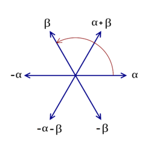

$$
\Phi
$$

%

The **root system**.

\[
\alpha \in \Phi \subset \mathfrak{h}^* \iff [h, x] = \alpha(h) x \text{ for all } h\in \mathfrak{h}
\]

- Span a Euclidean space
- \(\alpha, c\alpha \in \Phi \implies c=-1\)
- \( s_\alpha \Phi \subseteq \Phi\) for all \( \alpha \)

%

lie algebra

---

$$
\mathfrak{g}_\alpha
$$

%

The **root space**.

$$
\mathfrak{g}_\alpha = \{g\in \mathfrak{g} \mid [h, g] = \alpha(h) g\}
$$

%

lie algebra

---

$$
\Lambda_r
$$

%

The (integral) **root lattice**.

$$
\Lambda_r = \mathrm{span}_{\mathbb{Z}}\Phi \subset E
$$

Has a basis given by \( \Phi \) or \( \Delta \).

%

topics

---

$$
\alpha\beta\gamma\delta \NN
$$

%

Something else

$$
\definecolor{energy}{RGB}{114,0,172}
\definecolor{freq}{RGB}{45,177,93}
\definecolor{spin}{RGB}{251,0,29}
\definecolor{signal}{RGB}{18,110,213}
\definecolor{circle}{RGB}{217,86,16}
\definecolor{average}{RGB}{203,23,206}
\color{energy} X_{\color{freq} k} \color{black} =
\color{average} \frac{1}{N} \sum_{n=0}^{N-1}
\color{signal}x_n \color{spin}
e^{\mathrm{i} \color{circle} 2\pi \color{freq}k
\color{average} \frac{n}{N}}
$$

%

test

---

