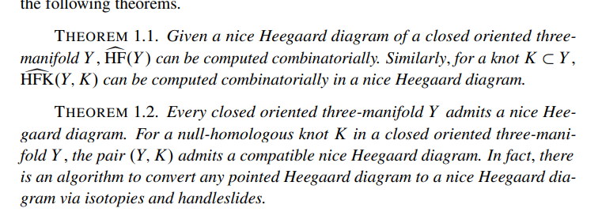

Tags: #todo #floer 

# Reference Material

[Paper: Sarkar-Wang, An algorithm for computing some Heegard-Floer homologies](https://arxiv.org/pdf/math/0607777.pdf)

[Annals version of the paper](https://annals.math.princeton.edu/wp-content/uploads/annals-v171-n2-p11-s.pdf)

# Intro/Overview

- Goals: 
  - Given $Y$ a closed oriented smooth 3-manifold, compute the Heegard-Floer homology $\hat{\HF}(Y; \FF_2) \in \gr\Ab$.
  - Given $K \embeds Y$ a knot, compute the knot Floer homology $\hat{\HFK}(Y, K; \FF_2)$
- Strategy: turn **admissible diagrams** into **nice diagrams** using isotopies and handleslides
  - Note: stabilization not used in this paper.
- Main theorem:

# Definitions

:::{.definition title="Good and bad regions"}
A region is **good** if it is an $n\gon$ with $n\leq 4$, and **bad** if $n\geq 5$
:::

## Algorithm Overview

- Start from an admissible pointed Heegard diagram, end up with an admissible *nice* pointed Heegard diagram using isotopies and handleslides on the $\beta$ curves.

- Definition: good and bad regions
  - Good: Bigons and squares
  - Bad: Anything else

- Overview of strategy:

  - Isotope all regions to disks
  - Define a **complexity** for the diagram
  - Show it's minimized iff all regions *not* containing basepoints are good
  - Do an isotopy or handleslide that strictly decreases the complexity.

- Recipe:

  1. Kill non-disk regions (easier)
  2. Make all but one region bigons or squares (harder)

## Step 1: Killing Non-disk Regions

- Short procedure
- Ensure every \( \alpha \) curve intersects some \( \beta \) curve and vice-versa
  - Fix $j$. 
  If \( \alpha_j \) does not intersect any \( \beta_k \), 
  choose a $p\in \alpha_j, q\in \beta_k$ and use path-connectedness to find a curve $c_{pq}$ connecting them.
  - Do this for every 
  - Perturb if necessary to avoid the finitely many intersection points of the form \( \alpha_i \intersect \beta_{i'} \).
  - Do a finger move: contract $c$ keeping $p$ fixed.
  - See pictures/diagrams!

  
  

- Now reduce the number of boundary components on non-disk regions $D$.:

  - Every region is now a planer surface, since \( \Sigma\sm \vec{ \alpha} \) is a punctured sphere.
## Step 2: Converting Regions to Bigons or Squares

# Todos

- Define bigon
- Define finger moves

\[
b(D) &\da \max \ts{ n-2, 0 } = n-2 \text{ when } D\in 2n\dash\text{gon}, n\geq 3 \\
b_d( \mathcal{H} ) &\da \sum_i b_d (D_i) \\
c_d( \mathcal{H} ) &\da \tv{ b_d(\mathcal{H}), -b(D_1), \cdots } && b(D_1) \geq b(D_2) \geq \cdots \\
.\]

