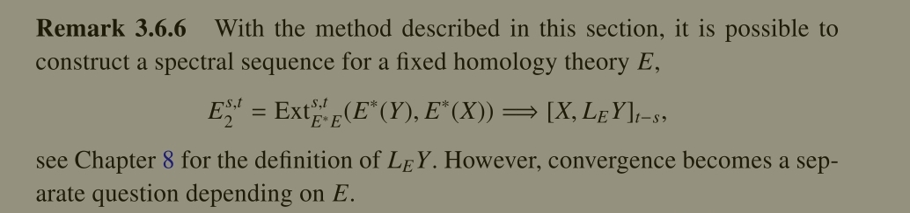
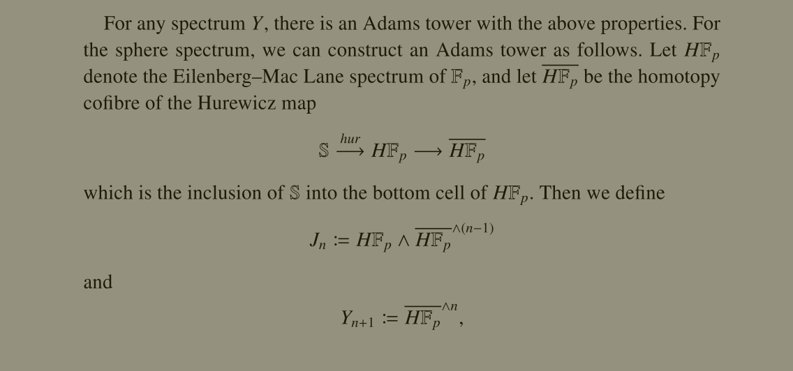

# Barnes and Roitzheim

## Setup and Motivation

- To define:
  - $[X, Y]_*$ 
  - $X\complete{p}$
  - $\ZZ_{(p)}$: p-adics?
  - $E^* E$
  - $L_E X$
  - $H^* X$ for $X\in \Spectra$
    - $H^* \SS = \FF_2$?
  - $\mca$ the mod $p$ Steenrod algebra, usually $p=2$.
    - Defined as $\mca = [H\FF_p, H\FF_p]_*$.
    - The dual is defined as $\mca\dual \da \displaystyle\Hom_{\modsleft{\FF_p}}(\mca, \FF_p)$, with grading $\gr_n \mca\dual = \Hom(\gr_n \mca, \FF_p)$.
  - $\pi_n X \da \colim_k \pi_{n+k} X_k =_? [\Suspend^n \SS, X] =_? [\SS, X]_{n}$
  - Generalized homology: $E_nX = \pi_n \qty{E \smashprod X} = [\Suspend^n \SS, E\smashprod X] =_? [\SS, E\smashprod X]_{n}$
  - Generalized cohomology: $E^n X \da [X, E]_{-n} =_? [\Suspend^{-n}X, E]$.

- Strategy:
  

- General AdSS for usual homology:
  

- Homological version: 
  

- Special case for spheres:
  
  - Special case for $FF_2$

- Product structure on pages:
  

## Construction

- Definition of Adams tower: 
  
  - Dual is simpler

- Construction of Adams tower: 

  - Here $(\wait)^{\smashprod n}$ is the $n\dash$fold smash product.
    This constructs the "standard Adams tower".

- 
- 
- 
- 
- 
- 
- 
- 
- 

