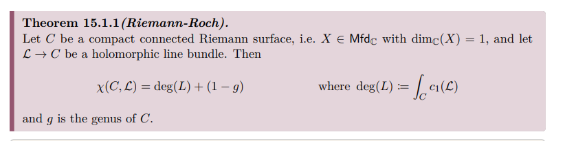

# References

- Survey Paper: Anton Zorich, [Flat Surfaces](https://arxiv.org/abs/math/0609392)
- Alex Eskin, Andrei Okounkov, [Asymptotics of numbers of branched coverings of a torus and volumes of moduli spaces of holomorphic differentials](https://arxiv.org/abs/math/0006171)
- Alex Eskin, Howard Masur, Anton Zorich, [Moduli Spaces of Abelian Differentials: The Principal Boundary, Counting Problems and the Siegel--Veech Constants
](https://arxiv.org/abs/math/0202134)
- Alex Eskin, Andrei Okounkov, [Pillowcases and quasimodular forms](https://arxiv.org/abs/math/0505545)
- Vincent Delecroix, Elise Goujard, Peter Zograf, Anton Zorich, [Contribution of one-cylinder square-tiled surfaces to Masur-Veech volumes](https://arxiv.org/abs/1903.10904)
  - See Phil for appendix! 
- Engel, [Hurwitz Theory of Elliptic Orbifolds, I](https://arxiv.org/abs/1706.06738)
- Engel, [Hurwitz Theory of Elliptic Orbifolds, II](https://arxiv.org/abs/1809.07434)

- A. Eskin 
- G. Forni
- P. Hubert and T. Schmidt 
- H. Masur 
- H. Masur and S. Tabachnikov
- J. Smillie

# Basics

:::{.fact}
For $\Sigma_g$ a genus $g$ surface, the Poincaré polynomial and the Euler characteristic are given by 
\[
p(z) = 1 + (2g)z + z^2 && \chi(\Sigma_g) = 2-2g
.\]
:::

:::{.definition title="Ramified, branch points, ramification index"}
A map $Y \mapsvia{f} X$ of Riemann surfaces is said to be **ramified** at a point $p\in Y$ iff in local charts $f$ has the form $z\mapsto z^n$ for some $n\geq 2$.
Note that in this case, in charts $q\da f(p)$ has exactly one preimage and $\# f\inv(q') = n$ for all $q'$ in a punctured neighborhood of $q$.
The number $e_p \da n$ referred to as the **ramification index** of $f$ at $p$.

The set of points where $f$ is ramified, sometimes denoted $R_f \subseteq Y$, is referred to as the **ramification locus**.
Its image $B_f \da f(R_f) \subseteq X$ is referred to as the **branch locus**.
:::

:::{.theorem title="Well-definedness of degree"}
If $Y \mapsvia{f} X$ is a (possibly ramified) covering, then
\[
x_1, x_2, \in B_f^c \implies
\# f\inv(x_1) = \# f\inv(x_2)
.\]
This common number $d$ is referred to as the **degree** of $f$.

:::

:::{.proposition title="Euler characteristic is multiplicative in unramified covers"}
If $Y\mapsvia{f} X$ is an unramified covering map of degree $d$, then 
\[
\chi(Y) = d\cdot \chi(X)
.\]
:::

:::{.theorem title="Riemann-Hurwitz"}
If $Y\mapsvia{f}X$ is a ramified covering map of degree $d$, define the correction term
\[
\delta_f \da \sum_{p\in R_f} \qty{e_p - 1}
.\]
Then
\[
\chi(Y) = d\cdot  \chi(X) - \delta_f
.\]
:::

:::{.remark title="Other useful forms"}
There are several other useful forms:
\[
2g(Y) - 2 &=  d\cdot (2g(X) - 2)  - \delta_f\\
2- 2g(Y) &=  d\cdot (2-2g(X))  + \delta_f \\
\chi(Y) - \# R_f &= d \cdot (\chi(X) - \# B_f)
.\]
:::

:::{.remark}
In everything that follows, we take $TX, T\dual X$ to be *holomorphic* tangent/cotangent bundles.
:::

:::{.definition title="Holomorphic forms"}
A holomorphic $p\dash$form on $X$ is a section of the sheaf $\Lambda^p T\dual X$, the $p$th exterior power of the holomorphic cotangent bundle of $X$:
\[
\Omega^p_X \da \Omega_{\Hol}^p(X) &\da \Extalg^p T\dual X && \in\Sh_{/X}\\
\Omega^p_X(X) &\da \globsec{\Extalg^p T\dual X}
.\]

$0\dash$forms are global holomorphic functions on $X$.
For general $p$, in coordinates we have
\[
\omega \in \Omega^p_X \implies \omega = 
\sum f_I(\vector{z}) \Wedge dz_I
\]
for some holomorphic functions $f_I: \CC^n \to \CC$.
:::

:::{.definition title="Canonical Bundle"}
It is a theorem that taking the top exterior power yields a line bundle:

\begin{tikzcd}
\CC 
  \ar[r] 
& 
\Extalg^p T\dual X
  \ar[d] 
\\
& 
X 
\end{tikzcd}

The **canonical bundle** is defined by as this top exterior power.
Letting $n\da \dim_\CC X$,
\[
K_X = \omega = \Omega^{n}_X &&\in \Sh_{/X}
.\]
:::

:::{.remark}
For vector bundles, the top exterior power is referred to as the **determinant bundle**.
:::

:::{.remark}
A holomorphic $n\dash$form is precisely a section of the canonical bundle.
:::

:::{.fact}
If $M$ is a smooth manifold, then $\omega$ has a global section.
:::

:::{.theorem title="Riemann-Roch"}

:::

:::{.exercise title="?"}
For $\Sigma_g$ a compact Riemann surface of genus $g$, the dimension of the space of holomorphic sections of the canonical bundle, i.e. the space of holomorphic differentials on $\Sigma_G$, is given by $\dim H^0(X; \Omega) = g$ (the genus of the surface).

> Hint: use Riemann-Roch.

:::

:::{.definition title="Hurwitz Space"}
?
:::

:::{.definition title="Hurwitz Number"}
?

:::

:::{.definition title="Abelian differential"}

:::

# Elliptic Orbifolds

:::{.remark}
Classification of elliptic orbifolds of dimension 2:

Define $(n_1, \cdots; m_1, \cdots)$ as the *profile*, where $n_i$ are *elliptic* points (locally look like quotient by $\ZZ/n\ZZ$), and $m_i$ are *corner reflectors* (locally look like quotient by a dihedral group):

\

Conformal (or equivalently complex) structures on a genus $g$ surface form a moduli space $\MM_g$ of dimension $3g-3$ for $g > 1$.

Let $\alpha$ be any partition of $2g-2$, and $\mch(\alpha)$ the moduli space of pairs $(\Sigma_g, \omega)$ where $\Sigma_g$ is a Riemann surface of genus $g$ and $\omega$ is a holomorphic 1-form (Abelian differential) on $M$ with the orders of its zeros given by $\alpha$.
Letting $\mch$ be the moduli space of all abelian differentials on Riemann surfaces of genus $g$ is stratified by $\mch(\alpha)$ as $\alpha$ ranges over all partitions.
For flat tori, $\mch = \GL_+(2, \RR)/\SL(2, \ZZ)$.

:::

:::{.fact}
For $\Sigma_g$ a Riemann surface, there is a formula (Gauss-Bonnet in the flat metric) relating the degrees of the zeros of a holomorphic 1-form to the genus:
\[
\sum d_j = 2g-2
.\]
:::

# Notes on Paper

> Reference: [https://arxiv.org/abs/math/0609392](https://arxiv.org/abs/math/0609392)

## Section  1

Flat surfaces are characterized as surfaces with a flat metric and (finitely many?) cone-like singularities.
These surfaces appear to be isomorphic to moduli spaces of holomorphic 1-forms.
It is profitable to study the orbit of the surface under the Teichmüller geodesic flow, as well as a $\GL_n$ action.

We usually associate

- Constant positive curvature = $S^2$
- Constant zero curvature = $S^1 \cross S^1 \definedas T^1 = \Sigma_1$
- Constant negative curvature = $\Sigma_g$ for $g\geq 2$, a surface of higher genus

**Proposition:**
Any surface can be given a flat metric, possibly introducing singular points.

> Idea: Push all of the curvature into a cone point.

:::{.example title="?"}
The standard cube embedded in $\RR^3$.

This is a flat surface with 8 cone points located at the vertices.
Note that the metric is non-degenerate on the edges, since any neighborhood of a point on an edge is still homeomorphic to $\RR^2$:

Any neighborhood of a vertex is isometric to the vertex of the usual notion of a cone.
The cone angle can be measured by cutting a cone from the base to the vertex, yielding a flat pattern that sits in $\RR_2$, and measuring the "missing" angle in the resulting circle:

This shows that the cone angle of the cube is $3\pi/2$, which coincides with the fact that there are 3 square (and thus 3 right angles) adjacent to any cone point.

:::

:::{.definition title="Geodesic"}
?
:::

:::{.definition title="Ergodic"}

:::

> Here this means that a typical geodesic will visit any region in phase space and time spent in a region is proportional to volume.

:::{.definition title="Holonomy"}
Holonomy and Holonomy group (todo)
:::

:::{.problem title="?"}
General (wildly open) problems:

- Describe the behavior of a generic geodesic on a surface
- Prove that the geodesic flow is ergodic on a typical flat surface
- Does almost every surface have a closed geodesic that does not pass through singular points?
  - If so, how many?
  - Find the (asymptotic) number of such closed geodesics of length shorter than $L$

This remains unsolved for $S^2$ with 3 singularities (equivalent to a certain billiards problem). 
It is not even known if any flat sphere admits a single closed geodesic.

:::

Flat surfaces have nontrivial holonomy, which makes them resemble Riemannian manifolds more than flat tori.

If we take the surface and puncture the conical points, it is locally isometric to the punctured Euclidean plane.
This allows a notion of parallel transport of tangent vectors.

Parallel transports along homotopically trivial loops are always the identity; otherwise, for homotopically nontrivial loops this rotates the vector by some angle.
Parallel transport around a cone point rotates by exactly the cone angle.
Nontrivial holonomy forces geodesics to self-intersect many times.

> Exercise: parallel transport a vector around the cone point of a cube.

The flat torus has trivial linear holonomy -- all geodesics either close up, or never self-intersect and produce a dense winding path.

**Definition:**
A translation surface is closed orientable surface with a flat metric, a finite number of conical singularities, and trivial linear holonomy.

Note that trivial linear holonomy implies that cone angles are all integer multiples of $2\pi$.

> Convention: we assume all flat surfaces come with a distinguished direction.

Remark:
Billiards gives rise to a flat surface with nontrivial linear holonomy. 

**Definition:**
A half-translation surface is a surface with a flat metric and holonomy group $\ZZ/(2)$.

> In this case, a vector $\vector v$ may come back as $-\vector v$ after parallel transport.

We'll often consider families of flat surface sharing the same genus and number/type of conical singularities.
These will correspond to strata of moduli spaces of one-forms.

It will often be useful to let $\SL(2, \RR)$ act on these families, consider the orbits, and take its closure.

Central problem / conjecture:
Taking the closure of an orbit under the action of $\GL^+(2, \RR)$ is a complex subvariety, so both the moduli space of holomorphic one-forms and the moduli space of quadratic differentials resemble homogeneous spaces under the action of a unipotent group.

The there is a projection from these orbits (Teichmüller discs)  to the moduli space of complex structures (?), which will be denoted $\MM_g$.
It is well-known that moduli spaces are not homogeneous spaces, but the conjecture here is that they behave as if they were.

## Section 2: Motivations

Open problems in rectangular billiards:

1. Describe the behavior of a billiard trajectory in a generic triangle, and prove that the billiard flow is ergodic.
2. Does (almost) any table have at least one regular periodic trajectory? Is it preserved under deformations?
3. Asymptotically in length, how many periodic trajectories are there? 
4. Does any obtuse triangle have a single periodic trajectory?

*Known example:* 
Acute triangles have at least 1, see Fagnano trajectory 

*Fox-Kershner construction:*
Yields a way to go from billiard trajectories to geodesics on a flat surface.
General idea: glue two copies of the billiard table along the edge to get a flat sphere; then paths lift to geodesics.
Such surfaces are not "very flat", i.e. they have nontrivial linear holonomy.

