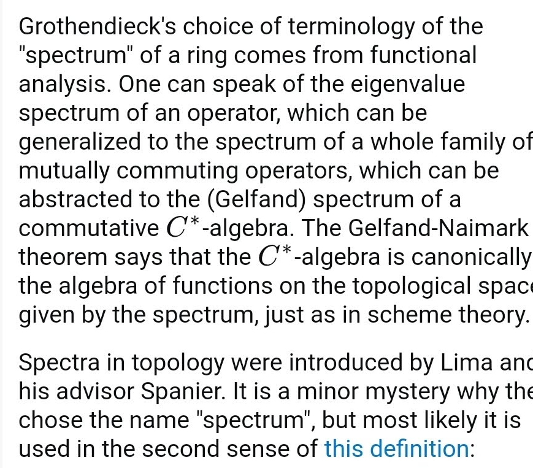

# 2021-04-14

## 21:22

- Why are functional analytic spectra related to algebraic geometry spectra?

## 22:15

- What is the Bloch-Kato conjecture?
  What does it predict for $L\dash$functions?
  - How does it relate to motivic cohomology?
- What are the BSD conjectures?
  What do they predict for $L\dash$functions?
- What is a regulator?
- What is the height pairing?

