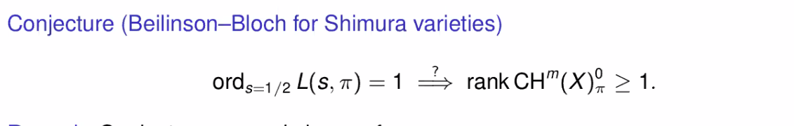
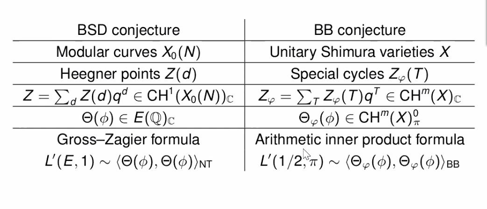

# 2021-04-15

## Beilinson-Bloch Conjecture (Harvard NT Seminar)

- What is the Beilinson-Bloch conjecture?
- Beilinson-Bloch conjecture: generalizes the BSD conjecture.
- What are higher Chow groups?
  What do they generalize?
  - Higher Chow groups: generalize the Mordell-Weil group for elliptic curves.

- What is an adelic point?

- I should also review what a "place" really is.
  Definitely what it means to be an Archimedean place.
  Also double-check the $v\divides \infty$ notation.

- What is an automorphic representation?

- See Gross-Zagier formula.

- What is a modular curve? What is a Heegner divisor for some imaginary quadratic field over $\QQ$ and why can one use the theory of CM to get it defined over other fields?

- Gotta learn modular forms.
  They can take values in the complexification of a Mordell-Weil group?
  Also need to know something about Hecke operators.

- What is a Shimura variety?

- What is a theta series?
  Something here called an *arithmetic theta lift*, where some pairing form generalizes Gross-Zagier (?).
  See Beilinson-Bloch height maybe?

- I should read a lot more about Chow groups.

- What is Betti cohomology?

- Why is proving that something is modular a *big deal*?

- Look for the Kudla Program in arithmetic geometry, and Kudla-Rapoport conjecture.

- BSD was first checked numerically for CM elliptic curves! (Comment by Peter Sarnak)

- What is the characteristic function of a lattice?
  What is a self-dual lattice?

- What is a Siegel Eisenstein series?
  Or even just an Eisenstein series.

- See Néron-Tate height pairing?
  Seems like these BB heights can only really be computed locally, then you have to sum over places.

- What are the Standard Conjectures?
  
- Main formula and big theorem:

  

  Seems that we know a lot about the LHS, the right-hand side is new.
  We don't know nondegeneracy of the RHS, for example, e.g. the pairing vanishing implying the cycle is zero.

  - Proof technique: "doubling".

- See Tate conjecture.

- Comment from Peter Sarnak: we know very little about where $L$ functions vanish, except for $1/2$.

- Need to do resolution of singularities when you don't have a "regular" (integral?) model.

## 20:13

- Paper recommended by Juliette Bruce:
  <https://arxiv.org/pdf/2003.02494.pdf>

  - Jonathan Love! 
  Shows some cool consequences of the BB conjecture, primarily a 2-parameter family of elliptic curves  where the image $\CH^1(E_1)_0 \tensor \CH^1(E_2)_0 \to \CH^2(E_1 \cross E_2)$ is finite.
  BB predicts this is always finite when defined over $k$ a number field.

- I should remind myself what local and global fields are.
