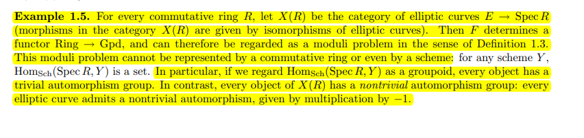
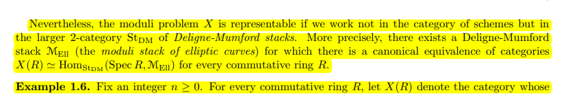
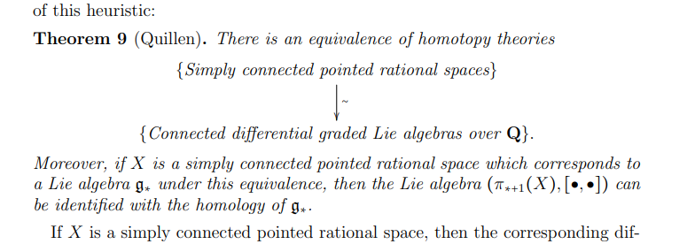
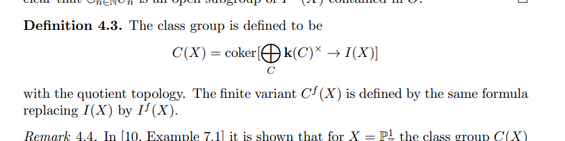

# 2021-04-21

## 15:05

Bhargav Bhatt (Harvard NT Seminar)

- One can take etale cohomology of varieties, and later refine to schemes, and thus take it for the base field even when it's not algebraically closed and extract arithmetically interesting information.

- Prismatic cohomology: meant to relate a number of other cohomology theories

- Prism: a pair $(A, I)$ where $A$ is a commutative ring with a derived Frobenius lift $\phi:A\to A$, i.e. a $\delta\dash$structure.
  - $I \normal A$ is an ideal defining a Cartier divisor.
  - $A$ is $(P, I)\dash$complete.
  - Any ideal generator $d\in I$ satisfies $\phi(d) = d^p + p\cdot u, u\in A\units$.

- Fix a scheme and study prisms over it.
  Need these definitions to have stability under base-change.

- Examples:
  - $A \da \ZZ_p$ and $\phi = \id$ with $I = \gens{ p }$ yields crystalline cohomology. 
  - $A \da \ZZ_p[[u]], \phi(u) = u^p$.
  Then $I = \gens{ E(u) }$ is generated by an Eisenstein polynomial. 
  Here $A/I = \OO_K$

- Prismatic site: fix a base prism $(A, I)$ for $X$ a \(p\dash \)adic formal scheme over $A/I$.
  Define
  \[
  (X/A)_\prism = \ts{ (A, I) \to (B, J) \in \Mor(\Prism), \Spf(B/J) \to X \text{ over } A/I } 
  ,\]
  topologized via the flat topology on $B/J$.

- There is a structure sheaf $\OO_\prism$ where $(B, J) \to B$.
  Take $R \Gamma$, which receives a Frobenius action, to define a cohomology theory.
  Why is this a good idea?

- Absolute prismatic sites: for $X\in \Sch(\padic)$, define
\[
X_\prism \da \ts{ (B, J) \in \Prism,\, \Spf(B/J) \to X } 
.\]
  Take sheaf cohomology to obtain $R\Gamma_\prism(X) \da R \Gamma(X_\prism, \OO_\prism) \selfmap_\phi$.

- The category $\Prism$ doesn't have a final object, so has interesting cohomology.
Relates to algebraic $K\dash$theory of $\ZZ_p$?

- Questions: let $X_{/\ZZ_p}$ be a smooth formal scheme.
  -  What is the cohomological dimension of $R \Gamma_\prism(X)$?
  - What are the $F\dash$crystals on $X_\prism$?
    - Produce finite flat $B\dash$modules?

- Bhatt and Lurie: found a stacky way to understand the absolute prismatic site of $\ZZ_p$.
  Drinfeld found independently.

- Construction due to Simpson: take $X\in \Var(\Alg)$, define a de Rham presheaf
\[
X_{\dR}: \CCalg^{\fp} &\to \Set \\
R &\mapsto X(R_\red)
.\]

  - Translates other cohomology theories into something about coherent sheaves..?
  - Can reduce to studying e.g. a vector bundle on a more complicated object.

- Def: Cartier-Witt stack, a.k.a. the prismatization of $\ZZ_p$
   - Define $\WCart$ to be the formal stack on $p\dash$complete rings.
- Plug in a $p\dash$nilpotent ring $R$ to extract all (derived) prism structure on $W(R)$.
- Prisms aren't base-change compatible without the derived part.
- This is a groupoid.

- An explicit presentation: $\WCart_0(R)$ are distinguished Witt vectors in $W(R)$.
  Given by \( [a_0, a_1, \cdots ] \) where $a_0$ is nilpotent and $a_1$ is a unit.
  This is a formal affine scheme.
  $\WCart = \WCart_0 / W^*$ is a presentation as a stack quotient.

  - Receives a natural Frobenius action, which is a derived Frobenius lift.

- Start by understanding its points, suffices to evaluate on fields of characteristic $p$.

- If $k\in \Field(\Perf)_{\chp}$, $\WCart(k) = \ts{ \pt }$, with the point represented by $(W(k), ?)$.

  - Yields a (geometric?) point $x_{\FFp}: \spec(\FFp) \to \WCart$.

- Analogy to understanding Hodge-Tate cohomology.
  Similar easy locus in this stack.

- Take 0th component of distinguished Witt vectors to get a diagram

\begin{tikzcd}
  \WCart &&& {\hat{\AA^1}/\GG_m} \\
  \\
  \\
  {\WCart^{\mathrm{HT}}} &&& {B\GG_m}
  \arrow[dashed, from=4-1, to=4-4]
  \arrow[from=1-1, to=1-4]
  \arrow[hook, from=4-4, to=1-4]
  \arrow[hook, from=4-1, to=1-1]
\end{tikzcd}

> [Link to Diagram](https://q.uiver.app/?q=WzAsNCxbMCwwLCJcXFdDYXJ0Il0sWzMsMCwiXFxoYXR7XFxBQV4xfS9cXEdHX20iXSxbMywzLCJCXFxHR19tIl0sWzAsMywiXFxXQ2FydF57XFxtYXRocm17SFR9fSJdLFszLDIsIiIsMCx7InN0eWxlIjp7ImJvZHkiOnsibmFtZSI6ImRhc2hlZCJ9fX1dLFswLDFdLFsyLDEsIiIsMSx7InN0eWxlIjp7InRhaWwiOnsibmFtZSI6Imhvb2siLCJzaWRlIjoidG9wIn19fV0sWzMsMCwiIiwxLHsic3R5bGUiOnsidGFpbCI6eyJuYW1lIjoiaG9vayIsInNpZGUiOiJ0b3AifX19XV0=)

- The bottom-left is this *Hodge-Tate stack*.

- Now has a better chance of being an algebraic stack instead of a formal stack.
  Bottom arrow kills the formal direction.

- Will be classifying stack of a group scheme: need to produce a point and take automorphisms.

- Take the distinguished element $V(?) \in W(\ZZ_p)$.
Produces a map
\[
\Spf(\ZZ_p) \mapsvia{\pi_\HT} \WCart^\HT
.\]

  - Fact: $\pi_\HT$ is a flat cover and $\Aut(\pi_\HT) = W^*[ F]$.

- **Upshot**: $\WCart^\HT = B W^* [F]$ is a classifying stack.
  Quasicoherent sheaves on the left and representations of the (classifying stack of the) group scheme on the right. I.e. $D_\qc(\WCart^\HT) = \Rep(W^*[F])$.
  - Teichmüller lift yields a $\ZZ/p$ grading on the LHS.

  - Something about Deligne-Illusie?
  Hodge-to-deRham degeneration?
  - Upshot: a divisor inside is easy to understand.

- Fact: $D_\qc(\WCart)$ are equivalent to $\inverselim_{(A, I)\in \Prism} D_{(P, I)-?}(A)$.

- Diffracted Hodge cohomology: let $X\in \Schf_{\ZZ_p}$.
  Get a prismatic structure sheaf using the assignment $(A, I) \to R \Gamma_\prism \qty{ (X\tensor A/I) / A}$.

- Heuristic: $\spec \ZZ_p$ should be 1-dimensional over something.

- Get an absolute comparison: $\cohdim R \Gamma_\prism (X) \leq d+1$ where $d = \reldim X_{/\ZZ_p}$.

- There is a deRham comparison: 
\[
X_{\FFp}^* H_\prism(X) \cong R \Gamma_\dR (X_{\FFp})
.\]

- There is a Hodge-Tate comparison: the object $H_\prism(X)$ restricted to $\WCart^\HT$ has an increasing filtration with $\gr_i = R \Gamma(X, \Omega^i_X)[-i]$.

  - Use representation interpretation, then $\mu_p \actson \gr_i$ by weight $-i$.

- Combine these comparisons to get Deligne-Illusie: if $\reldim X < p$, then 
\[
R \Gamma_\dR(X_{\FFp}) \cong \bigoplus_{i} R \Gamma(X_{\FFp}, \Omega^i[-i])
.\]
Get a lift to characteristic zero, yields Hodge-to-deRham degeneration there.

- An $F\dash$crystal on $X_\prism$ is a vector bundle $\bundle{E} \in \Vect(X_\prism, \OO_\prism)$? 
  Plus some extra data.

- Infinite tensor product:
\[
I_\prism \tensor F^* I_\prism \tensor (F^2)^* I_\prism \tensor \cdots 
.\]
  Converges to some object \( \OO_\prism \ts{ 1 } \in \Pic(X_\prism, \OO_\prism ) \), twisted?
  Yields isomorphism of sheaves after inverting $I_\prism$,
   \[
   F^* \OO_\prism \ts{ 1 } \cong I_\prism\inv \tensor \OO_\prism \ts{ 1 } 
   .\]

   - Convergence: this is a formal stack, any thickenings are identified with something...
   On each finite approximation, most terms are $\OO_X$.

- Some analog of Artin-Schreir here, taking fixed points?

- There is a natural functor from $F\dash$crystals on $X$ to local $\ZZ_p$ systems on a geometric fiber $X_?$?

- Main theorem: produces descent data, uses work on Beilinson fiber sequence (Antieu, Morrow, others?)

- Can say
\[
H^i(\Delta_{\ZZ_p}) =
\begin{cases}
\ZZ_p & i=0 
\\
\prod_{\NN} \ZZ_p & i=1.
\end{cases}
\]
  Can compute using THH?
  $\pi_{-1}( \TP(\ZZ_p) )$ is where the $i=1$ part comes from.

  - TP corresponds to prismatic cohomology, THH corresponds to Hodge-Tate cohomology.

- Prismatic is filtered by things that look like Hodge-Tate

- Absolute = arithmetic (take eigenspaces, related to motivic cohomology), relative = geometric?

  - Link to $K\dash$theory comes from eigenspaces somehow.

- Similar to situation in étale cohomology: need absolute and relative to compute either.

## 18:34

Why are triangulated and derived categories important?
Quote from a reddit thread:

> The most fundamental reason why derived categories show up is simply because they provide a convenient language to talk about various things that we already know to be important like cohomology theories. Homological algebra lives in the derived category.
>
> In algebraic geometry (let’s stick to smooth projective varieties) there is in many cases a tight link between varieties being birational and an equivalence of the derived category of coherent sheaves. See the Bondal-Orlov conjecture.
> 
> Just as birationality is a weakening of isomorphism between varieties, being derived equivalent, is a weakening of having equivalent categories of coherent sheaves (which implies isomorphism for smooth proj).
>
> In representation theory, having equivalent categories of modules is called Morita equivalence. Being derived equivalent is a similar weakening of Morita equivalence. It is important since sometimes, if we are studying a property preserved by derived equivalence, we can replace an algebra by a much simpler derived equivalent one. There are conjectures about derived equivalences for blocks of group algebras and these have lots and lots of numerical consequences. 

## 18:41

[Roadmap to HHR](https://mathoverflow.net/questions/257885/roadmap-to-hill-hopkins-ravenel)

## 18:43

[Lurie's Seminar on Algebraic Topology](http://people.math.harvard.edu/~lurie/915.html)

[A bunch of suggested papers](http://people.math.harvard.edu/~lurie/915list.pdf)

[Lurie's Topics in Geometric Topology](http://people.math.harvard.edu/~lurie/937.html)

Some remarks on THH and K-Theory, no clue what the original source was:

> I can say a little bit more about THH and K theory! The basic idea is that computing algebraic K-theory is really hard, so we want to use slightly easier things to learn about K-theory. If you imagine algebraic K-theory saying something about vector bundles, the comparison with THH says something about monodromy of vector bundles around infinitesimal loops.
>
> Let me be more precise: if X is a nice-enough scheme, let LX be the derived free loop space of X, i.e., the derived mapping stack Map(S1 , X). If you don't know derived algebraic geometry, feel free to think of points of LX as "really small loops" in X. There is an identification of THH(X) with O(LX), functions on the free loop space. To be honest, I'm not sure I understand how this identification works, but people tell me it's a corollary of a result in Ben-Zvi--Francis--Nadler "Integral Transforms and Drinfeld Centers in Derived Algebraic Geometry". Anyway, there is a comparison map K(X) --> THH(X) called the Dennis trace, and this takes a vector bundle E on X to the trace of the canonical monodromy automorphism of the pullback of E to LX (there's a map LX --> X given by "projecting loops to their basepoints").
>
> Because we're working with loops, and traces are "circle-invariant", this Dennis trace map is S1 -equivariant when K(X) is equipped with the trivial S1action. Thus, we can take homotopy fixed points of this action and get something "smaller" than THH: we call this thing THC- , which stands for "topological negative cyclic homology" after Connes' negative cyclic homology.
>
> There's a further refinement one can make, as the Dennis trace isn't just invariant for rotations of circles, but for all covering maps of circles (even multi-sheeted ones). This structure isn't encoded in a group action, but rather what's called a cyclotomic structure. The "homotopy fixed points" of this cyclotomic structure on THH give you something called TC, "topological cyclic homology". This is a very nice invariant, as TC plus its map K --> TC are the main players in a beautiful theorem of Dundas--Goodwillie--McCarthy. This theorem says roughly that whenever A --> A' is a nilpotent extension of connective ring spectra, the natural map K(A') ---> K(A) x_{TC(A)} TC(A') is an equivalence.
>
>
> TL;DR: THH and its circle action are super important in computing algebraic K-theory because of a cool theorem due to Dundas, Goodwillie, and McCarth

- Some good stuff from Akhil Mathew on EM spaces: [Blog post](https://amathew.wordpress.com/2010/12/06/eilenberg-maclane-spaces/amp/) 

- Why should I care about stacks?

  - Why should I care about *derived* stacks?
  Note from Arun: one can get TMF/tmf along with their ring structures without doing obstruction theory

## 20:24

## 20:29

> Wiesend’s finiteness theorem is one of the strongest and most beautiful results in
higher global class field theory

> The main aim of higher global class field theory is to determine the abelian fundamental group $\pi_1^{\ab}(X)$ of a regular arithmetic scheme $X$, i.e. of a connected regular separated scheme flat and of finite type over $\ZZ$, in terms of an arithmetically defined class group $C(X)$.

