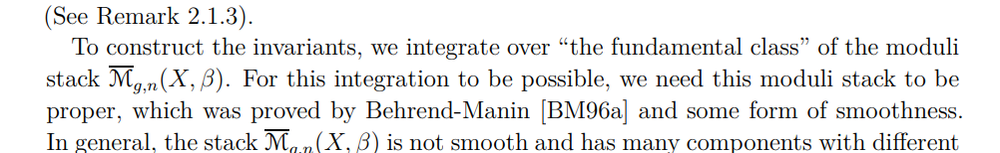
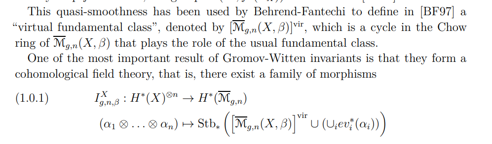
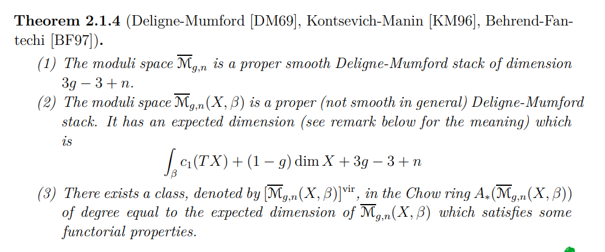
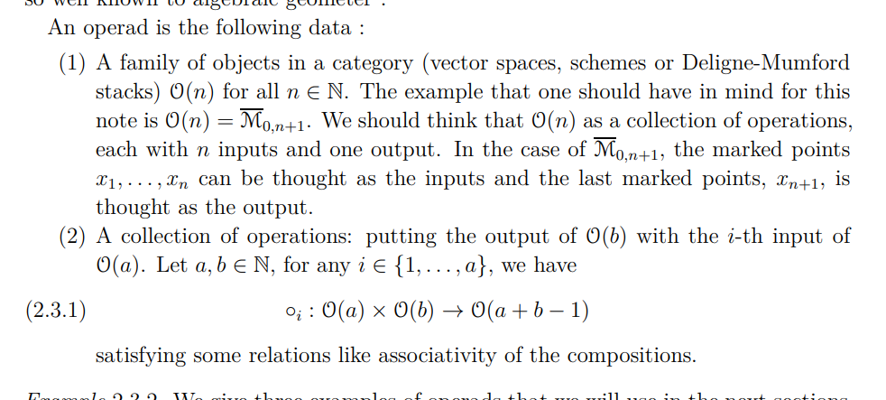
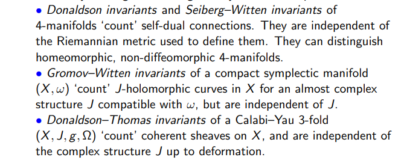
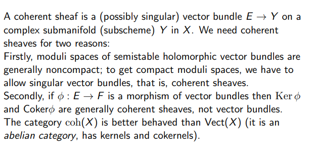
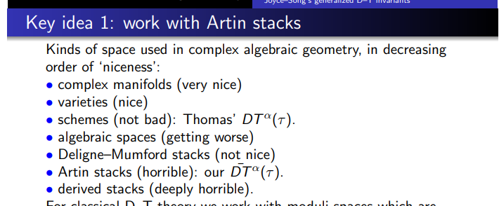

# 2021-04-22

## 09:57

Some morning reading: Gromov-Witten invariants in derived algebraic geometry.
My main question: does this somehow make a computation easier??
I haven't found any explicit computations of these, but sources alluded to actual counts (numbers) conjecturally coming from physics, where a few have been verified.

Why care about coherent sheaves?

