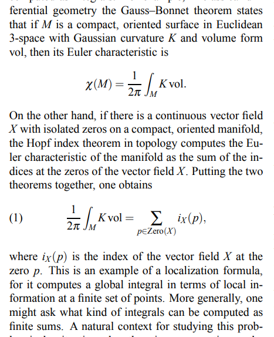
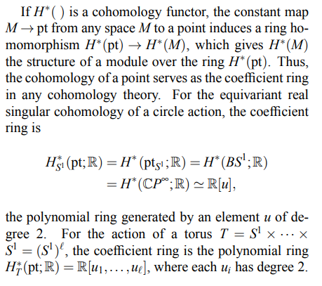
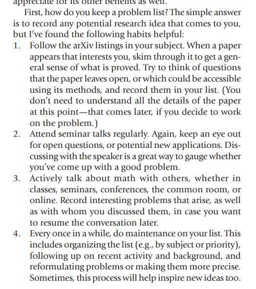

# 2021-04-23

## 13:49

**What is equivariant cohomology?**

- <https://arxiv.org/pdf/1305.4293.pdf>

- Some uses:

  - Calculate number of rational curves in a quintic threefold (Kontsevich 1995)
  - Calculate characteristic numbers of a compact homogeneous space (Tu 2010)
  - Derive Gysin formula for fiber bundles whose fibers are homogeneous spaces (Tu 2011)
  - Calculate integrals over manifolds as sums over fixed points

    

- What is the homotopy quotient?
  
  - 

- If $G\actson M$ with $G$ a compact connected Lie group, Cartan constructs a chain complex from $M, \lieg$.

  - 

  - Is this not precisely the Borel construction??

- Classifying spaces: $\B S^1 = \CP^{\infty}$

- Why are maximal torii useful?
  - 

**What is a scheme?**

- <https://www.ams.org/publications/journals/notices/201711/rnoti-p1300.pdf>

- Manifolds are the place to do differential calculus, schemes are the place to do algebra by finding zeros of functions.

- Closed points: of the form $V(S) \da \ts{ q\in \spec R \st q\contains S}$

**Notes on Homotopy Colimits (via Diagrams)**

- <http://mathieu.anel.free.fr/mat/doc/Anel-Semiomaths-HomotopyColimit.pdf>

- 

- 

- 

- 

- 

- 

- 

- Hocolims are $\infty\dash$groupoids, equivalently homotopy types.
- There is a functor $\pi_0: \inftyGrpd\to \Set$.

## 15:07

- Hironaka: Fields for existence of resolution of singularities in every dimension in $\ch(k) = 0$.

## 15:11

### Advice

- Don't do now what can wait until tomorrow! 
Make room for your research:

  

### Time Management

- Setting goals: SMART.
  Doesn't work for research though!

  

- Make lists, and habitually review/revise/plan.

  

- I really like the "keeping a problem list" idea.

- Don't be ashamed to ask people if they have problems you can work on.

## 15:34

- Thinking about the link between group cohomology and homotopy theory: if I have a SES 
\[
0\to A \to B \to C \to 0
,\]
  should one apply a functor like $K(\wait, 1)$?
  Is this actually a functor...?
  We definitely get spaces $K(A, 1)$ and $K(B, 1)$, for example, and there must be an induced map between them.
  Want to make precise what it means to get a SES like this:
  \[
  0 \to K(A, 1) \to K(B, 1) \to K(C, 1) \to 0
  .\]
  One would kind of want this to be part of a fiber sequence I guess.
  But we're in $\Top$ anyway, so there's no real issue with just doing fibrant/cofibrant replacement,.

  Maybe the "right" think to do here is to actually take classifying groupoids (?), which must be some functor like $\B: \Grp \to \Grpd$.
  Surely this is some known thing.
  But then what is an "exact sequence of groupoids"...?
  \[
  0 \to \B A \to \B B \to \B C \to 0
  .\]

  Also, why should such a functor be an exact? 
  It'd kind of be more interesting if it *weren't*.
  Say it's right-exact, then how might you make sense of $\LL \B(\wait)$?
  I think this just needs a model category structure on the *source*, although it seems reasonable to expect that $\Grpd$ would have some simple model structure.

