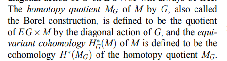
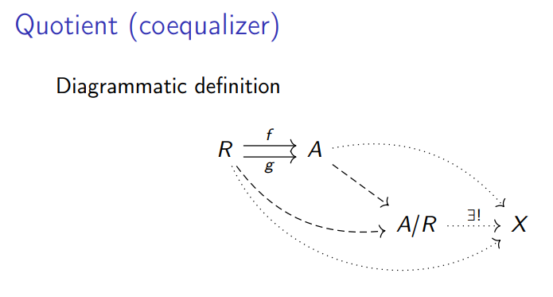
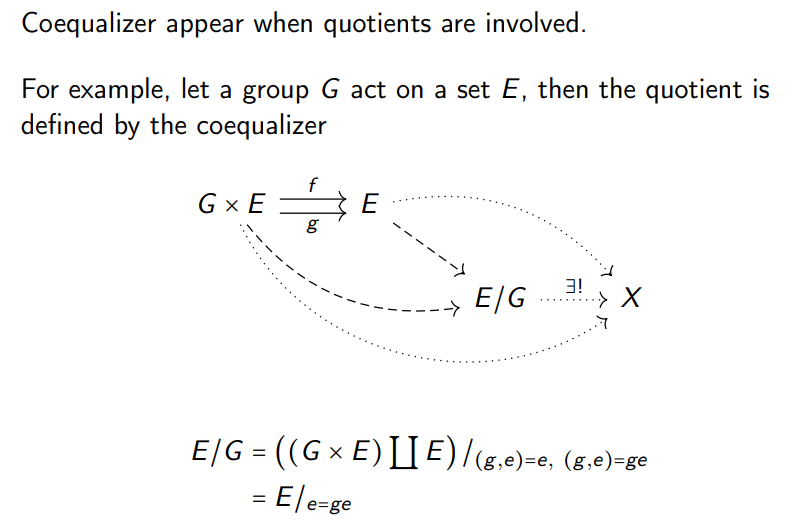

# 2021-04-23

## 13:49

**What is equivariant cohomology?**

<https://arxiv.org/pdf/1305.4293.pdf>

Uses:

- Calculate number of rational curves in a quintic threefold (Kontsevich 1995)
- Calculate characteristic numbers of a compact homogeneous space (Tu 2010)
- Derive Gysin formula for fiber bundles whose fibers are homogeneous spaces (Tu 2011)
- Calculate integrals over manifolds as sums over fixed points

If $G\actson M$ with $G$ a compact connected Lie group, Cartan constructs a chain complex from $M, \lieg$.

$BS^1 = \CP^{\infty}$

**What is a scheme?**

<https://www.ams.org/publications/journals/notices/201711/rnoti-p1300.pdf>

Manifolds are the place to do differential calculus, schemes are the place to do algebra by finding zeros of functions.

Closed points: of the form $V(S) \da \ts{ q\in \spec R \st q\contains S}$

**Notes on Diagram Calculus**

<http://mathieu.anel.free.fr/mat/doc/Anel-Semiomaths-HomotopyColimit.pdf>

Hocolims are $\infty\dash$groupoids, equivalently homotopy types.
There is a functor $\pi_0: \inf\Gpd\to \Set$.

## 15:07

- Hironaka: Fields for existence of resolution of singularities in every dimension in $\ch(k) = 0$.

## 15:11

Some advice:

