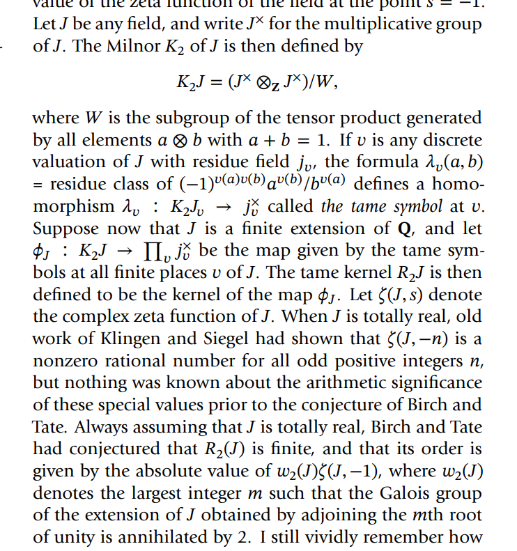
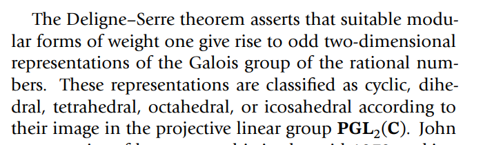

# 2021-04-25

## 02:13

Description of a certain wrapped Fukaya category $\OO$: take the objects to be (Lagrangian) embedded curves, the morphisms are the graded abelian groups $\hom_\OO \definedas \qty{\bigoplus_{L_0 \transverse L_1} \ZZ/2\ZZ, \bd}$ wher $\bd$ is given by counting holomorphic strips, localize along small isotopies.

## Notes from Eisenbud

An ideal $\pr$ is prime iff $JK \subset \pr \implies J \subset \pr$ or $K\subset \pr$.

A ring is a domain iff the ideal $(0)$ is prime.

> Inductively, if $\pr$ contains a product of ideals then it contains one of them.

Maximal ideals are prime, since $\mm$ maximal implies that $R/\mm$ is a field.

A ring is *local* iff it has a unique maximal ideal $\mm$.

An element $e$ is idempotent iff $e^2 = e$.

An $R\dash$algebra $S$ is a ring $S$ and a homomorphism $\alpha:R \to S$.

Every ring is a $\ZZ\dash$algebra in a unique way.

The most interesting commutative algebras are $S/I$ where $S = k[x_1, \cdots, x_n]$ for $k$ a field, $\ZZ$, or the localization of a ring at a prime ideal.

## 02:16

- Steenbrink spectral sequence (Peters-Steenbrink for exposition)
- Rapoport-Zink spectral sequence
- Bounding ranks of curves over function field: see elliptic fibrations
- Burnside ring in AG: free abelian group on finitely generated field extensions over a base field
- Check statement of the Baez-Dolan Cobordism Hypothesis

## 12:25

## 12:43

## 20:37

- The representation ring $R(G)$: the free \(\ZZ\dash\)module on isomorphism classes of irreducible representations.

  - How can we construct this using modern groupoid yoga? 
  Take the category \(G\dash\)module, somehow restrict to just irreducibles.
  Maybe there's a better thing to do here though, like "ignoring" reducibles the same way John Carlson "ignored" projectives.
  But okay, anyway, take that category. 
  Take its nerve and then the geometric realization and then $\pi_0$ or something?
  And then take the free \(\ZZ\dash\)module.
  I definitely need to ask some homotopy theorists how this construction goes for usual \(K\dash\)theory in modern terms.
  So like...
  \[
  \ZZ \left[ \pi_0 \abs{ N \cat{C} } \right]
  .\]
  The $\pi_0$ should be taking isomorphism classes somehow, but maybe this only works for groupoids?
  But okay, whatever, I just need a functor that takes categories into spaces where two objects end up in the same path component iff they're isomorphic in $\cat{C}$. 
  So maybe this needs to be something more simplicial.

