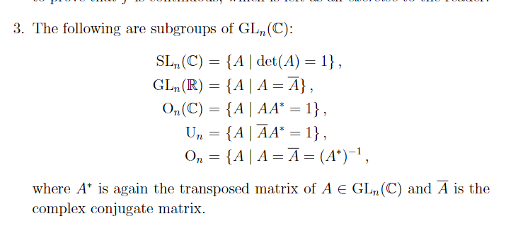

# 2021-04-25

## 01:51

- 

## 02:13

Description of a certain wrapped Fukaya category $\OO$: take the objects to be (Lagrangian) embedded curves, the morphisms are the graded abelian groups $\hom_\OO \definedas \qty{\bigoplus_{L_0 \transverse L_1} \ZZ/2\ZZ, \bd}$ wher $\bd$ is given by counting holomorphic strips, localize along small isotopies.

