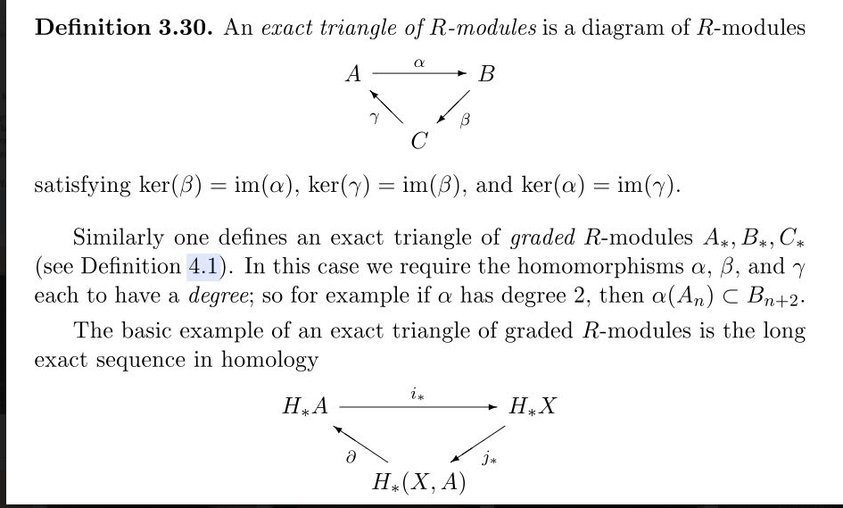

# 2021-04-26

## 11:48

Some random notes:

- 

## 13:29

Paper on "constructive" algebraic topology
[J. Rubio, F. Sergeraert / Bull. Sci. math. 126 (2002) 389–412 403](https://www-fourier.ujf-grenoble.fr/~sergerar/Papers/Constructive-AT.pdf)

Many constructions in algebraic topology can be organized as solutions of fibration problems.

## 13:37

- What are Quillen equivalences?
  These need to preserve the model structure on each side presumably.

  - More fundamental: how *should* one prove an equivalence of categories in general?
  Finding adjunctions is usually easy, because checking isomorphisms on hom sets is concrete.
  If you just have a random functor, does it even *have* adjoints in general?

- What is a Stiefel manifold?
  Should be able to write down an explicit set-theoretic characterization.

## 19:38

Is there a natural exact sequence associated to a composition series?

