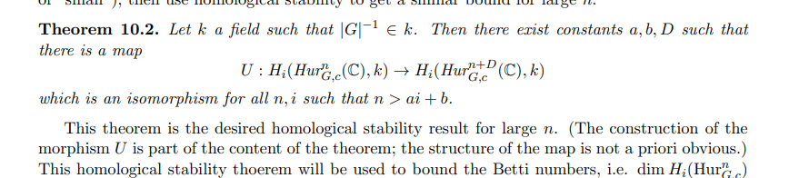

# 2021-05-01

## 17:27

## 17:31

## 17:32

## 17:33

- $\eps$ is a $q^i$ Weil number if $\abs{ \iota(\eps) } = q^{i/2}$ for any embedding $\iota: \Qbar \embeds \CC$.

  - Examples: eigenvalues of geometric Frobenius acting on $H^i_c$.

- As a general philosophy, one should expect that moduli problems whose objects have nontrivial automorphisms are representable by stacks, and those without nontrivial automorphisms are representable by schemes. 

## 21:38

> Some old notes from March 10th, 2020

I talked to [Erik Schreyer](https://erikschreyer.wordpress.com/) today about some of the research he did with his advisor [Jason Cantarella](http://www.jasoncantarella.com/wordpress/), including his dissertation work (which he spoke about in the Geometry seminar last week) and a few other papers.

His dissertation work involved a cool way to represent arbitrary planar curves by *piecewise circular* arcs:

From what I understand, this involves fixing a curve (blue), choosing a collection of circles $C_1, \cdots C_n$ (black) such that each $C_i$ intersects $C_{i+1}$ in at least one distinguished point $p_i$ (pink). The curve traced out by following an arc on $C_i$ and switching to circle $C_{i+1}$ at $p_i$ is intended to yield a good approximation to the original curve, with certain regularity conditions at the $p_i$ (such as the first derivatives along both arcs agreeing at the point).

Erik's work actually seems to go a bit farther -- he has an algorithm (a *curve-closing operator*) that actually takes an *open* curve and produces a closed curve that is nearby in the $C_1$ norm. He uses this to construct piecewise circular approximations that consist of circles of *equal* radii, along with some control over the $C^1$ distance between the original curve and the approximation.

We also talked a bit about another problem Jason was working on, discussed in the following papers:

- [The symplectic geometry of closed equilateral random walks in 3-space (Cantarella, Shonkwiler 2013)](https://arxiv.org/abs/1310.5924)
- [A Fast Direct Sampling Algorithm for Equilateral Closed Polygons (Cantarella et al 2015)](https://arxiv.org/abs/1510.02466)

## 21:43

Dirichlet's Theorem: An arithmetic progress with $(a, p) = 1$ contains infinitely many primes.
As a corollary, one can always find a *prime* $q$ that generates $\ZZ_p\units$ for any prime $p$.

## 21:49

### Non-split Extensions

[Reference](http://math.stackexchange.com/questions/1082283/example-of-a-non-splitting-exact-sequence-0-%E2%86%92-m-%E2%86%92-m-oplus-n-%E2%86%92-n-%E2%86%92-0/1082313#1082313) Not every sequence of the form $0\to A \to A \oplus C \to C \to 0$ splits; take
$$
0 \to \ZZ \to \ZZ \oplus \bigoplus_\NN \ZZ/(2) \to \bigoplus_\NN \ZZ/(2) \to 0
$$
where the first map is multiplication by 2, the second is the quotient map and a right-shift. This can't split because $(1, 0, \cdots)$ has order 2 in the RHS but pulls back to $(1, 0) \oplus (2\ZZ \oplus 0)$ which has no element of order 2.

### Cogroups

Reference: [One of Qiaochu Yuan's Blog Posts](https://qchu.wordpress.com/2011/01/21/structures-on-hom-sets/)

Cogroup objects: have structure maps
$$
m: H \to H^2 \\
e: H \to 0 \\
i: H \to H
$$
where $0$ is an initial object.

Example: $S^n \in \mathrm{hoTop}$.
Importance: What structure does $H$ need to have such that $\hom(H,\wait)$ has a group structure when applied? The answer is that $H$ is a group object in $\mathcal{C}\op$, or equivalently that $H$ is a cogroup object in $\mathcal{C}$.

The forgetful functor $U: \Set\to\Grp$ is representable by $\hom_{\Grp}(\ZZ, \wait)$, and the coproduct in $\Grp$ is the free product.

Recall that $\mathrm{CommRing}\op \cong \mathrm{AffSch}$, the category of affine schemes.

The adjoint to the forgetful functor $\mathrm{CommRing} \to \Set$ is the free commutative ring on $X$, i.e. $\ZZ[X]$, and is thus representable. The forgetful functor $\mathrm{CommRing} \to \Ab$ given by sending a ring to its underlying abelian group is also representable, namely by $\hom_{\Ring}(\ZZ[x], \wait)$. The coproduct in $\Ring$ is the tensor product over $\ZZ$, and the initial object is $\ZZ$.

$\ZZ[x]$ with its cogroup structure defines the structure of an affine group scheme on $\spec \ZZ[x]$, which represents the "additive group" functor and is called the additive group scheme $\GG_a$. Dualizing, an affine group scheme in the category $\mathrm{CommRing}$ is precisely a Hopf algebra.

Similarly, the forgetful functor $\mathrm{CommRing} \to \Ab$ given by sending $R$ to $R\units$ is representable by $\hom_{\Ring}(\ZZ[x, x\inv], \wait)$, and the corresponding affine group scheme $\spec \ZZ[x, \xinv]$ is the multiplicative group scheme $\GG_m$.

Note: the functor $\AffSch \to \Set$ sending a ring to its set of prime ideals is not representable (and doesn't preserve products), but the functor $\hom_{\AffSch}(\spec k, \wait)$ sending a scheme to its $k\dash$points for any $k$ is representable (and preserves all limits).

