# 2021-05-04

## 14:31

> Reference: The reciprocity law for the twisted second moment of
Dirichlet L-functions <https://arxiv.org/pdf/0708.2928.pdf>

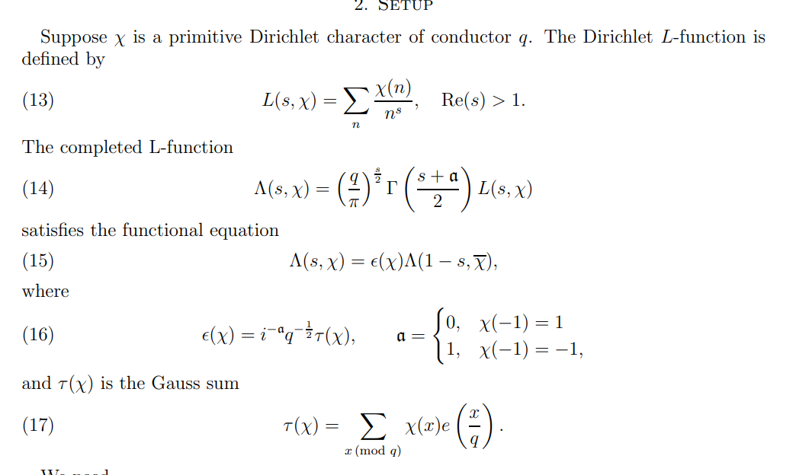

- What is a [Dirichlet character](Dirichlet%20character)?
- What is a [Gauss sum](Gauss%20sum)?
- What is the *completion* of an $L$ function?
  	Guessing this has to do with continuation.

- What is Dirichlet's trick?

- How can you break a sum up into [arithmetic progressions](arithmetic%20progressions)?

## 14:36

> Reference: The $K'$–theory of monoid sets <https://arxiv.org/pdf/1909.00297.pdf>

[K Theory](../zettelkasten/K%20Theory.md)

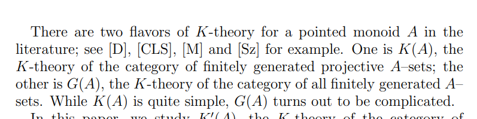

- $K'(A)$ defined for partially cancellative $A\dash$sets.
  - Important example: the pointed [monoid](monoid) $\NN \da \ts{\pt, 1, t, t^2, \cdots, }$.

- Useful in [toric geometry](toric%20geometry).

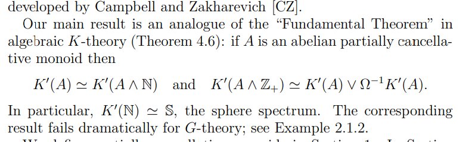

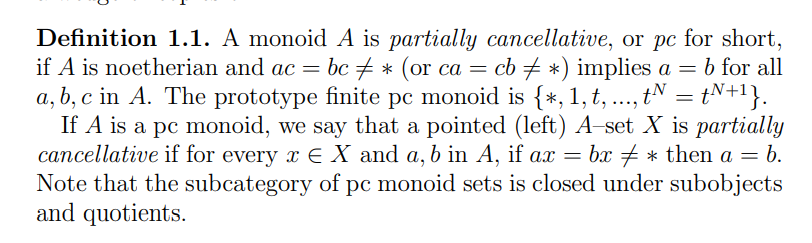

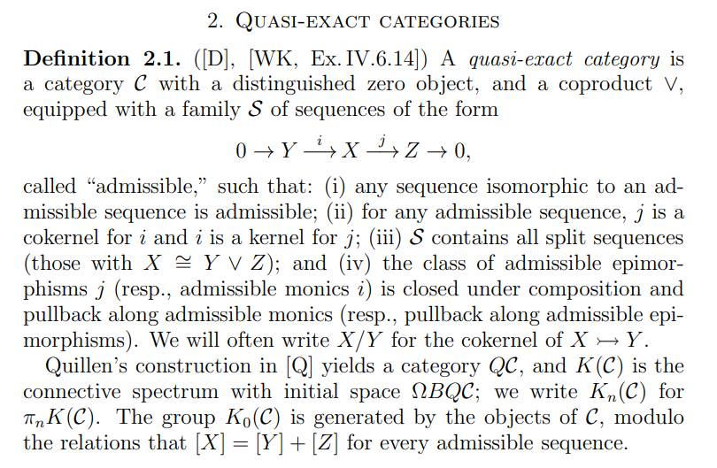

- The category $\Set^\fin_{\ptd}$ of finite pointed sets is quasi-exact, and Barratt-Priddy-Quillen implies that $K(\Set^\fin_\ptd) \homotopic \SS$.
  - If $A$ has no idempotents or units then $K(A) \homotopic \SS$.

- [Group completion](Group%20completion): comes from $\Loop^\infty \Suspend^\infty \B G_+$.

- Big theorem: Devissage.
  But I have no clue what this means.
  Seems to say when $\K(A) \cong \K(B)$?

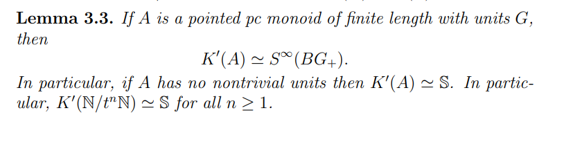

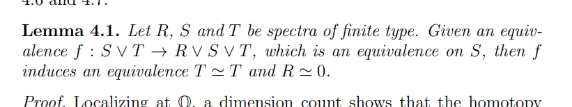

- Apparently easy theorem: $\K'(\NN) \homotopic \SS$.

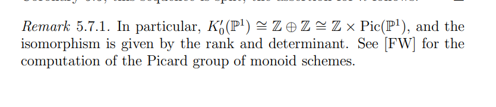

## 15:06

> Reference:  Stefan Schreieder, Refined unramified cohomology. Harvard/MIT AG Seminar talk.

- See the [Chow Ring](../zettelkasten/Chow%20Ring.md) and [cycle class map](cycle%20class%20map).
  Understanding the image amounts to the [Hodge conjecture](Hodge%20conjecture) and understanding torsion in the image $Z^i(X)$?

  - See algebraic equivalence in the [Chow group](Chow%20group).

- Gysin sequence yields a residue map $\del_x: H^i( \kappa(X); A) \to H^{i-1}( \kappa(X); A)$.

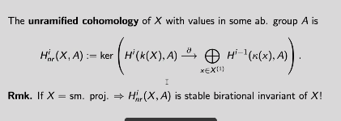

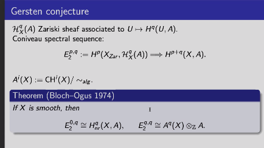

- Interesting parts of the Coniveau spectral sequence: something coming from unramified cohomology, and something coming from algebraic cycles mod algebraic equivalence.

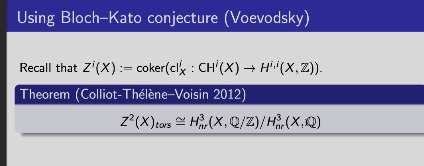

  - Uses [Bloch-Kato conjecture](Bloch-Kato%20conjecture)
  - Allows detecting classes in $Z^2(X)$ using [K-theoretic](../zettelkasten/K%20Theory.md) methods.

- See [Borel-Moore cohomology](Borel-Moore%20cohomology) -- for $X$ a smooth [algebraic scheme](algebraic%20scheme), essentially singular homology with a degree shift?

- See [pro-objects](pro-objects) and [ind-objects](ind-objects) in an arbitrary category.
  - [pro-scheme](pro-scheme): an inverse limit of [schemes](../zettelkasten/scheme.md).

- Filter by codimension, then obstructions to extending over higher codimension things is measured by cohomology of the [function field](Function%20field):

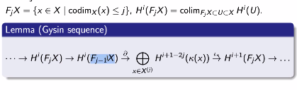

  - Here $\bd$ is a *residue map*.

  - See [separated](separated) schemes of [finite type](finite%20type).

**Main theorem**,
works not just for smooth schemes, but in greater generality:

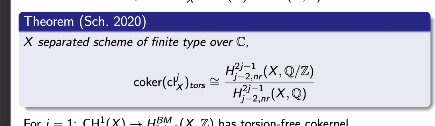
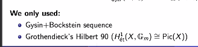

- Torsion in the Griffiths group is generally not finitely generated.
  - Use an Enriques surface to produce $(\ZZ/2)^{\oplus \infty}$ in $\Griff^3$.

- See [canonical class](canonical%20class) $K_S$ for a surface, [Abel-Jacobi invariants](Abel-Jacobi%20invariants)?

- No Poincaré duality for Chow groups, at least not at the level of cycles.
  Need to pass to cohomology.

  - Dual $\beta$ of $[K_S] \in H^2(S; \ZZ/2)$ generates the [Brauer group](Brauer%20group) $\Br(S)$ of the surface.
  Note $\beta$ is not algebraic.

- Theorem: there exists a [regular](regular) [flat](flat) [proper](proper) $S\to \spec \CC\fps{t}$ such that $S_\eta$ is an Enriques surface, $S_0$ is a union of [ruled surfaces](ruled%20surfaces), and $\Br(S) \surjects \Br(S_\eta)$.
  - $\Br(X_\eta) \cong \ZZ/2$ is generated by an [unramified](unramified) conic bundle. 
  - Can extend conic smoothly over [Central fiber](Central%20fiber)
  - Need that the Poincaré dual [specializes](specializes) to zero on the [Special fiber](Special%20fiber).

- See [Zariski locally](Zariski%20locally) and [étale locally](étale%20locally).

- [Unramified cohomology](Unramified%20cohomology) is linked to [Milnor K theory](Milnor%20K%20theory).

## 19:33

> Reference: <https://www.youtube.com/watch?v=XTOwj1LvntM>

Clausen: baby topic in [geometric representation theory](geometric%20representation%20theory): [Springer correspondence](Springer%20correspondence).
Need [equivariant](equivariant) [derived categories](derived%20categories)... very difficult to define!
